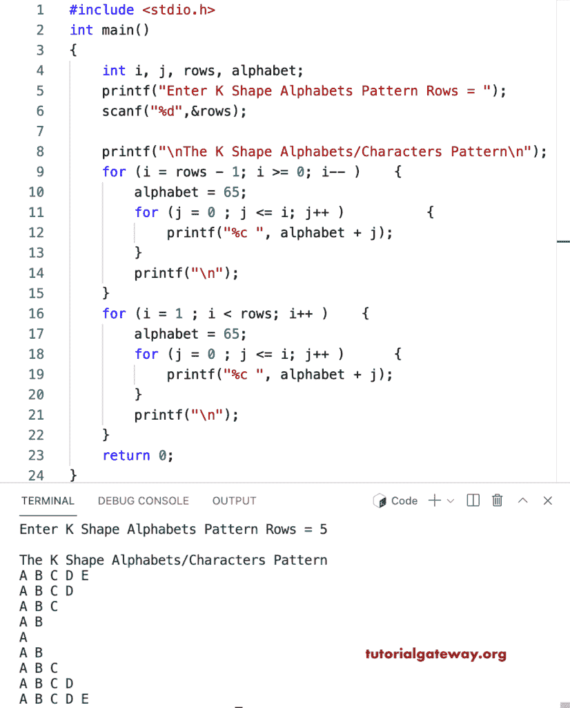

# C 程序：打印字母的`K`形图案

> 原文：<https://www.tutorialgateway.org/c-program-to-print-k-shape-alphabets-pattern/>

写一个 C 程序打印字母的`K`形图案用于循环。

```c
#include <stdio.h>

int main()
{
    int i, j, rows, alphabet;

    printf("Enter K Shape Alphabets Pattern Rows = ");
    scanf("%d",&rows);

    printf("\nThe K Shape Alphabets/Characters Pattern\n"); 

    for (i = rows - 1; i >= 0; i-- ) 
	{
		alphabet = 65;
		for (j = 0 ; j <= i; j++ ) 	
		{
			printf("%c ", alphabet + j);
		}
		printf("\n");
	}

	for (i = 1 ; i < rows; i++ ) 
	{
		alphabet = 65;
		for (j = 0 ; j <= i; j++ ) 	
		{
			printf("%c ", alphabet + j);
		}
		printf("\n");
	}
    return 0;
}
```



这个 [C 示例](https://www.tutorialgateway.org/c-programming-examples/)使用 while 循环打印字母的`K`形模式。

```c
#include <stdio.h>

int main()
{
    int i, j, rows, alphabet;

    printf("Enter K Shape Alphabets Pattern Rows = ");
    scanf("%d",&rows);

    printf("\nThe K Shape Alphabets/Characters Pattern\n");

	i = rows - 1;

	while (i >= 0 ) 
	{
		alphabet = 65;
		j = 0 ;
		while ( j <= i) 	
		{
			printf("%c ", alphabet + j);
			j++;
		}
		printf("\n");
		i--;
	}

	i = 1 ;
	while ( i < rows ) 
	{
		alphabet = 65;
		j = 0 ;
		while ( j <= i ) 	
		{
			printf("%c ", alphabet + j);
			j++;
		}
		printf("\n");
		i++;
	} 
    return 0;
}
```

```c
Enter K Shape Alphabets Pattern Rows = 8

The K Shape Alphabets/Characters Pattern
A B C D E F G H 
A B C D E F G 
A B C D E F 
A B C D E 
A B C D 
A B C 
A B 
A 
A B 
A B C 
A B C D 
A B C D E 
A B C D E F 
A B C D E F G 
A B C D E F G H
```

用一个边做边循环显示一个`K`形字母图案的程序。

```c
#include <stdio.h>

int main()
{
    int i, j, rows, alphabet;

    printf("Enter K Shape Alphabets Pattern Rows = ");
    scanf("%d",&rows);

    printf("\nThe K Shape Alphabets/Characters Pattern\n");

	i = rows - 1;

	do
	{
		alphabet = 65;
		j = 0 ;
		do	
		{
			printf("%c ", alphabet + j);

		} while ( ++j <= i) ;
		printf("\n");

	} while (--i >= 0 );

	i = 1 ;
	do 
	{
		alphabet = 65;
		j = 0 ;
		do	
		{
			printf("%c ", alphabet + j);

		} while ( ++j <= i );
		printf("\n");

	} while ( ++i < rows );
    return 0;
}
```

```c
Enter K Shape Alphabets Pattern Rows = 12

The K Shape Alphabets/Characters Pattern
A B C D E F G H I J K L 
A B C D E F G H I J K 
A B C D E F G H I J 
A B C D E F G H I 
A B C D E F G H 
A B C D E F G 
A B C D E F 
A B C D E 
A B C D 
A B C 
A B 
A 
A B 
A B C 
A B C D 
A B C D E 
A B C D E F 
A B C D E F G 
A B C D E F G H 
A B C D E F G H I 
A B C D E F G H I J 
A B C D E F G H I J K 
A B C D E F G H I J K L 
```