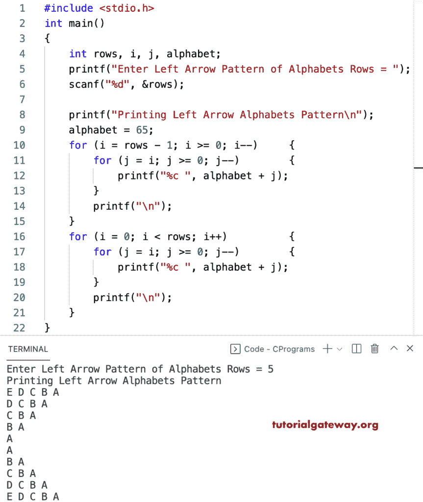

# C 程序：打印左箭头字母图案

> 原文：<https://www.tutorialgateway.org/c-program-to-print-left-arrow-alphabets-pattern/>

写一个 C 程序打印左箭头字母图案用于循环。

```c
#include <stdio.h>

int main()
{
	int rows, i, j, alphabet;

	printf("Enter Left Arrow Pattern of Alphabets Rows = ");
	scanf("%d", &rows);

	printf("Printing Left Arrow Alphabets Pattern\n");
	alphabet = 65;

	for (i = rows - 1; i >= 0; i--)
	{
		for (j = i; j >= 0; j--)
		{
			printf("%c ", alphabet + j);
		}
		printf("\n");
	}

	for (i = 0; i < rows; i++)
	{
		for (j = i; j >= 0; j--)
		{
			printf("%c ", alphabet + j);
		}
		printf("\n");
	}
}
```



这个 C 程序使用 while 循环打印字母表模式的左箭头。

```c
#include <stdio.h>

int main()
{
	int rows, i, j, alphabet;

	printf("Enter Left Arrow Pattern of Alphabets Rows = ");
	scanf("%d", &rows);

	printf("Printing Left Arrow Alphabets Pattern\n");
	alphabet = 65;
	i = rows - 1;

	while (i >= 0)
	{
		j = i;
		while (j >= 0)
		{
			printf("%c ", alphabet + j);
			j--;
		}
		printf("\n");
		i--;
	}

	i = 0;
	while (i < rows)
	{
		j = i;
		while (j >= 0)
		{
			printf("%c ", alphabet + j);
			j--;
		}
		printf("\n");
		i++;
	}
}
```

```c
Enter Left Arrow Pattern of Alphabets Rows = 10
Printing Left Arrow Alphabets Pattern
J I H G F E D C B A 
I H G F E D C B A 
H G F E D C B A 
G F E D C B A 
F E D C B A 
E D C B A 
D C B A 
C B A 
B A 
A 
A 
B A 
C B A 
D C B A 
E D C B A 
F E D C B A 
G F E D C B A 
H G F E D C B A 
I H G F E D C B A 
J I H G F E D C B A 
```

这个 [C 模式](https://www.tutorialgateway.org/c-programming-examples/)示例使用 do while 循环打印字母的左箭头。

```c
#include <stdio.h>

int main()
{
	int rows, i, j, alphabet;

	printf("Enter Left Arrow Pattern of Alphabets Rows = ");
	scanf("%d", &rows);

	printf("Printing Left Arrow Alphabets Pattern\n");
	alphabet = 65;
	i = rows - 1;

	do
	{
		j = i;
		do
		{
			printf("%c ", alphabet + j);

		} while (--j >= 0);
		printf("\n");

	} while (--i >= 0);

	i = 0;
	do
	{
		j = i;
		do
		{
			printf("%c ", alphabet + j);

		} while (--j >= 0);
		printf("\n");

	} while (++i < rows);
}
```

```c
Enter Left Arrow Pattern of Alphabets Rows = 12
Printing Left Arrow Alphabets Pattern
L K J I H G F E D C B A 
K J I H G F E D C B A 
J I H G F E D C B A 
I H G F E D C B A 
H G F E D C B A 
G F E D C B A 
F E D C B A 
E D C B A 
D C B A 
C B A 
B A 
A 
A 
B A 
C B A 
D C B A 
E D C B A 
F E D C B A 
G F E D C B A 
H G F E D C B A 
I H G F E D C B A 
J I H G F E D C B A 
K J I H G F E D C B A 
L K J I H G F E D C B A
```