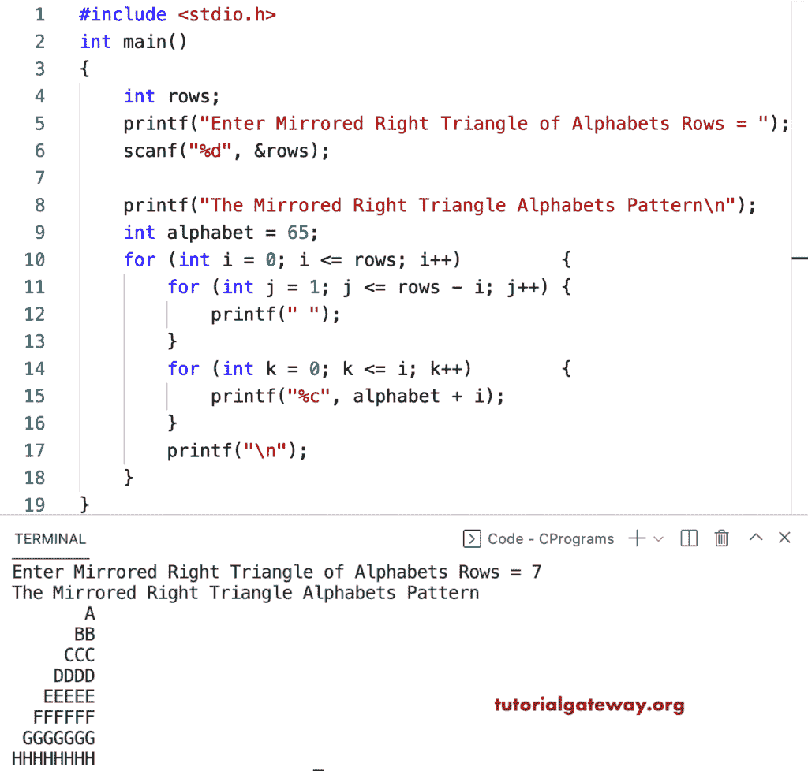

# C 程序：打印字母的镜像直角三角形图案

> 原文：<https://www.tutorialgateway.org/c-program-to-print-mirrored-right-triangle-alphabets-pattern/>

写一个 C 程序打印字母的镜像直角三角形图案用于循环。

```c
#include <stdio.h>

int main()
{
	int rows;

	printf("Enter Mirrored Right Triangle of Alphabets Rows = ");
	scanf("%d", &rows);

	printf("The Mirrored Right Triangle Alphabets Pattern\n");

	int alphabet = 65;

	for (int i = 0; i <= rows; i++)
	{
		for (int j = 1; j <= rows - i; j++)
		{
			printf(" ");
		}
		for (int k = 0; k <= i; k++)
		{
			printf("%c", alphabet + i);
		}
		printf("\n");
	}
}
```



这个 C 程序使用 while 循环打印字母图案的镜像直角三角形。

```c
#include <stdio.h>

int main()
{
	int rows, i, j, k, alphabet;

	printf("Enter Mirrored Right Triangle of Alphabets Rows = ");
	scanf("%d", &rows);

	printf("The Mirrored Right Triangle Alphabets Pattern\n");

	alphabet = 65;
	i = 0;

	while (i < rows)
	{
		j = 1;
		while (j <= rows - i)
		{
			printf(" ");
			j++;
		}

		k = 0;
		while (k <= i)
		{
			printf("%c", alphabet + i);
			k++;
		}
		printf("\n");
		i++;
	}
}
```

```c
Enter Mirrored Right Triangle of Alphabets Rows = 17
The Mirrored Right Triangle Alphabets Pattern
                 A
                BB
               CCC
              DDDD
             EEEEE
            FFFFFF
           GGGGGGG
          HHHHHHHH
         IIIIIIIII
        JJJJJJJJJJ
       KKKKKKKKKKK
      LLLLLLLLLLLL
     MMMMMMMMMMMMM
    NNNNNNNNNNNNNN
   OOOOOOOOOOOOOOO
  PPPPPPPPPPPPPPPP
 QQQQQQQQQQQQQQQQQ
```

这个 [C 示例](https://www.tutorialgateway.org/c-programming-examples/)使用 do while 循环打印字母的镜像直角三角形模式。

```c
#include <stdio.h>

int main()
{
	int rows, i, j, k, alphabet;

	printf("Enter Mirrored Right Triangle of Alphabets Rows = ");
	scanf("%d", &rows);

	printf("The Mirrored Right Triangle Alphabets Pattern\n");

	alphabet = 65;
	i = 0;

	do
	{
		j = 1;
		do
		{
			printf(" ");

		} while (j++ <= rows - i);

		k = 0;
		do
		{
			printf("%c", alphabet + i);

		} while (++k <= i);
		printf("\n");

	} while (++i < rows);
}
```

```c
Enter Mirrored Right Triangle of Alphabets Rows = 15
The Mirrored Right Triangle Alphabets Pattern
                A
               BB
              CCC
             DDDD
            EEEEE
           FFFFFF
          GGGGGGG
         HHHHHHHH
        IIIIIIIII
       JJJJJJJJJJ
      KKKKKKKKKKK
     LLLLLLLLLLLL
    MMMMMMMMMMMMM
   NNNNNNNNNNNNNN
  OOOOOOOOOOOOOOO
```