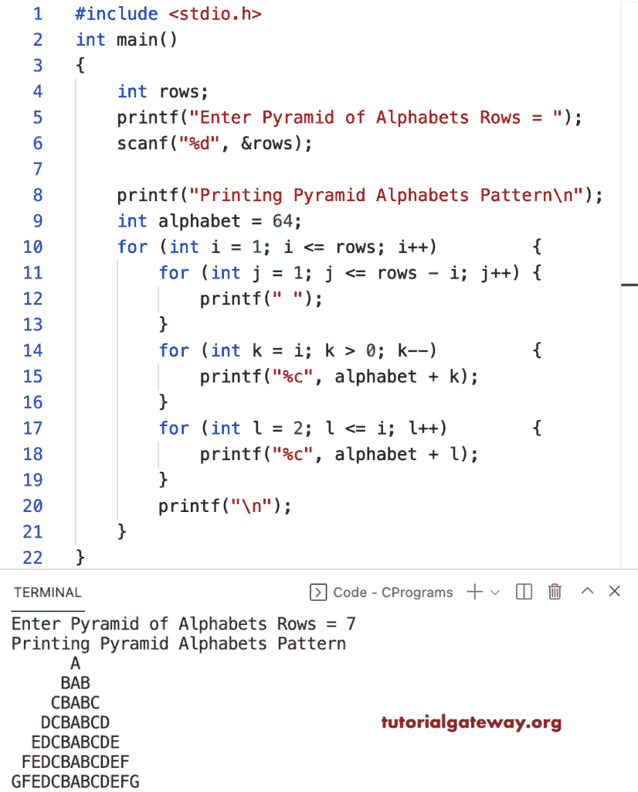

# C 程序：打印金字塔字母图案

> 原文：<https://www.tutorialgateway.org/c-program-to-print-pyramid-alphabets-pattern/>

写一个 C 程序打印金字塔字母图案用于循环。

```c
#include <stdio.h>

int main()
{
	int rows;

	printf("Enter Pyramid of Alphabets Rows = ");
	scanf("%d", &rows);

	printf("Printing Pyramid Alphabets Pattern\n");

	int alphabet = 64;

	for (int i = 1; i <= rows; i++)
	{
		for (int j = 1; j <= rows - i; j++)
		{
			printf(" ");
		}
		for (int k = i; k > 0; k--)
		{
			printf("%c", alphabet + k);
		}
		for (int l = 2; l <= i; l++)
		{
			printf("%c", alphabet + l);
		}
		printf("\n");
	}
}
```



这个 [C 示例](https://www.tutorialgateway.org/c-programming-examples/)使用 while 循环打印字母的金字塔模式。

```c
#include <stdio.h>

int main()
{
	int i, j, k, l, alphabet, rows;

	printf("Enter Pyramid of Alphabets Rows = ");
	scanf("%d", &rows);

	printf("Printing Pyramid Alphabets Pattern\n");

	alphabet = 64;
	i = 1;

	while (i <= rows)
	{
		j = 1;
		while (j <= rows - i)
		{
			printf(" ");
			j++;
		}

		k = i;
		while (k > 0)
		{
			printf("%c", alphabet + k);
			k--;
		}

		l = 2;
		while (l <= i)
		{
			printf("%c", alphabet + l);
			l++;
		}
		printf("\n");
		i++;
	}
}
```

```c
Enter Pyramid of Alphabets Rows = 16
Printing Pyramid Alphabets Pattern
               A
              BAB
             CBABC
            DCBABCD
           EDCBABCDE
          FEDCBABCDEF
         GFEDCBABCDEFG
        HGFEDCBABCDEFGH
       IHGFEDCBABCDEFGHI
      JIHGFEDCBABCDEFGHIJ
     KJIHGFEDCBABCDEFGHIJK
    LKJIHGFEDCBABCDEFGHIJKL
   MLKJIHGFEDCBABCDEFGHIJKLM
  NMLKJIHGFEDCBABCDEFGHIJKLMN
 ONMLKJIHGFEDCBABCDEFGHIJKLMNO
PONMLKJIHGFEDCBABCDEFGHIJKLMNOP#include <stdio.h>

int main()
{
	int rows;

	printf("Enter Pyramid of Alphabets Rows = ");
	scanf("%d", &rows);

	printf("Printing Pyramid Alphabets Pattern\n");

	int alphabet = 64;

	for (int i = 1; i <= rows; i++)
	{
		for (int j = 1; j <= rows - i; j++)
		{
			printf(" ");
		}
		for (int k = i; k > 0; k--)
		{
			printf("%c", alphabet + k);
		}
		for (int l = 2; l <= i; l++)
		{
			printf("%c", alphabet + l);
		}
		printf("\n");
	}
}
```