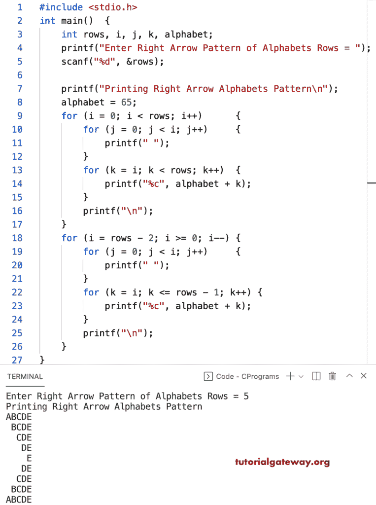

# C 程序：打印右箭头字母图案

> 原文：<https://www.tutorialgateway.org/c-program-to-print-right-arrow-alphabets-pattern/>

写一个 C 程序打印右箭头字母图案用于循环。

```c
#include <stdio.h>

int main()
{
	int rows, i, j, k, alphabet;

	printf("Enter Right Arrow Pattern of Alphabets Rows = ");
	scanf("%d", &rows);

	printf("Printing Right Arrow Alphabets Pattern\n");
	alphabet = 65;

	for (i = 0; i < rows; i++)
	{
		for (j = 0; j < i; j++)
		{
			printf(" ");
		}
		for (k = i; k < rows; k++)
		{
			printf("%c", alphabet + k);
		}
		printf("\n");
	}

	for (i = rows - 2; i >= 0; i--)
	{
		for (j = 0; j < i; j++)
		{
			printf(" ");
		}
		for (k = i; k <= rows - 1; k++)
		{
			printf("%c", alphabet + k);
		}
		printf("\n");
	}
}
```



这个 [C 示例](https://www.tutorialgateway.org/c-programming-examples/)使用 while 循环打印字母的右箭头模式。

```c
#include <stdio.h>

int main()
{
	int rows, i, j, k, alphabet;

	printf("Enter Right Arrow Pattern of Alphabets Rows = ");
	scanf("%d", &rows);

	printf("Printing Right Arrow Alphabets Pattern\n");

	alphabet = 65;
	i = 0;

	while (i < rows)
	{
		j = 0;
		while (j < i)
		{
			printf(" ");
			j++;
		}
		k = i;
		while (k < rows)
		{
			printf("%c", alphabet + k);
			k++;
		}
		printf("\n");
		i++;
	}

	i = rows - 2;
	while (i >= 0)
	{
		j = 0;
		while (j < i)
		{
			printf(" ");
			j++;
		}
		k = i;
		while (k <= rows - 1)
		{
			printf("%c", alphabet + k);
			k++;
		}
		printf("\n");
		i--;
	}
}
```

```c
Enter Right Arrow Pattern of Alphabets Rows = 13
Printing Right Arrow Alphabets Pattern
ABCDEFGHIJKLM
 BCDEFGHIJKLM
  CDEFGHIJKLM
   DEFGHIJKLM
    EFGHIJKLM
     FGHIJKLM
      GHIJKLM
       HIJKLM
        IJKLM
         JKLM
          KLM
           LM
            M
           LM
          KLM
         JKLM
        IJKLM
       HIJKLM
      GHIJKLM
     FGHIJKLM
    EFGHIJKLM
   DEFGHIJKLM
  CDEFGHIJKLM
 BCDEFGHIJKLM
ABCDEFGHIJKLM
```