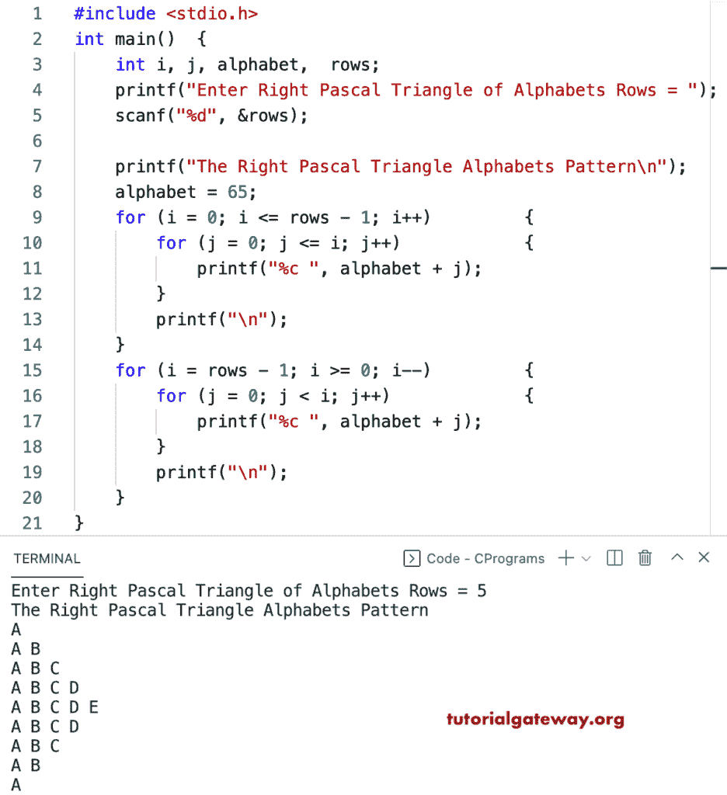

# C 程序：打印字母的直角三角形图案

> 原文：<https://www.tutorialgateway.org/c-program-to-print-right-pascals-triangle-alphabets-pattern/>

写一个 C 程序来打印字母的用于循环的直角三角形图案。

```c
#include <stdio.h>

int main()
{
	int i, j, alphabet,  rows;

	printf("Enter Right Pascal Triangle of Alphabets Rows = ");
	scanf("%d", &rows);

	printf("The Right Pascal Triangle Alphabets Pattern\n");

	alphabet = 65;

	for (i = 0; i <= rows - 1; i++)
	{
		for (j = 0; j <= i; j++)
		{
			printf("%c ", alphabet + j);
		}
		printf("\n");
	}

	for (i = rows - 1; i >= 0; i--)
	{
		for (j = 0; j < i; j++)
		{
			printf("%c ", alphabet + j);
		}
		printf("\n");
	}
}
```



这个 C 程序使用 while 循环打印字母的右帕斯卡三角形图案。

```c
#include <stdio.h>

int main()
{
	int i, j, alphabet,  rows;

	printf("Enter Right Pascal Triangle of Alphabets Rows = ");
	scanf("%d", &rows);

	printf("The Right Pascal Triangle Alphabets Pattern\n");

	alphabet = 65;
	i = 0;

	while (i <= rows - 1)
	{
		j = 0;
		while (j <= i)
		{
			printf("%c ", alphabet + j);
			j++;
		}
		printf("\n");
		i++;
	}

	i = rows - 1;
	while (i >= 0)
	{
		j = 0;
		while (j < i)
		{
			printf("%c ", alphabet + j);
			j++;
		}
		printf("\n");
		i--;
	}
}
```

```c
Enter Right Pascal Triangle of Alphabets Rows = 11
The Right Pascal Triangle Alphabets Pattern
A 
A B 
A B C 
A B C D 
A B C D E 
A B C D E F 
A B C D E F G 
A B C D E F G H 
A B C D E F G H I 
A B C D E F G H I J 
A B C D E F G H I J K 
A B C D E F G H I J 
A B C D E F G H I 
A B C D E F G H 
A B C D E F G 
A B C D E F 
A B C D E 
A B C D 
A B C 
A B 
A
```

这个 [C 示例](https://www.tutorialgateway.org/c-programming-examples/)使用 do while 循环打印字母表的右帕斯卡三角形图案。

```c
#include <stdio.h>

int main()
{
	int i, j, alphabet,  rows;

	printf("Enter Right Pascal Triangle of Alphabets Rows = ");
	scanf("%d", &rows);

	printf("The Right Pascal Triangle Alphabets Pattern\n");

	alphabet = 65;
	i = 0;

	do
	{
		j = 0;
		do
		{
			printf("%c ", alphabet + j);

		} while (++j <= i);

		printf("\n");

	} while (++i <= rows - 1);

	i = rows - 1;
	do
	{
		j = 0;
		do
		{
			printf("%c ", alphabet + j);

		} while (++j < i);
		printf("\n");

	} while (--i > 0);
}
```

```c
Enter Right Pascal Triangle of Alphabets Rows = 14
The Right Pascal Triangle Alphabets Pattern
A 
A B 
A B C 
A B C D 
A B C D E 
A B C D E F 
A B C D E F G 
A B C D E F G H 
A B C D E F G H I 
A B C D E F G H I J 
A B C D E F G H I J K 
A B C D E F G H I J K L 
A B C D E F G H I J K L M 
A B C D E F G H I J K L M N 
A B C D E F G H I J K L M 
A B C D E F G H I J K L 
A B C D E F G H I J K 
A B C D E F G H I J 
A B C D E F G H I 
A B C D E F G H 
A B C D E F G 
A B C D E F 
A B C D E 
A B C D 
A B C 
A B 
A 
```