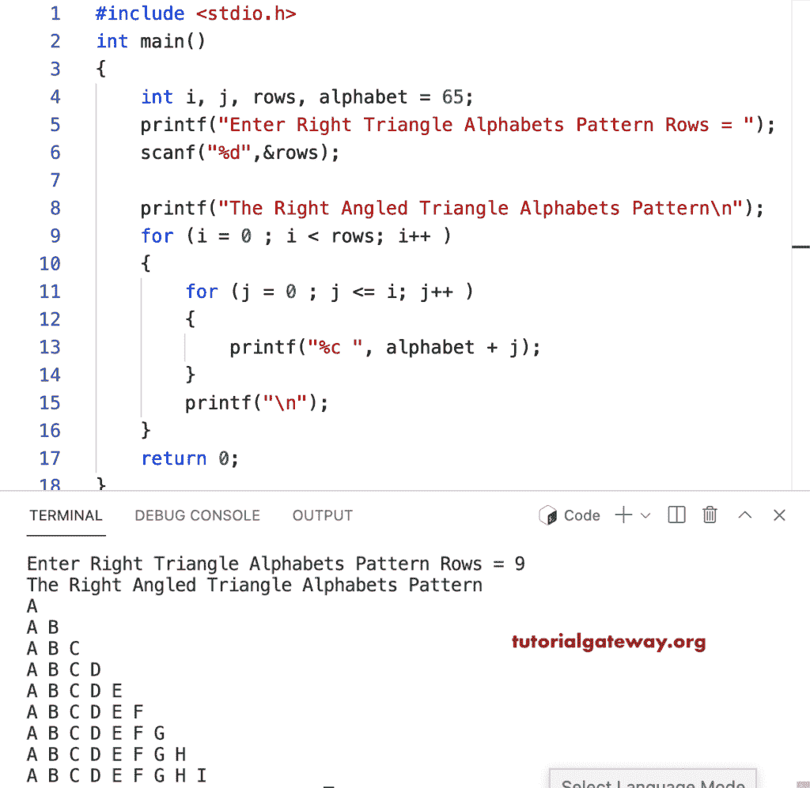

# C 程序：打印字母的直角三角形图案

> 原文：<https://www.tutorialgateway.org/c-program-to-print-right-triangle-alphabets-pattern/>

写一个 C 程序打印字母的用于循环的直角三角形图案。

```c
#include <stdio.h>

int main()
{
    int i, j, rows, alphabet = 65;

    printf("Enter Right Triangle Alphabets Pattern Rows = ");
    scanf("%d",&rows);

    printf("The Right Angled Triangle Alphabets Pattern\n"); 

	for (i = 0 ; i < rows; i++ ) 
	{
		for (j = 0 ; j <= i; j++ ) 	
		{
			printf("%c ", alphabet + j);
		}
		printf("\n");
	}

    return 0;
}
```



这个 [C 示例](https://www.tutorialgateway.org/c-programming-examples/)使用 while 循环打印直角三角形模式中的字母。

```c
#include <stdio.h>

int main()
{
    int i = 0, j, rows, alphabet = 65;

    printf("Enter Right Triangle Alphabets Pattern Rows = ");
    scanf("%d",&rows);

    printf("\nThe Right Angled Triangle Alphabets Pattern\n"); 

	while (i < rows ) 
	{
		j = 0 ;
		while ( j <= i ) 	
		{
			printf("%c ", alphabet + j);
			j++;
		}
		printf("\n");
		i++;
	}

    return 0;
}
```

```c
Enter Right Triangle Alphabets Pattern Rows = 12

The Right Angled Triangle Alphabets Pattern
A 
A B 
A B C 
A B C D 
A B C D E 
A B C D E F 
A B C D E F G 
A B C D E F G H 
A B C D E F G H I 
A B C D E F G H I J 
A B C D E F G H I J K 
A B C D E F G H I J K L
```

使用 do while 循环显示字母直角三角形模式的 c 程序。

```c
#include <stdio.h>

int main()
{
    int i = 0, j, rows, alphabet = 65;

    printf("Enter Right Triangle Alphabets Pattern Rows = ");
    scanf("%d",&rows);

    printf("\nThe Right Angled Triangle Alphabets Pattern\n"); 

	do 
	{
		j = 0 ;
		do	
		{
			printf("%c ", alphabet + j);

		} while (++j <= i );
		printf("\n");

	} while (++i < rows );

    return 0;
}
```

```c
Enter Right Triangle Alphabets Pattern Rows = 16

The Right Angled Triangle Alphabets Pattern
A 
A B 
A B C 
A B C D 
A B C D E 
A B C D E F 
A B C D E F G 
A B C D E F G H 
A B C D E F G H I 
A B C D E F G H I J 
A B C D E F G H I J K 
A B C D E F G H I J K L 
A B C D E F G H I J K L M 
A B C D E F G H I J K L M N 
A B C D E F G H I J K L M N O 
A B C D E F G H I J K L M N O P 
```