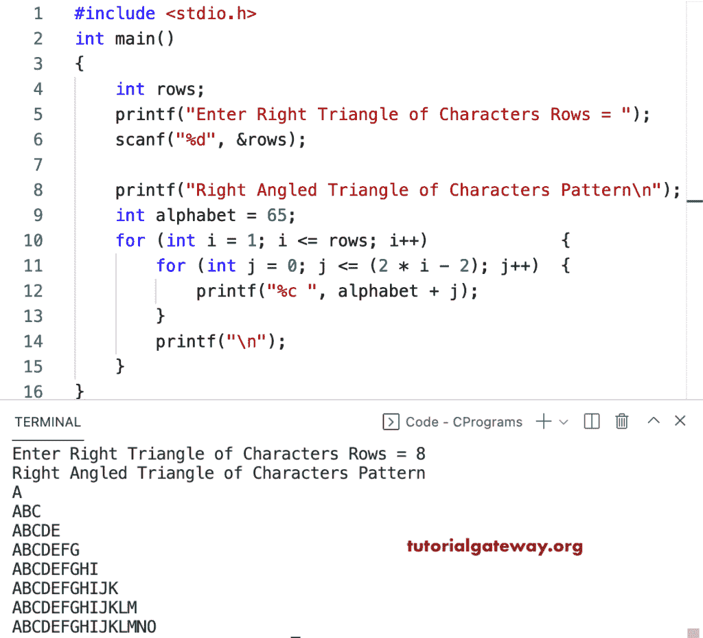

# C 程序：打印字符的直角三角形图案

> 原文：<https://www.tutorialgateway.org/c-program-to-print-right-triangle-characters-pattern/>

写一个 C 程序打印字母的直角三角形字符模式或图案用于循环。

```c
#include <stdio.h>

int main()
{
	int rows;

	printf("Enter Right Triangle of Characters Rows = ");
	scanf("%d", &rows);

	printf("Right Angled Triangle of Characters Pattern\n");
	int alphabet = 65;

	for (int i = 1; i <= rows; i++)
	{
		for (int j = 0; j <= (2 * i - 2); j++)
		{
			printf("%c ", alphabet + j);
		}
		printf("\n");
	}
}
```



这个 C 程序使用 while 循环打印字符的直角三角形模式。

```c
#include <stdio.h>

int main()
{
	int i, j, alphabet, rows;

	printf("Enter Right Triangle of Characters Rows = ");
	scanf("%d", &rows);

	printf("Right Angled Triangle of Characters Pattern\n");
	alphabet = 65;
	i = 1;

	while (i <= rows)
	{
		j = 0;
		while (j <= (2 * i - 2))
		{
			printf("%c ", alphabet + j);
			j++;
		}
		printf("\n");
		i++;
	}
}
```

```c
Enter Right Triangle of Characters Rows = 14
Right Angled Triangle of Characters Pattern
A 
A B C 
A B C D E 
A B C D E F G 
A B C D E F G H I 
A B C D E F G H I J K 
A B C D E F G H I J K L M 
A B C D E F G H I J K L M N O 
A B C D E F G H I J K L M N O P Q 
A B C D E F G H I J K L M N O P Q R S 
A B C D E F G H I J K L M N O P Q R S T U 
A B C D E F G H I J K L M N O P Q R S T U V W 
A B C D E F G H I J K L M N O P Q R S T U V W X Y 
A B C D E F G H I J K L M N O P Q R S T U V W X Y Z [
```

本 [C 示例](https://www.tutorialgateway.org/c-programming-examples/)使用 do while 循环打印字符的直角三角形图案。

```c
#include <stdio.h>

int main()
{
	int i, j, alphabet, rows;

	printf("Enter Right Triangle of Characters Rows = ");
	scanf("%d", &rows);

	printf("Right Angled Triangle of Characters Pattern\n");
	alphabet = 65;
	i = 1;

	do
	{
		j = 0;
		do
		{
			printf("%c ", alphabet + j);

		} while (++j <= (2 * i - 2));
		printf("\n");

	} while (++i <= rows);
}
```

```c
Enter Right Triangle of Characters Rows = 17
Right Angled Triangle of Characters Pattern
A 
A B C 
A B C D E 
A B C D E F G 
A B C D E F G H I 
A B C D E F G H I J K 
A B C D E F G H I J K L M 
A B C D E F G H I J K L M N O 
A B C D E F G H I J K L M N O P Q 
A B C D E F G H I J K L M N O P Q R S 
A B C D E F G H I J K L M N O P Q R S T U 
A B C D E F G H I J K L M N O P Q R S T U V W 
A B C D E F G H I J K L M N O P Q R S T U V W X Y 
A B C D E F G H I J K L M N O P Q R S T U V W X Y Z [ 
A B C D E F G H I J K L M N O P Q R S T U V W X Y Z [ \ ] 
A B C D E F G H I J K L M N O P Q R S T U V W X Y Z [ \ ] ^ _ 
A B C D E F G H I J K L M N O P Q R S T U V W X Y Z [ \ ] ^ _ ` a 
```