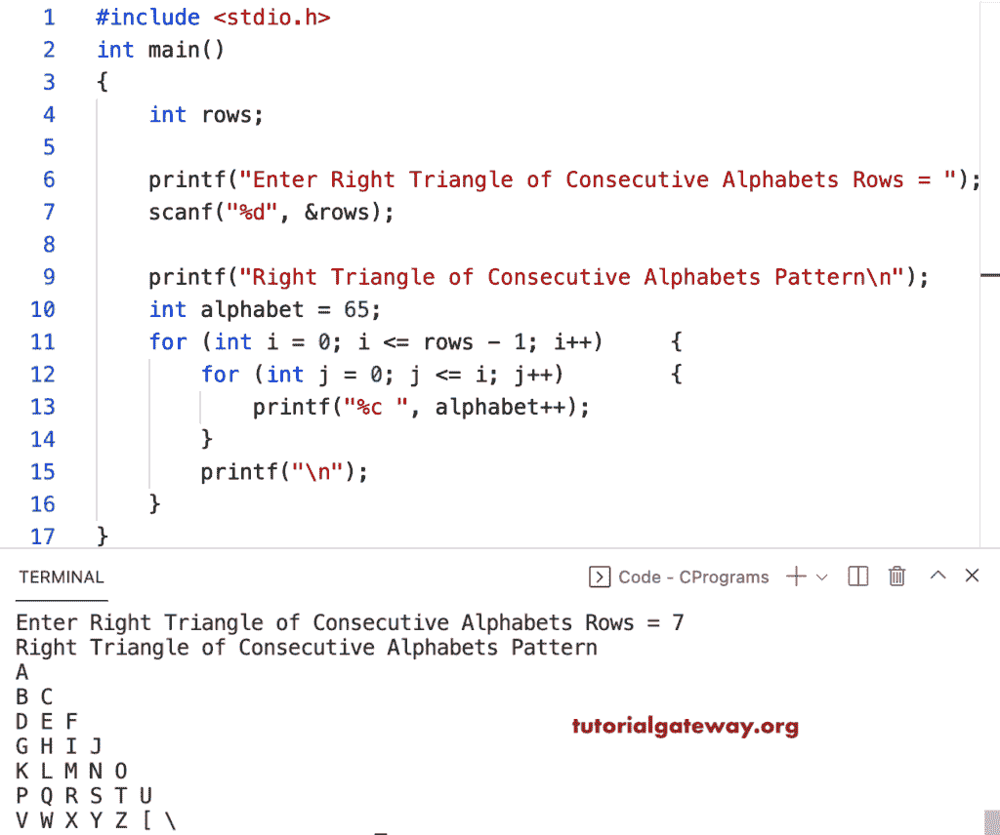

# C 程序：打印连续字母图案直角三角形

> 原文：<https://www.tutorialgateway.org/c-program-to-print-right-triangle-of-consecutive-alphabets-pattern/>

写一个 C 程序来打印用于循环的连续字母模式的直角三角形。

```c
#include <stdio.h>

int main()
{
	int rows;

	printf("Enter Right Triangle of Consecutive Alphabets Rows = ");
	scanf("%d", &rows);

	printf("Right Triangle of Consecutive Alphabets Pattern\n");
	int alphabet = 65;

	for (int i = 0; i <= rows - 1; i++)
	{
		for (int j = 0; j <= i; j++)
		{
			printf("%c ", alphabet++);
		}
		printf("\n");
	}
}
```



这个 C 程序使用 while 循环打印连续字母的直角三角形模式。

```c
#include <stdio.h>

int main()
{
	int i, j, rows, alphabet;

	printf("Enter Right Triangle of Consecutive Alphabets Rows = ");
	scanf("%d", &rows);

	printf("Right Triangle of Consecutive Alphabets Pattern\n");
	alphabet = 65;

	i = 0;

	while (i <= rows - 1)
	{
		j = 0;

		while (j <= i)
		{
			printf("%c ", alphabet++);
			j++;
		}
		printf("\n");
		i++;
	}
}
```

```c
Enter Right Triangle of Consecutive Alphabets Rows = 9
Right Triangle of Consecutive Alphabets Pattern
A 
B C 
D E F 
G H I J 
K L M N O 
P Q R S T U 
V W X Y Z [ \ 
] ^ _ ` a b c d 
e f g h i j k l m 
```

这个 [C 示例](https://www.tutorialgateway.org/c-programming-examples/)使用 do while 循环打印连续列字母模式的直角三角形。

```c
#include <stdio.h>

int main()
{
	int i, j, rows, alphabet;

	printf("Enter Right Triangle of Consecutive Alphabets Rows = ");
	scanf("%d", &rows);

	printf("Right Triangle of Consecutive Alphabets Pattern\n");

	alphabet = 65;

	i = 0;

	do
	{
		j = 0;

		do
		{
			printf("%c ", alphabet++);

		} while (++j <= i);

		printf("\n");

	} while (++i <= rows - 1);
}
```

```c
Enter Right Triangle of Consecutive Alphabets Rows = 10
Right Triangle of Consecutive Alphabets Pattern
A 
B C 
D E F 
G H I J 
K L M N O 
P Q R S T U 
V W X Y Z [ \ 
] ^ _ ` a b c d 
e f g h i j k l m 
n o p q r s t u v w
```