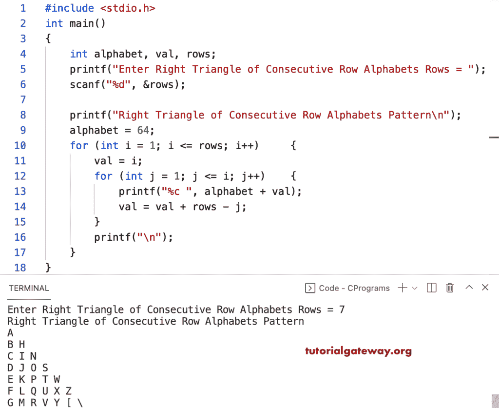

# C 程序：打印连续行字母直角三角形图案

> 原文：<https://www.tutorialgateway.org/c-program-to-print-right-triangle-of-consecutive-row-alphabets-pattern/>

写一个 C 程序打印连续行字母的直角三角形模式用于循环。

```c
#include <stdio.h>

int main()
{
	int alphabet, val, rows;

	printf("Enter Right Triangle of Consecutive Row Alphabets Rows = ");
	scanf("%d", &rows);

	printf("Right Triangle of Consecutive Row Alphabets Pattern\n");
	alphabet = 64;

	for (int i = 1; i <= rows; i++)
	{
		val = i;
		for (int j = 1; j <= i; j++)
		{
			printf("%c ", alphabet + val);
			val = val + rows - j;
		}
		printf("\n");
	}
}
```



这个 C 程序使用 while 循环显示连续字母的直角三角形。

```c
#include <stdio.h>

int main()
{
	int i, j, alphabet, val, rows;

	printf("Enter Right Triangle of Consecutive Row Alphabets Rows = ");
	scanf("%d", &rows);

	printf("Right Triangle of Consecutive Row Alphabets Pattern\n");
	alphabet = 64;
	i = 1;

	while (i <= rows)
	{
		val = i;
		j = 1;

		while (j <= i)
		{
			printf("%c ", alphabet + val);
			val = val + rows - j;
			j++;
		}
		printf("\n");
		i++;
	}
}
```

```c
Enter Right Triangle of Consecutive Row Alphabets Rows = 9
Right Triangle of Consecutive Row Alphabets Pattern
A 
B J 
C K R 
D L S Y 
E M T Z _ 
F N U [ ` d 
G O V \ a e h 
H P W ] b f i k 
I Q X ^ c g j l m 
```

这个 [C 示例](https://www.tutorialgateway.org/c-programming-examples/)代码使用 do while 循环打印字母的连续行图案的直角三角形。

```c
#include <stdio.h>

int main()
{
	int i, j, alphabet, val, rows;

	printf("Enter Right Triangle of Consecutive Row Alphabets Rows = ");
	scanf("%d", &rows);

	printf("Right Triangle of Consecutive Row Alphabets Pattern\n");
	alphabet = 64;
	i = 1;

	do
	{
		val = i;
		j = 1;

		do
		{
			printf("%c ", alphabet + val);
			val = val + rows - j;

		} while (++j <= i);
		printf("\n");

	} while (++i <= rows);
}
```

```c
Enter Right Triangle of Consecutive Row Alphabets Rows = 10
Right Triangle of Consecutive Row Alphabets Pattern
A 
B K 
C L T 
D M U \ 
E N V ] c 
F O W ^ d i 
G P X _ e j n 
H Q Y ` f k o r 
I R Z a g l p s u 
J S [ b h m q t v w 
```