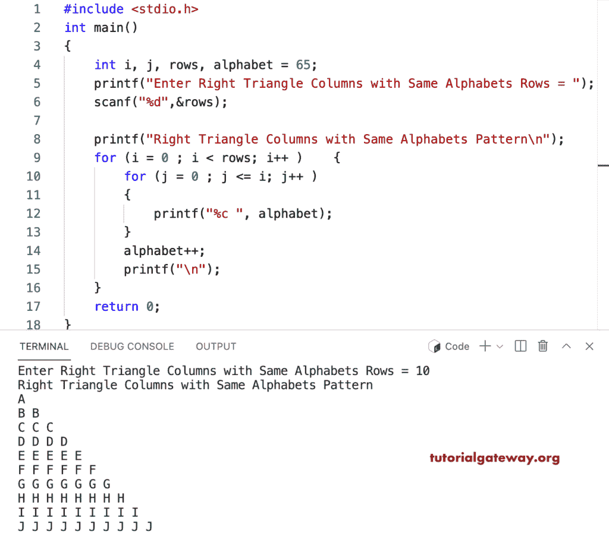

# C 程序：在每个直角三角形列中打印相同字母

> 原文：<https://www.tutorialgateway.org/c-program-to-print-same-alphabet-in-each-right-triangle-column/>

写一个 C 程序，用 for 循环在每个直角三角形列中打印相同的字母。或者，编写一个 C 程序，使用 for 循环打印每个直角三角形列中重复的字符或相同的字母。

```c
#include <stdio.h>

int main()
{
    int i, j, rows, alphabet = 65;

    printf("Enter Right Triangle Columns with Same Alphabets Rows = ");
    scanf("%d",&rows);

    printf("Right Triangle Columns with Same Alphabets Pattern\n"); 

	for (i = 0 ; i < rows; i++ ) 
	{
		for (j = 0 ; j <= i; j++ ) 	
		{
			printf("%c ", alphabet);
		}
		alphabet++;
		printf("\n");
	}

    return 0;
}
```



这个 [C](https://www.tutorialgateway.org/c-programming-examples/) 字母图案示例使用 while 循环显示每列中重复字符的直角三角形模式。

```c
#include <stdio.h>

int main()
{
    int i = 0, j, rows, alphabet = 65;

    printf("Enter Right Triangle Columns with Same Alphabets Rows = ");
    scanf("%d",&rows);

    printf("\nRight Triangle Columns with Same Alphabets Pattern\n"); 

	while ( i < rows ) 
	{
		j = 0 ;
		while( j <= i) 	
		{
			printf("%c ", alphabet);
			j++ ;
		}
		alphabet++;
		printf("\n");
		i++;
	}

    return 0;
}
```

```c
Enter Right Triangle Columns with Same Alphabets Rows = 12

Right Triangle Columns with Same Alphabets Pattern
A 
B B 
C C C 
D D D D 
E E E E E 
F F F F F F 
G G G G G G G 
H H H H H H H H 
I I I I I I I I I 
J J J J J J J J J J 
K K K K K K K K K K K 
L L L L L L L L L L L L 
```

使用 do while 循环在每个直角三角形行-列中打印相同字母的 c 程序。

```c
#include <stdio.h>

int main()
{
    int i = 0, j, rows, alphabet = 65;

    printf("Enter Right Triangle Columns with Same Alphabets Rows = ");
    scanf("%d",&rows);

    printf("\nRight Triangle Columns with Same Alphabets Pattern\n"); 

	do 
	{
		j = 0 ;
		do	
		{
			printf("%c ", alphabet);

		} while( ++j <= i);
		alphabet++;
		printf("\n");

	} while ( ++i < rows );

    return 0;
}
```

```c
Enter Right Triangle Columns with Same Alphabets Rows = 15

Right Triangle Columns with Same Alphabets Pattern
A 
B B 
C C C 
D D D D 
E E E E E 
F F F F F F 
G G G G G G G 
H H H H H H H H 
I I I I I I I I I 
J J J J J J J J J J 
K K K K K K K K K K K 
L L L L L L L L L L L L 
M M M M M M M M M M M M M 
N N N N N N N N N N N N N N 
O O O O O O O O O O O O O O O 
```