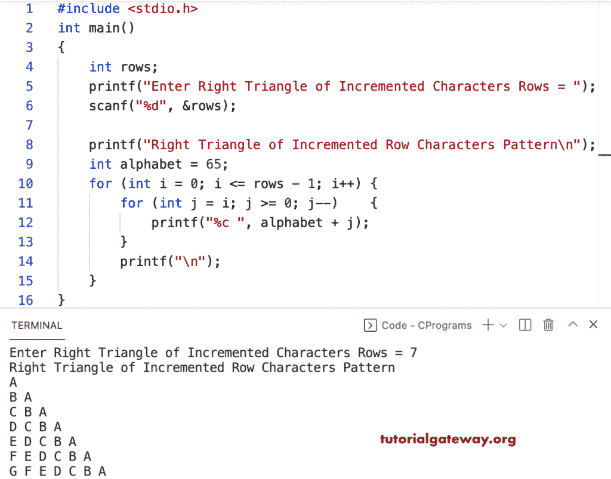

# C 程序：打印递增字母的直角三角形图案

> 原文：<https://www.tutorialgateway.org/c-program-to-print-right-triangle-of-incremental-alphabets-pattern/>

写一个 C 程序打印字母的增量图案的直角三角形用于循环。

```c
#include <stdio.h>

int main()
{
	int rows;

	printf("Enter Right Triangle of Incremented Characters Rows = ");
	scanf("%d", &rows);

	printf("Right Triangle of Incremented Row Characters Pattern\n");
	int alphabet = 65;

	for (int i = 0; i <= rows - 1; i++)
	{
		for (int j = i; j >= 0; j--)
		{
			printf("%c ", alphabet + j);
		}
		printf("\n");
	}
}
```



这个 C 程序使用 while 循环打印递增字母或升序的直角三角形图案。

```c
#include <stdio.h>

int main()
{
	int rows, i, j, alphabet;

	printf("Enter Right Triangle of Incremented Characters Rows = ");
	scanf("%d", &rows);

	printf("Right Triangle of Incremented Row Characters Pattern\n");

	alphabet = 65;

	i = 0;
	while (i <= rows - 1)
	{
		j = i;
		while (j >= 0)
		{
			printf("%c ", alphabet + j);
			j--;
		}
		printf("\n");
		i++;
	}
}
```

```c
Enter Right Triangle of Incremented Characters Rows = 14
Right Triangle of Incremented Row Characters Pattern
A 
B A 
C B A 
D C B A 
E D C B A 
F E D C B A 
G F E D C B A 
H G F E D C B A 
I H G F E D C B A 
J I H G F E D C B A 
K J I H G F E D C B A 
L K J I H G F E D C B A 
M L K J I H G F E D C B A 
```

这个 [C 示例](https://www.tutorialgateway.org/c-programming-examples/)使用 do while 循环以升序模式打印字母的倾斜三角形。

```c
#include <stdio.h>

int main()
{
	int rows, i, j, alphabet;

	printf("Enter Right Triangle of Incremented Characters Rows = ");
	scanf("%d", &rows);

	printf("Right Triangle of Incremented Row Characters Pattern\n");

	alphabet = 65;

	i = 0;
	do
	{
		j = i;
		do
		{
			printf("%c ", alphabet + j);

		} while (--j >= 0);

		printf("\n");

	} while (++i <= rows - 1);
}
```

```c
Enter Right Triangle of Incremented Characters Rows = 16
Right Triangle of Incremented Row Characters Pattern
A 
B A 
C B A 
D C B A 
E D C B A 
F E D C B A 
G F E D C B A 
H G F E D C B A 
I H G F E D C B A 
J I H G F E D C B A 
K J I H G F E D C B A 
L K J I H G F E D C B A 
M L K J I H G F E D C B A 
N M L K J I H G F E D C B A 
O N M L K J I H G F E D C B A 
P O N M L K J I H G F E D C B A 
```