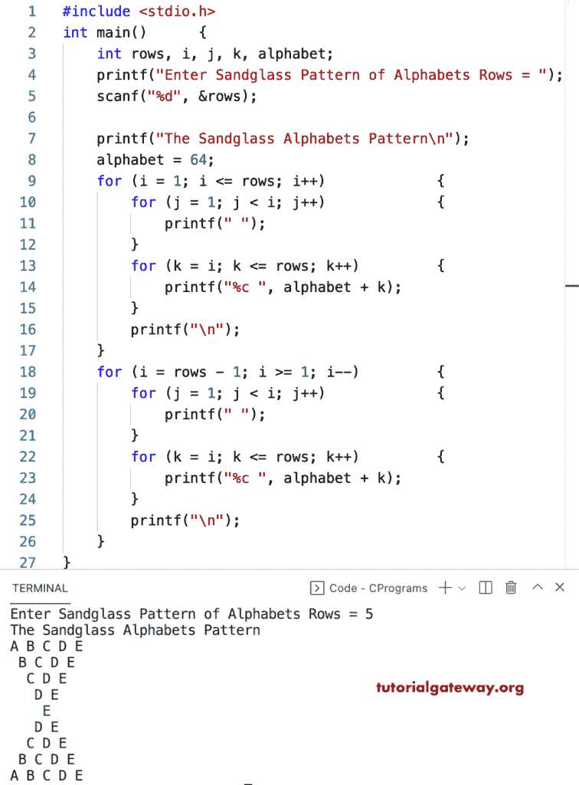

# C 程序：打印沙漏字母图案

> 原文：<https://www.tutorialgateway.org/c-program-to-print-sandglass-alphabets-pattern/>

写一个 C 程序打印沙漏字母图案用于循环。

```c
#include <stdio.h>

int main()
{
	int rows, i, j, k, alphabet;

	printf("Enter Sandglass Pattern of Alphabets Rows = ");
	scanf("%d", &rows);

	printf("The Sandglass Alphabets Pattern\n");
	alphabet = 64;

	for (i = 1; i <= rows; i++)
	{
		for (j = 1; j < i; j++)
		{
			printf(" ");
		}
		for (k = i; k <= rows; k++)
		{
			printf("%c ", alphabet + k);
		}
		printf("\n");
	}

	for (i = rows - 1; i >= 1; i--)
	{
		for (j = 1; j < i; j++)
		{
			printf(" ");
		}
		for (k = i; k <= rows; k++)
		{
			printf("%c ", alphabet + k);
		}
		printf("\n");
	}
}
```



这个 C 程序使用 while 循环显示字母的沙漏模式。

```c
#include <stdio.h>

int main()
{
	int rows, i, j, k, alphabet;

	printf("Enter Sandglass Pattern of Alphabets Rows = ");
	scanf("%d", &rows);

	printf("Printing Sandglass Alphabets Pattern\n");
	alphabet = 64;
	i = 1;

	while (i <= rows)
	{
		j = 1;
		while (j < i)
		{
			printf(" ");
			j++;
		}

		k = i;
		while (k <= rows)
		{
			printf("%c ", alphabet + k);
			k++;
		}
		printf("\n");
		i++;
	}

	i = rows - 1;
	while (i >= 1)
	{
		j = 1;
		while (j < i)
		{
			printf(" ");
			j++;
		}

		k = i;
		while (k <= rows)
		{
			printf("%c ", alphabet + k);
			k++;
		}
		printf("\n");
		i--;
	}
}
```

```c
Enter Sandglass Pattern of Alphabets Rows = 11
Printing Sandglass Alphabets Pattern
A B C D E F G H I J K 
 B C D E F G H I J K 
  C D E F G H I J K 
   D E F G H I J K 
    E F G H I J K 
     F G H I J K 
      G H I J K 
       H I J K 
        I J K 
         J K 
          K 
         J K 
        I J K 
       H I J K 
      G H I J K 
     F G H I J K 
    E F G H I J K 
   D E F G H I J K 
  C D E F G H I J K 
 B C D E F G H I J K 
A B C D E F G H I J K 
```

这个 [C 示例](https://www.tutorialgateway.org/c-programming-examples/)使用 do while 循环打印字母的沙漏图案。

```c
#include <stdio.h>

int main()
{
	int rows, i, j, k, alphabet;

	printf("Enter Sandglass Pattern of Alphabets Rows = ");
	scanf("%d", &rows);

	printf("The Sandglass Alphabets Pattern\n");
	alphabet = 64;
	i = 1;

	do
	{
		j = 1;
		do
		{
			printf(" ");

		} while (j++ < i);

		k = i;
		do
		{
			printf("%c ", alphabet + k);

		} while (++k <= rows);
		printf("\n");

	} while (++i <= rows);

	i = rows - 1;
	do
	{
		j = 1;
		do
		{
			printf(" ");

		} while (j++ < i);

		k = i;
		do
		{
			printf("%c ", alphabet + k);

		} while (++k <= rows);
		printf("\n");

	} while (--i >= 1);
}
```

```c
Enter Sandglass Pattern of Alphabets Rows = 13
The Sandglass Alphabets Pattern
 A B C D E F G H I J K L M 
  B C D E F G H I J K L M 
   C D E F G H I J K L M 
    D E F G H I J K L M 
     E F G H I J K L M 
      F G H I J K L M 
       G H I J K L M 
        H I J K L M 
         I J K L M 
          J K L M 
           K L M 
            L M 
             M 
            L M 
           K L M 
          J K L M 
         I J K L M 
        H I J K L M 
       G H I J K L M 
      F G H I J K L M 
     E F G H I J K L M 
    D E F G H I J K L M 
   C D E F G H I J K L M 
  B C D E F G H I J K L M 
 A B C D E F G H I J K L M 
```