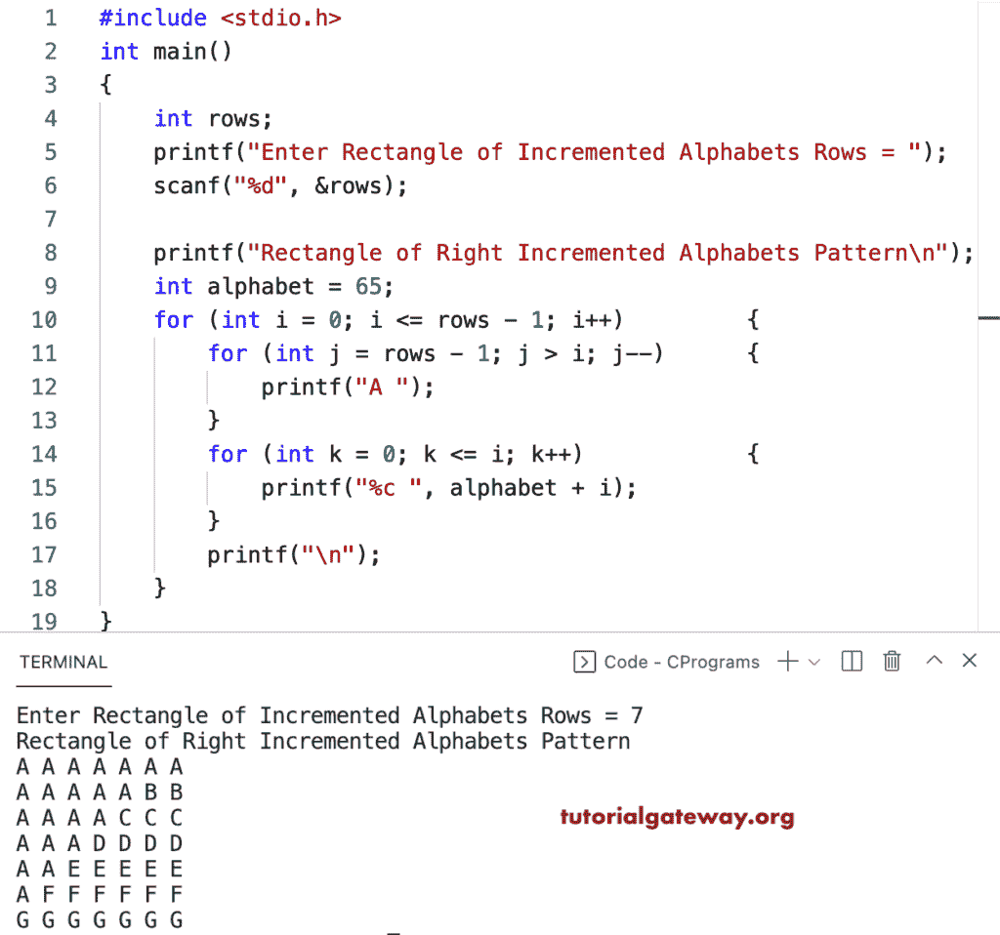

# C 程序：打印字母的直角增量图案方块

> 原文：<https://www.tutorialgateway.org/c-program-to-print-square-of-right-increment-alphabets-pattern/>

写一个 C 程序打印字母的用于循环的直角增量图案的方块。

```c
#include <stdio.h>

int main()
{
	int rows;

	printf("Enter Rectangle of Incremented Alphabets Rows = ");
	scanf("%d", &rows);

	printf("Rectangle of Right Incremented Alphabets Pattern\n");
	int alphabet = 65;

	for (int i = 0; i <= rows - 1; i++)
	{
		for (int j = rows - 1; j > i; j--)
		{
			printf("A ");
		}
		for (int k = 0; k <= i; k++)
		{
			printf("%c ", alphabet + i);
		}
		printf("\n");
	}
}
```



这个 [C 程序](https://www.tutorialgateway.org/c-programming-examples/)使用 while 循环从右手边打印增量字母的正方形模式。

```c
#include <stdio.h>

int main()
{
	int i, j, k, alphabet, rows;

	printf("Enter Square of Incremented Alphabets Rows = ");
	scanf("%d", &rows);

	printf("Square of Right Incremented Alphabets Pattern\n");
	alphabet = 65;
	i = 0;

	while (i <= rows - 1)
	{
		j = rows - 1;
		while (j > i)
		{
			printf("A ");
			j--;
		}

		k = 0;
		while (k <= i)
		{
			printf("%c ", alphabet + i);
			k++;
		}
		printf("\n");
		i++;
	}
}
```

```c
Enter Square of Incremented Alphabets Rows = 16
Square of Right Incremented Alphabets Pattern
A A A A A A A A A A A A A A A A 
A A A A A A A A A A A A A A B B 
A A A A A A A A A A A A A C C C 
A A A A A A A A A A A A D D D D 
A A A A A A A A A A A E E E E E 
A A A A A A A A A A F F F F F F 
A A A A A A A A A G G G G G G G 
A A A A A A A A H H H H H H H H 
A A A A A A A I I I I I I I I I 
A A A A A A J J J J J J J J J J 
A A A A A K K K K K K K K K K K 
A A A A L L L L L L L L L L L L 
A A A M M M M M M M M M M M M M 
A A N N N N N N N N N N N N N N 
A O O O O O O O O O O O O O O O 
P P P P P P P P P P P P P P P P 
```