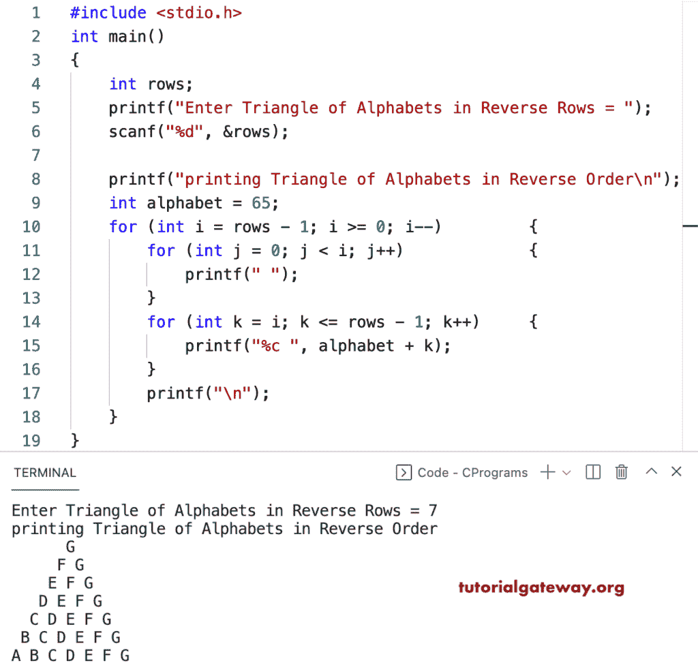

# C 程序：打印倒排字母三角形

> 原文：<https://www.tutorialgateway.org/c-program-to-print-triangle-of-alphabets-in-reverse-pattern/>

写一个 C 程序，用循环打印倒三角字母。

```c
#include <stdio.h>

int main()
{
	int rows;

	printf("Enter Triangle of Alphabets in Reverse Rows = ");
	scanf("%d", &rows);

	printf("printing Triangle of Alphabets in Reverse Order\n");

	int alphabet = 65;

	for (int i = rows - 1; i >= 0; i--)
	{
		for (int j = 0; j < i; j++)
		{
			printf(" ");
		}
		for (int k = i; k <= rows - 1; k++)
		{
			printf("%c ", alphabet + k);
		}
		printf("\n");
	}
}
```



这个 C 模式示例使用 while 循环以降序或逆序打印字母三角形。

```c
#include <stdio.h>

int main()
{
	int rows, i, j, k, alphabet;

	printf("Enter Triangle of Alphabets in Reverse Rows = ");
	scanf("%d", &rows);

	printf("printing Triangle of Alphabets in Reverse Order\n");

	alphabet = 65;

	i = rows - 1;
	while (i >= 0)
	{

		j = 0;
		while (j < i)
		{
			printf(" ");
			j++;
		}

		k = i;
		while (k <= rows - 1)
		{
			printf("%c ", alphabet + k);
			k++;
		}
		printf("\n");
		i--;
	}
}
```

```c
Enter Triangle of Alphabets in Reverse Rows = 17
printing Triangle of Alphabets in Reverse Order
                Q 
               P Q 
              O P Q 
             N O P Q 
            M N O P Q 
           L M N O P Q 
          K L M N O P Q 
         J K L M N O P Q 
        I J K L M N O P Q 
       H I J K L M N O P Q 
      G H I J K L M N O P Q 
     F G H I J K L M N O P Q 
    E F G H I J K L M N O P Q 
   D E F G H I J K L M N O P Q 
  C D E F G H I J K L M N O P Q 
 B C D E F G H I J K L M N O P Q 
A B C D E F G H I J K L M N O P Q
```

这个 [C 示例](https://www.tutorialgateway.org/c-programming-examples/)使用 do while 循环以相反的顺序打印字母的三角形模式。

```c
#include <stdio.h>

int main()
{
	int rows, i, j, k, alphabet;

	printf("Enter Triangle of Alphabets in Reverse Rows = ");
	scanf("%d", &rows);

	printf("printing Triangle of Alphabets in Reverse Order\n");

	alphabet = 65;

	i = rows - 1;
	do
	{

		j = 0;
		do
		{
			printf(" ");

		} while (j++ < i);

		k = i;
		do
		{
			printf("%c ", alphabet + k);

		} while (++k <= rows - 1);

		printf("\n");

	} while (--i >= 0);
}
```

```c
Enter Triangle of Alphabets in Reverse Rows = 14
printing Triangle of Alphabets in Reverse Order
              N 
             M N 
            L M N 
           K L M N 
          J K L M N 
         I J K L M N 
        H I J K L M N 
       G H I J K L M N 
      F G H I J K L M N 
     E F G H I J K L M N 
    D E F G H I J K L M N 
   C D E F G H I J K L M N 
  B C D E F G H I J K L M N 
 A B C D E F G H I J K L M N 
```