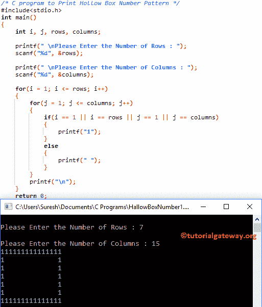

# C 程序：打印空心盒数字图案

> 原文：<https://www.tutorialgateway.org/c-program-to-print-hollow-box-number-pattern/>

如何用实例编写 C 程序打印空心盒数字图案？。对于这个空心盒数字模式，我们将使用 For 循环和 While 循环。

## 打印空心盒数字图案的 c 程序示例 1

该程序允许用户输入行和列值。在这里，我们将打印 1 的空心盒数字模式。我的意思是，它将打印第一行、最后一行、第一列和最后一列为 1，其余元素为空。

首先，我们使用[嵌套循环](https://www.tutorialgateway.org/for-loop-in-c-programming/)来迭代每一行和每一列元素。接下来，我们使用嵌套 [For 循环](https://www.tutorialgateway.org/for-loop-in-c-programming/)中的 [If 语句](https://www.tutorialgateway.org/if-statement-in-c/)来检查它是第一行、第一列、最后一行还是最后一列。

```c
/* C program to Print Hollow Box Number Pattern */

#include<stdio.h>

int main()
{
    int i, j, rows, columns;

    printf(" \nPlease Enter the Number of Rows : ");
    scanf("%d", &rows);

    printf(" \nPlease Enter the Number of Columns : ");
    scanf("%d", &columns);

    for(i = 1; i <= rows; i++)
    {
    	for(j = 1; j <= columns; j++)
		{
			if(i == 1 || i == rows || j == 1 || j == columns)
			{
				printf("1");
			}
			else
			{
				printf(" ");
			}       	
        }
        printf("\n");
    }
    return 0;
}
```



## 打印空心盒数字图案的程序示例 2

这个空心盒号 C 程序和第一个例子一样，但是这次我们用的是 [While Loop](https://www.tutorialgateway.org/while-loop-in-c/) (只是用 While Loop 代替 [C 编程](https://www.tutorialgateway.org/c-programming/) For Loop)。

```c
/* C program to Print Hollow Box Number Pattern */

#include<stdio.h>

int main()
{
    int i, j, rows, columns;
    i = 1;

    printf(" \nPlease Enter the Number of Rows : ");
    scanf("%d", &rows);

    printf(" \nPlease Enter the Number of Columns : ");
    scanf("%d", &columns);

    while(i <= rows)
    {
    	j = 1;
    	while(j <= columns)
		{
			if(i == 1 || i == rows || j == 1 || j == columns)
			{
				printf("1");
			}
			else
			{
				printf(" ");
			}  
			j++;     	
        }
        i++;
        printf("\n");
    }
    return 0;
}
```

```c
Please Enter the Number of Rows : 10

Please Enter the Number of Columns : 22
1111111111111111111111
1                    1
1                    1
1                    1
1                    1
1                    1
1                    1
1                    1
1                    1
1111111111111111111111
```

## 打印空心盒数字图案的程序示例 3

这个[程序](https://www.tutorialgateway.org/c-programming-examples/)和上面的例子一样，只是我们改了打印号。我的意思是，这个程序将打印 0 的空心盒数字模式。因此，编译器将在第一行、最后一行、第一列和最后一列打印 0。

```c
/* C program to Print Hollow Box Number Pattern */

#include<stdio.h>

int main()
{
    int i, j, rows, columns;

    printf(" \nPlease Enter the Number of Rows : ");
    scanf("%d", &rows);

    printf(" \nPlease Enter the Number of Columns : ");
    scanf("%d", &columns);

    for(i = 1; i <= rows; i++)
    {
    	for(j = 1; j <= columns; j++)
		{
			if(i == 1 || i == rows || j == 1 || j == columns)
			{
				printf("0");
			}
			else
			{
				printf(" ");
			}       	
        }
        printf("\n");
    }
    return 0;
}
```

```c
Please Enter the Number of Rows : 12

Please Enter the Number of Columns : 24
000000000000000000000000
0                      0
0                      0
0                      0
0                      0
0                      0
0                      0
0                      0
0                      0
0                      0
0                      0
000000000000000000000000
```