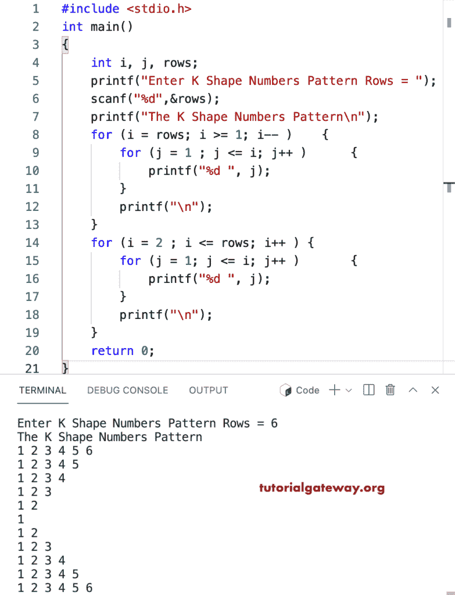

# C 程序：打印 K 字形数字图案

> 原文：<https://www.tutorialgateway.org/c-program-to-print-k-shape-number-pattern/>

写一个 C 程序打印用于循环的 K 字形数字图案。

```c
#include <stdio.h>

int main()
{
    int i, j, rows;

    printf("Enter K Shape Numbers Pattern Rows = ");
    scanf("%d",&rows);

    printf("\nThe K Shape Numbers Pattern\n"); 

    for (i = rows; i >= 1; i-- ) 
	{
		for (j = 1 ; j <= i; j++ ) 	
		{
			printf("%d ", j);
		}
		printf("\n");
	}

	for (i = 2 ; i <= rows; i++ ) 
	{
		for (j = 1; j <= i; j++ ) 	
		{
			printf("%d ", j);
		}
		printf("\n");
	}
    return 0;
}
```



这个 [C 示例](https://www.tutorialgateway.org/c-programming-examples/)使用 while 循环打印数字或整数的 K 形模式。

```c
#include <stdio.h>

int main()
{
    int i, j, rows;

    printf("Enter K Shape Numbers Pattern Rows = ");
    scanf("%d",&rows);

    printf("\nThe K Shape Numbers Pattern\n"); 
    i = rows;

    while( i >= 1 ) 
	{
		j = 1 ;
		while( j <= i ) 	
		{
			printf("%d ", j);
			j++;
		}
		printf("\n");
		i--;
	}

	i = 2 ;
	while ( i <= rows ) 
	{
		j = 1;
		while ( j <= i) 	
		{
			printf("%d ", j);
			j++;
		}
		printf("\n");
		i++;
	}
    return 0;
}
```

```c
Enter K Shape Numbers Pattern Rows = 11

The K Shape Numbers Pattern
1 2 3 4 5 6 7 8 9 10 11 
1 2 3 4 5 6 7 8 9 10 
1 2 3 4 5 6 7 8 9 
1 2 3 4 5 6 7 8 
1 2 3 4 5 6 7 
1 2 3 4 5 6 
1 2 3 4 5 
1 2 3 4 
1 2 3 
1 2 
1 
1 2 
1 2 3 
1 2 3 4 
1 2 3 4 5 
1 2 3 4 5 6 
1 2 3 4 5 6 7 
1 2 3 4 5 6 7 8 
1 2 3 4 5 6 7 8 9 
1 2 3 4 5 6 7 8 9 10 
1 2 3 4 5 6 7 8 9 10 11
```

用一个边做边循环显示一个 K 形数字图案的程序。

```c
#include <stdio.h>

int main()
{
    int i, j, rows;

    printf("Enter K Shape Numbers Pattern Rows = ");
    scanf("%d",&rows);

    printf("\nThe K Shape Numbers Pattern\n"); 
    i = rows;

    do
	{
		j = 1 ;
		do 	
		{
			printf("%d ", j);

		} while( ++j <= i );
		printf("\n");

	} while( --i >= 1 );

	i = 2 ;
	do 
	{
		j = 1;
		do 	
		{
			printf("%d ", j);

		} while ( ++j <= i);
		printf("\n");

	} while ( ++i <= rows );
    return 0;
}
```

```c
Enter K Shape Numbers Pattern Rows = 16

The K Shape Numbers Pattern
1 2 3 4 5 6 7 8 9 10 11 12 13 14 15 16 
1 2 3 4 5 6 7 8 9 10 11 12 13 14 15 
1 2 3 4 5 6 7 8 9 10 11 12 13 14 
1 2 3 4 5 6 7 8 9 10 11 12 13 
1 2 3 4 5 6 7 8 9 10 11 12 
1 2 3 4 5 6 7 8 9 10 11 
1 2 3 4 5 6 7 8 9 10 
1 2 3 4 5 6 7 8 9 
1 2 3 4 5 6 7 8 
1 2 3 4 5 6 7 
1 2 3 4 5 6 
1 2 3 4 5 
1 2 3 4 
1 2 3 
1 2 
1 
1 2 
1 2 3 
1 2 3 4 
1 2 3 4 5 
1 2 3 4 5 6 
1 2 3 4 5 6 7 
1 2 3 4 5 6 7 8 
1 2 3 4 5 6 7 8 9 
1 2 3 4 5 6 7 8 9 10 
1 2 3 4 5 6 7 8 9 10 11 
1 2 3 4 5 6 7 8 9 10 11 12 
1 2 3 4 5 6 7 8 9 10 11 12 13 
1 2 3 4 5 6 7 8 9 10 11 12 13 14 
1 2 3 4 5 6 7 8 9 10 11 12 13 14 15 
1 2 3 4 5 6 7 8 9 10 11 12 13 14 15 16
```