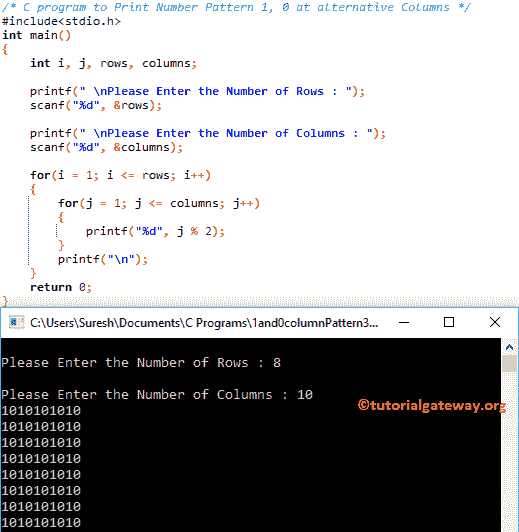

# C 程序：打印交替列中的 1 和 0

> 原文：<https://www.tutorialgateway.org/c-program-to-print-1-and-0-in-alternative-columns/>

如何用实例编写 C 程序在交替列中打印 1 和 0？对于这个数字模式，我们将使用 For 循环和 While 循环。

## C 程序打印交替列中的 1 和 0 示例 1

该程序允许用户输入行数和列值。这里，我们将在交替的列中打印 1 和 0。我的意思是，1 在奇数列，0 在偶数列。

首先，我们使用[嵌套循环](https://www.tutorialgateway.org/for-loop-in-c-programming/)来迭代每一行和每列元素。接下来，我们使用嵌套 [For 循环](https://www.tutorialgateway.org/for-loop-in-c-programming/)中的 [If 语句](https://www.tutorialgateway.org/if-statement-in-c/)来检查列号是[偶数还是奇数](https://www.tutorialgateway.org/c-program-for-even-or-odd/)

```c
/* C program to Print Number Pattern 1, 0 at Alternative Columns */

#include<stdio.h>

int main()
{
    int i, j, rows, columns;

    printf(" \nPlease Enter the Number of Rows : ");
    scanf("%d", &rows);

    printf(" \nPlease Enter the Number of Columns : ");
    scanf("%d", &columns);

    for(i = 1; i <= rows; i++)
    {
    	for(j = 1; j <= columns; j++)
		{
			if(j % 2 == 0)
			{
				printf("0");
			}
			else
			{
				printf("1");
			}       	
        }
        printf("\n");
    }
    return 0;
}
```

```c
Please Enter the Number of Rows : 5

Please Enter the Number of Columns : 8
10101010
10101010
10101010
10101010
10101010
```

## 程序打印交替列中的 1 和 0 示例 2

这个程序与第一个例子相同，但是这次我们使用的是 While 循环(只是用 While 循环替换 For 循环)。我建议你参考 [While Loop](https://www.tutorialgateway.org/while-loop-in-c/) 来理解循环迭代。

```c
/* C program to Print Number Pattern 1, 0 at Alternative Columns */

#include<stdio.h>

int main()
{
    int i, j, rows, columns;
    i = 1;

    printf(" \nPlease Enter the Number of Rows : ");
    scanf("%d", &rows);

    printf(" \nPlease Enter the Number of Columns : ");
    scanf("%d", &columns);

    while(i <= rows)
    {
    	j = 1;
    	while(j <= columns)
		{
			if(j % 2 == 0)
			{
				printf("0");
			}
			else
			{
				printf("1");
			}
			j++;       	
        }
        i++;
        printf("\n");
    }
    return 0;
}
```

```c
Please Enter the Number of Rows : 8

Please Enter the Number of Columns : 14
10101010101010
10101010101010
10101010101010
10101010101010
10101010101010
10101010101010
10101010101010
10101010101010
```

## 程序打印交替列中的 1 和 0 示例 3

这个[程序](https://www.tutorialgateway.org/c-programming-examples/)与第一个例子相同，但是这次我们直接在 printf 语句中使用 i % 2。这样，您就可以避免使用 If 语句。

```c
/* C program to Print Number Pattern 1, 0 at alternative Columns */

#include<stdio.h>

int main()
{
    int i, j, rows, columns;

    printf(" \nPlease Enter the Number of Rows : ");
    scanf("%d", &rows);

    printf(" \nPlease Enter the Number of Columns : ");
    scanf("%d", &columns);

    for(i = 1; i <= rows; i++)
    {
    	for(j = 1; j <= columns; j++)
		{
			printf("%d", j % 2);    	
        }
        printf("\n");
    }
    return 0;
}
```



## 程序打印交替列中的 1 和 0 示例 4

这个用于 1 和 0 交替列的 [C 程序](https://www.tutorialgateway.org/c-programming-examples/)与上面的例子相同，但是我们改变了打印。我的意思是，这个程序会在奇数行打印 0，在偶数行打印 1。

```c
/* C program to Print Number Pattern 1, 0 at Alternative Columns */

#include<stdio.h>

int main()
{
    int i, j, rows, columns;

    printf(" \nPlease Enter the Number of Rows : ");
    scanf("%d", &rows);

    printf(" \nPlease Enter the Number of Columns : ");
    scanf("%d", &columns);

    for(i = 1; i <= rows; i++)
    {
    	for(j = 1; j <= columns; j++)
		{
			if(j % 2 == 0)
			{
				printf("1");
			}
			else
			{
				printf("0");
			}       	
        }
        printf("\n");
    }
    return 0;
}
```

```c
Please Enter the Number of Rows : 10

Please Enter the Number of Columns : 25
0101010101010101010101010
0101010101010101010101010
0101010101010101010101010
0101010101010101010101010
0101010101010101010101010
0101010101010101010101010
0101010101010101010101010
0101010101010101010101010
0101010101010101010101010
0101010101010101010101010
```