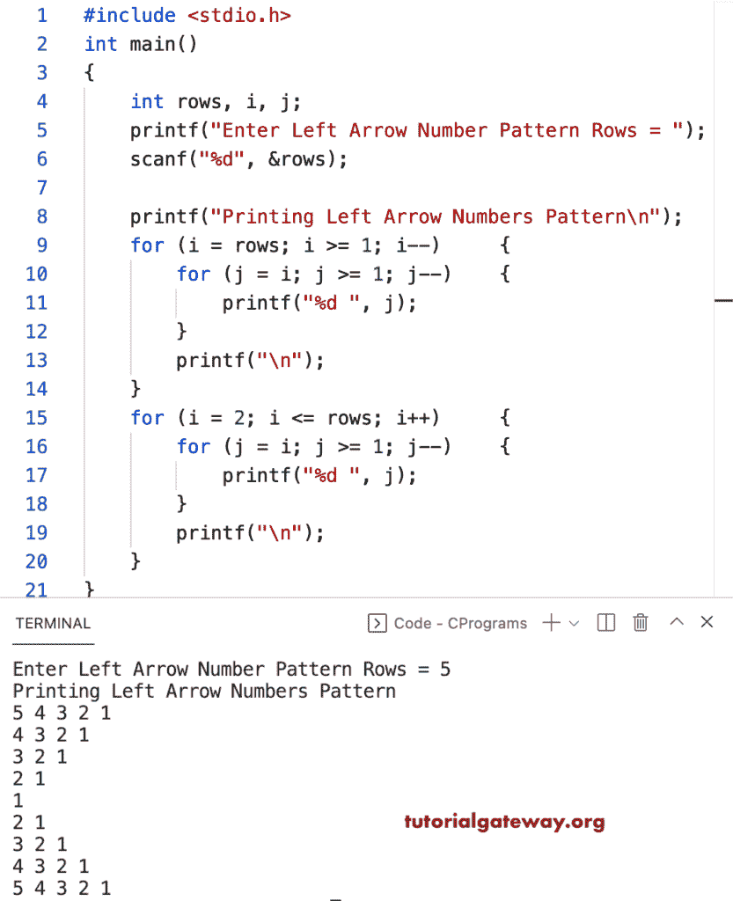

# C 程序：打印数字的左箭头图案

> 原文：<https://www.tutorialgateway.org/c-program-to-print-left-arrow-numbers-pattern/>

写一个 C 程序来打印用于循环的左箭头数字图案。

```c
#include <stdio.h>

int main()
{
	int rows, i, j;

	printf("Enter Left Arrow Number Pattern Rows = ");
	scanf("%d", &rows);

	printf("Printing Left Arrow Numbers Pattern\n");

	for (i = rows; i >= 1; i--)
	{
		for (j = i; j >= 1; j--)
		{
			printf("%d ", j);
		}
		printf("\n");
	}

	for (i = 2; i <= rows; i++)
	{
		for (j = i; j >= 1; j--)
		{
			printf("%d ", j);
		}
		printf("\n");
	}
}
```



这个 C 示例使用 while 循环打印数字图案的左箭头。

```c
#include <stdio.h>

int main()
{
	int rows, i, j;

	printf("Enter Left Arrow Number Pattern Rows = ");
	scanf("%d", &rows);

	printf("Printing Left Arrow Numbers Pattern\n");
	i = rows;

	while (i >= 1)
	{
		j = i;
		while (j >= 1)
		{
			printf("%d ", j);
			j--;
		}
		printf("\n");
		i--;
	}

	i = 2;
	while (i <= rows)
	{
		j = i;
		while (j >= 1)
		{
			printf("%d ", j);
			j--;
		}
		printf("\n");
		i++;
	}
}
```

```c
Enter Left Arrow Number Pattern Rows = 11
Printing Left Arrow Numbers Pattern
11 10 9 8 7 6 5 4 3 2 1 
10 9 8 7 6 5 4 3 2 1 
9 8 7 6 5 4 3 2 1 
8 7 6 5 4 3 2 1 
7 6 5 4 3 2 1 
6 5 4 3 2 1 
5 4 3 2 1 
4 3 2 1 
3 2 1 
2 1 
1 
2 1 
3 2 1 
4 3 2 1 
5 4 3 2 1 
6 5 4 3 2 1 
7 6 5 4 3 2 1 
8 7 6 5 4 3 2 1 
9 8 7 6 5 4 3 2 1 
10 9 8 7 6 5 4 3 2 1 
11 10 9 8 7 6 5 4 3 2 1 
```

这个 [C 示例](https://www.tutorialgateway.org/c-programming-examples/)使用 do while 循环来打印数字的左箭头模式。

```c
#include <stdio.h>

int main()
{
	int rows, i, j;

	printf("Enter Left Arrow Number Pattern Rows = ");
	scanf("%d", &rows);

	printf("Printing Left Arrow Numbers Pattern\n");
	i = rows;

	do
	{
		j = i;
		do
		{
			printf("%d ", j);

		} while (--j >= 1);
		printf("\n");

	} while (--i >= 1);

	i = 2;
	do
	{
		j = i;
		do
		{
			printf("%d ", j);

		} while (--j >= 1);
		printf("\n");

	} while (++i <= rows);
}
```

```c
Enter Left Arrow Number Pattern Rows = 13
Printing Left Arrow Numbers Pattern
13 12 11 10 9 8 7 6 5 4 3 2 1 
12 11 10 9 8 7 6 5 4 3 2 1 
11 10 9 8 7 6 5 4 3 2 1 
10 9 8 7 6 5 4 3 2 1 
9 8 7 6 5 4 3 2 1 
8 7 6 5 4 3 2 1 
7 6 5 4 3 2 1 
6 5 4 3 2 1 
5 4 3 2 1 
4 3 2 1 
3 2 1 
2 1 
1 
2 1 
3 2 1 
4 3 2 1 
5 4 3 2 1 
6 5 4 3 2 1 
7 6 5 4 3 2 1 
8 7 6 5 4 3 2 1 
9 8 7 6 5 4 3 2 1 
10 9 8 7 6 5 4 3 2 1 
11 10 9 8 7 6 5 4 3 2 1 
12 11 10 9 8 7 6 5 4 3 2 1 
13 12 11 10 9 8 7 6 5 4 3 2 1 
```