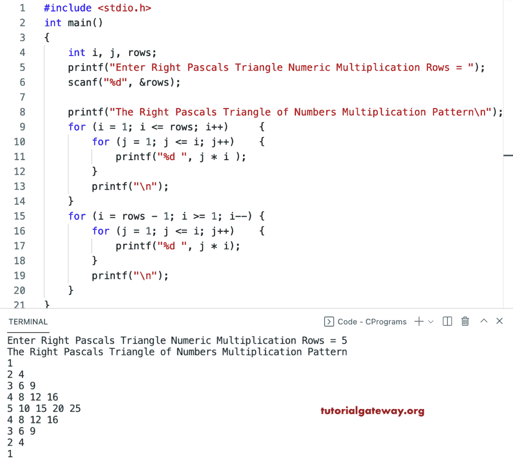

# C 程序：打印乘法数字图案直角三角形

> 原文：<https://www.tutorialgateway.org/c-program-to-print-right-pascals-triangle-of-multiplication-numbers-pattern/>

写一个 C 程序打印用于循环的乘法数字的直角三角形。

```c
#include <stdio.h>

int main()
{
	int i, j, rows;

	printf("Enter Right Pascals Triangle Numeric Multiplication Rows = ");
	scanf("%d", &rows);

	printf("The Right Pascals Triangle of Numbers Multiplication Pattern\n");

	for (i = 1; i <= rows; i++)
	{
		for (j = 1; j <= i; j++)
		{
			printf("%d ", j * i );
		}
		printf("\n");
	}

	for (i = rows - 1; i >= 1; i--)
	{
		for (j = 1; j <= i; j++)
		{
			printf("%d ", j * i);
		}
		printf("\n");
	}
}
```



这个 C 程序使用 while 循环打印乘法数字的右帕斯卡三角形模式。

```c
#include <stdio.h>

int main()
{
	int i, j, temp, rows;

	printf("Enter Right Pascals Triangle Numeric Multiplication Rows = ");
	scanf("%d", &rows);

	printf("The Right Pascals Triangle of Numbers Multiplication Pattern\n");
	temp = 1;

	for (i = 1; i <= rows / 2 + 1; i++, temp++)
	{
		for (j = 1; j <= i; j++)
		{
			printf("%d ", j * temp);
		}
		printf("\n");
	}

	for (i = 1; i <= rows / 2; i++, temp++)
	{
		for (j = 1; j <= rows / 2 - i + 1; j++)
		{
			printf("%d ", j * temp);
		}
		printf("\n");
	}
}
```

```c
Enter Right Pascals Triangle Numeric Multiplication Rows = 9
The Right Pascals Triangle of Numbers Multiplication Pattern
1 
2 4 
3 6 9 
4 8 12 16 
5 10 15 20 25 
6 12 18 24 
7 14 21 
8 16 
9
```

这个 [C 示例](https://www.tutorialgateway.org/c-programming-examples/)使用 do while 循环打印右帕斯卡乘法数字三角形模式。

```c
#include <stdio.h>

int main()
{
	int rows, i, j, temp;

	printf("Enter Right Pascals Numbers Multiplication Triangle Rows = ");
	scanf("%d", &rows);

	printf("The Right Pascals Triangle of Numbers Multiplication Pattern\n");
	i = temp = 1;

	while (i <= rows / 2 + 1)
	{
		j = 1;
		while (j <= i)
		{
			printf("%d ", j * temp);
			j++;
		}

		printf("\n");
		temp++;
		i++;
	}

	i = 1;
	while (i <= rows / 2)
	{
		j = 1;
		while (j <= rows / 2 - i + 1)
		{
			printf("%d ", j * temp);
			j++;
		}

		printf("\n");
		temp++;
		i++;
	}
}
```

```c
Enter Right Pascals Numbers Multiplication Triangle Rows = 15
The Right Pascals Triangle of Numbers Multiplication Pattern
1 
2 4 
3 6 9 
4 8 12 16 
5 10 15 20 25 
6 12 18 24 30 36 
7 14 21 28 35 42 49 
8 16 24 32 40 48 56 64 
9 18 27 36 45 54 63 
10 20 30 40 50 60 
11 22 33 44 55 
12 24 36 48 
13 26 39 
14 28 
15
```