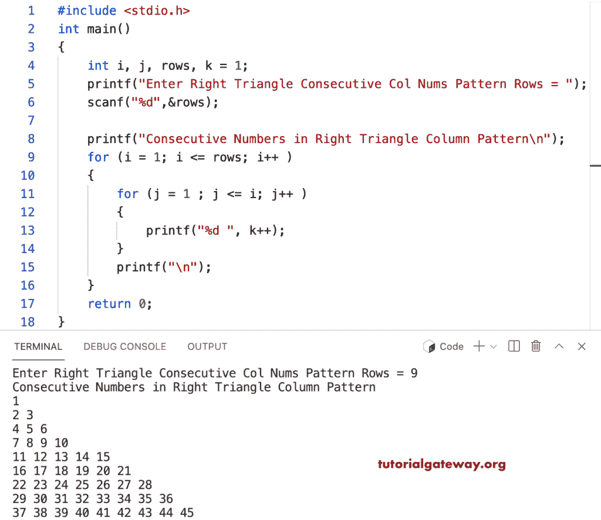

# C 程序：在直角三角形中打印列数字连续

> 原文：<https://www.tutorialgateway.org/c-program-to-print-consecutive-column-numbers-in-right-triangle/>

编写一个 C 程序，使用 for 循环以直角三角形模式打印连续的列号。

```c
#include <stdio.h>

int main()
{
    int i, j, rows, k = 1;

    printf("Enter Right Triangle Consecutive Col Nums Pattern Rows = ");
    scanf("%d",&rows);

    printf("Consecutive Numbers in Right Triangle Column Pattern\n"); 

	for (i = 1; i <= rows; i++ ) 
	{
		for (j = 1 ; j <= i; j++ ) 	
		{
			printf("%d ", k++);
		}
		printf("\n");
	}

    return 0;
}
```



这个 [C 示例](https://www.tutorialgateway.org/c-programming-examples/)使用 while 循环打印列数字连续的直角三角形模式。

```c
#include <stdio.h>

int main()
{
    int i = 1, j, rows, k = 1;

    printf("Enter Right Triangle Consecutive Col Nums Pattern Rows = ");
    scanf("%d",&rows);

    printf("Consecutive Numbers in Right Triangle Column Pattern\n"); 

	while (i <= rows ) 
	{
		j = 1 ;
		while( j <= i) 	
		{
			printf("%d ", k++);
			j++;
		}
		printf("\n");
		i++;
	}

    return 0;
}
```

```c
Enter Right Triangle Consecutive Col Nums Pattern Rows = 12
Consecutive Numbers in Right Triangle Column Pattern
1 
2 3 
4 5 6 
7 8 9 10 
11 12 13 14 15 
16 17 18 19 20 21 
22 23 24 25 26 27 28 
29 30 31 32 33 34 35 36 
37 38 39 40 41 42 43 44 45 
46 47 48 49 50 51 52 53 54 55 
56 57 58 59 60 61 62 63 64 65 66 
67 68 69 70 71 72 73 74 75 76 77 78
```

c 程序，使用 do while 循环在直角三角形中显示连续的列号。

```c
#include <stdio.h>

int main()
{
    int i = 1, j, rows, k = 1;

    printf("Enter Right Triangle Consecutive Col Nums Pattern Rows = ");
    scanf("%d",&rows);

    printf("Consecutive Numbers in Right Triangle Column Pattern\n"); 

	do
	{
		j = 1 ;
		do	
		{
			printf("%d ", k++);

		} while( ++j <= i);
		printf("\n");

	} while (++i <= rows );

    return 0;
}
```

```c
Enter Right Triangle Consecutive Col Nums Pattern Rows = 17
Consecutive Numbers in Right Triangle Column Pattern
1 
2 3 
4 5 6 
7 8 9 10 
11 12 13 14 15 
16 17 18 19 20 21 
22 23 24 25 26 27 28 
29 30 31 32 33 34 35 36 
37 38 39 40 41 42 43 44 45 
46 47 48 49 50 51 52 53 54 55 
56 57 58 59 60 61 62 63 64 65 66 
67 68 69 70 71 72 73 74 75 76 77 78 
79 80 81 82 83 84 85 86 87 88 89 90 91 
92 93 94 95 96 97 98 99 100 101 102 103 104 105 
106 107 108 109 110 111 112 113 114 115 116 117 118 119 120 
121 122 123 124 125 126 127 128 129 130 131 132 133 134 135 136 
137 138 139 140 141 142 143 144 145 146 147 148 149 150 151 152 153 
```