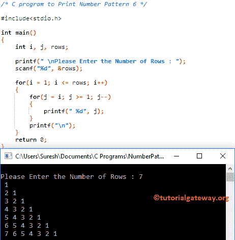

# C 程序：打印数字模式 6 

> 原文：<https://www.tutorialgateway.org/c-program-to-print-number-pattern-6/>

用一个例子写一个 C 程序来打印数字图案 6。对于这个直角三角形，我们将使用 For 循环和 While 循环。

## 使用 For 循环打印数字模式 6 的 c 程序

该程序允许用户输入他/她希望打印成直角三角形的最大行数。接下来，编译器将打印所需数字的模式。

```c
/* C program to Print Number Pattern 6 */

#include<stdio.h>

int main()
{
    int i, j, rows;

    printf(" \nPlease Enter the Number of Rows : ");
    scanf("%d", &rows);

    for(i = 1; i <= rows; i++)
    {
    	for(j = i; j >= 1; j--)
		{
			printf(" %d", j);     	
        }
        printf("\n");
    }
    return 0;
}
```



让我们看看[嵌套循环](https://www.tutorialgateway.org/for-loop-in-c-programming/)

外环–第一次迭代

从上面的 [C 编程](https://www.tutorialgateway.org/c-programming/)截图可以观察到 I 的值为 7，条件(i < = 7)为真。因此，它将进入第二个 for 循环

内部循环–第一次迭代

j 值为 1，条件(1 >= 1)为真。因此，它将开始执行循环中的语句。

```c
printf("%d", j);
```

接下来，我们使用[递减运算符](https://www.tutorialgateway.org/increment-and-decrement-operators-in-c/)J–将 J 值递减 1。它将一直发生，直到内部 for 循环中的条件失败。接下来，迭代将从头开始，直到内环和外环条件都失败。

## 使用 while 循环打印数字图案 6 的程序

在这个[程序](https://www.tutorialgateway.org/c-programming-examples/)中，我们刚刚用 While 循环替换了 For 循环。我建议你参考 [While Loop](https://www.tutorialgateway.org/while-loop-in-c/) 的文章来理解逻辑。

```c
/* C program to Print Number Pattern 6 */

#include<stdio.h>

int main()
{
    int i, j, rows;
    i = 1;

    printf(" \nPlease Enter the Number of Rows : ");
    scanf("%d", &rows);

    while(i <= rows)
    {
    	j = i;

    	while( j >= 1)
		{
			printf("%d", j);
			j--;     	
        }
        i++;
        printf("\n");
    }
    return 0;
}
```

```c
Please Enter the Number of Rows : 9
1
21
321
4321
54321
654321
7654321
87654321
987654321
```