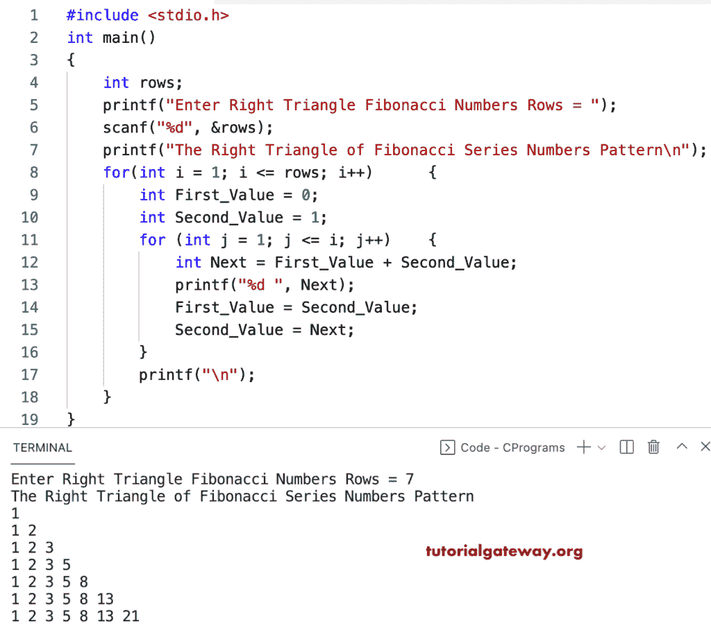

# C 程序：打印斐波那契数列的直角三角形图案

> 原文：<https://www.tutorialgateway.org/c-program-to-print-right-triangle-of-fibonacci-series-numbers-pattern/>

写一个 C 程序来打印用于循环的斐波那契数列的直角三角形。

```c
#include <stdio.h>

int main()
{
	int rows;

	printf("Enter Right Triangle Fibonacci Numbers Rows = ");
	scanf("%d", &rows);

	printf("The Right Triangle of Fibonacci Series Numbers Pattern\n");

	for(int i = 1; i <= rows; i++)  
	{
		int First_Value = 0;
		int Second_Value = 1;

		for (int j = 1; j <= i; j++)
		{
			int Next = First_Value + Second_Value;
			printf("%d ", Next);
			First_Value = Second_Value;
			Second_Value = Next;
		}
		printf("\n");
	}
}
```



这个 [C 程序](https://www.tutorialgateway.org/c-programming-examples/)使用 while 循环打印斐波那契数列模式中的直角三角形数字。

```c
#include <stdio.h>

int main()
{
	int rows, i, j, First_Value, Second_Value, Next;

	printf("Enter Right Triangle Fibonacci Numbers Rows = ");
	scanf("%d", &rows);

	printf("The Right Triangle of Fibonacci Series Numbers Pattern\n");
	i = 1;

	while(i <= rows)  
	{
		First_Value = 0;
		Second_Value = 1;
		j = 1;

		while (j <= i)
		{
			Next = First_Value + Second_Value;
			printf("%d ", Next);
			First_Value = Second_Value;
			Second_Value = Next;
			j++;
		}
		printf("\n");
		i++;
	}
}
```

```c
Enter Right Triangle Fibonacci Numbers Rows = 11
The Right Triangle of Fibonacci Series Numbers Pattern
1 
1 2 
1 2 3 
1 2 3 5 
1 2 3 5 8 
1 2 3 5 8 13 
1 2 3 5 8 13 21 
1 2 3 5 8 13 21 34 
1 2 3 5 8 13 21 34 55 
1 2 3 5 8 13 21 34 55 89 
1 2 3 5 8 13 21 34 55 89 144
```