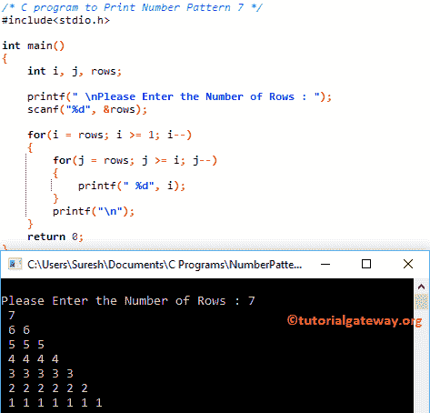

# C 程序：打印数字图案 7

> 原文：<https://www.tutorialgateway.org/c-program-to-print-number-pattern-7/>

用例子写一个 C 程序打印数字图案 7。对于这个反向编号的直角三角形，我们将使用 For 循环和 While 循环。

## 使用 For 循环打印数字图案 7 的 c 程序

该程序允许用户输入他/她希望打印成直角三角形的最大行数。接下来，编译器将以直角三角形模式从最大值到最小值打印数字。

```c
/* C program to Print Number Pattern 7 */

#include<stdio.h>

int main()
{
    int i, j, rows;

    printf(" \nPlease Enter the Number of Rows : ");
    scanf("%d", &rows);

    for(i = rows; i >= 1; i--)
    {
    	for(j = rows; j >= i; j--)
		{
			printf(" %d", i);     	
        }
        printf("\n");
    }
    return 0;
}
```



## 使用 while 循环打印数字图案 7 的程序

在这个[程序](https://www.tutorialgateway.org/c-programming-examples/)中，我们刚刚用 While 循环替换了 For 循环。建议大家参考 [While Loop](https://www.tutorialgateway.org/while-loop-in-c/) 文章，了解 [C 编程](https://www.tutorialgateway.org/c-programming/)逻辑。

```c
/* C program to Print Number Pattern 7 */

#include<stdio.h>

int main()
{
    int i, j, rows;

    printf(" \nPlease Enter the Number of Rows : ");
    scanf("%d", &rows);

    i = rows;

    while( i >= 1)
    {
    	j = rows;

    	while( j >= i)
		{
			printf("%d", i);
			j--;     	
        }
        i--;
        printf("\n");
    }
    return 0;
}
```

```c
Please Enter the Number of Rows : 9
9
88
777
6666
55555
444444
3333333
22222222
111111111
```