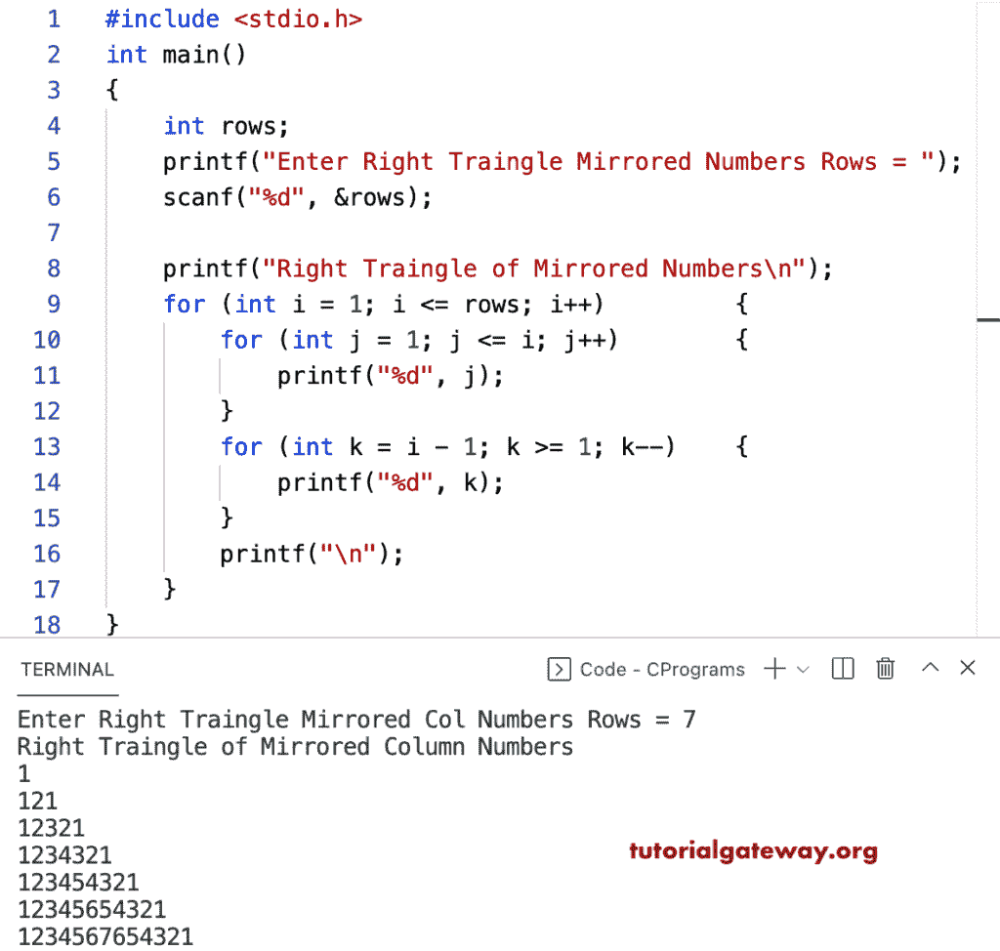

# C 程序：打印镜像数字图案直角三角形

> 原文：<https://www.tutorialgateway.org/c-program-to-print-right-triangle-of-mirrored-numbers-pattern/>

写一个 C 程序打印用于循环的镜像数字模式的直角三角形。

```c
#include <stdio.h>

int main()
{
	int rows;

	printf("Enter Right Traingle Mirrored Numbers Rows = ");
	scanf("%d", &rows);

	printf("Right Traingle of Mirrored Numbers\n");

	for (int i = 1; i <= rows; i++)			
	{
		for (int j = 1; j <= i; j++)		
		{
			printf("%d", j);
		}
		for (int k = i - 1; k >= 1; k--)	
		{
			printf("%d", k);
		}
		printf("\n");
	}
}
```



这个 C 程序使用 while 循环打印镜像数字的直角三角形模式。

```c
#include <stdio.h>

int main()
{
	int i, j, k, rows;

	printf("Enter Right Traingle Mirrored Numbers Rows = ");
	scanf("%d", &rows);

	printf("Right Traingle of Mirrored Numbers\n");

	i = 1;
	while (i <= rows)
	{
		j = 1;
		while (j <= i)
		{
			printf("%d", j);
			j++;
		}

		k = i - 1;
		while (k >= 1)
		{
			printf("%d", k);
			k--;
		}
		printf("\n");
		i++;
	}
}
```

```c
Enter Right Traingle Mirrored Numbers Rows = 10
Right Traingle of Mirrored Numbers
1
121
12321
1234321
123454321
12345654321
1234567654321
123456787654321
12345678987654321
12345678910987654321
```

这个 [C 示例](https://www.tutorialgateway.org/c-programming-examples/)使用 rMirroredNumbers 函数打印镜像数字模式的直角三角形。

```c
#include <stdio.h>

void rtMirroredNumbers(int rows);

int main()
{
	int rows;

	printf("Enter Right Traingle Mirrored Numbers Rows = ");
	scanf("%d", &rows);

	printf("Right Traingle of Mirrored Numbers\n");
	rtMirroredNumbers(rows);
}

void rtMirroredNumbers(int rows)
{
	for (int i = 1; i <= rows; i++)
	{
		for (int j = 1; j <= i; j++)
		{
			printf("%d", j);
		}
		for (int k = i - 1; k >= 1; k--)
		{
			printf("%d", k);
		}
		printf("\n");
	}
}
```

```c
Enter Right Traingle Mirrored Numbers Rows = 13
Right Traingle of Mirrored Numbers
1
121
12321
1234321
123454321
12345654321
1234567654321
123456787654321
12345678987654321
12345678910987654321
123456789101110987654321
1234567891011121110987654321
12345678910111213121110987654321
```