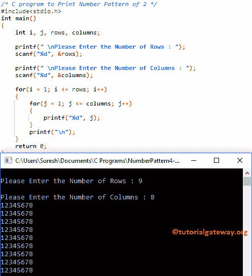

# C 程序：打印数字图案 2 

> 原文：<https://www.tutorialgateway.org/c-program-to-print-number-pattern-2/>

用例子写一个 C 程序打印数字的数字图案 2。或者，用 C 程序打印重复的图案。

## 使用 For 循环打印数字图案 2 的 c 程序

该程序允许用户输入他/她希望打印为矩形的最大行数和列数。接下来，编译器将为每行打印从 1 到用户指定列的数字。

```c
/* C program to Print Number Pattern 2 */

#include<stdio.h>

int main()
{
    int i, j, rows, columns;

    printf(" \nPlease Enter the Number of Rows : ");
    scanf("%d", &rows);

    printf(" \nPlease Enter the Number of Columns : ");
    scanf("%d", &columns);

    for(i = 1; i <= rows; i++)
    {
    	for(j = 1; j <= columns; j++)
		{
			printf("%d", j);     	
        }
        printf("\n");
    }
    return 0;
}
```



让我们看看[嵌套循环](https://www.tutorialgateway.org/for-loop-in-c-programming/)

```c
for(i = 1; i <= rows; i++)
{
   	for(j = 1; j <= columns; j++)
	{
		printf("%d", j);     	
        }
        printf("\n");
}
```

外环–第一次迭代

从上面的截图可以观察到，I 的值是 9，条件(i <= 9) is True. So, it will enter into second for loop

内部循环–第一次迭代

j 值为 1，且 [C 编程](https://www.tutorialgateway.org/c-programming/)条件(1 < = 8)为真。因此，它将开始执行循环中的语句。

```c
printf(" %d", j);
```

接下来，我们使用[增量运算符](https://www.tutorialgateway.org/increment-and-decrement-operators-in-c/) j++将 J 值增加 1。这种情况会一直发生，直到内部 for 循环中的条件失败。接下来，迭代将从头开始，直到内环和外环条件都失败。

## 使用 while 循环打印数字图案 2 的程序

在这个[程序](https://www.tutorialgateway.org/c-programming-examples/)中，我们刚刚用 While 循环替换了 For 循环。我建议你参考 [While Loop](https://www.tutorialgateway.org/while-loop-in-c/) 一文来了解逻辑。

```c
/* C program to Print Number Pattern 2 */

#include<stdio.h>

int main()
{
    int i, j, rows, columns;
    i = 1;

    printf(" \nPlease Enter the Number of Rows : ");
    scanf("%d", &rows);

    printf(" \nPlease Enter the Number of Columns : ");
    scanf("%d", &columns);

    while(i <= rows)
    {
    	j = 1;
    	while(j <= columns)
		{
			printf("%d", j);       
			j++;     	
        }
        i++;
        printf("\n");
    }
    return 0;
}
```

```c
Please Enter the Number of Rows : 9

Please Enter the Number of Columns : 12
123456789101112
123456789101112
123456789101112
123456789101112
123456789101112
123456789101112
123456789101112
123456789101112
123456789101112
```