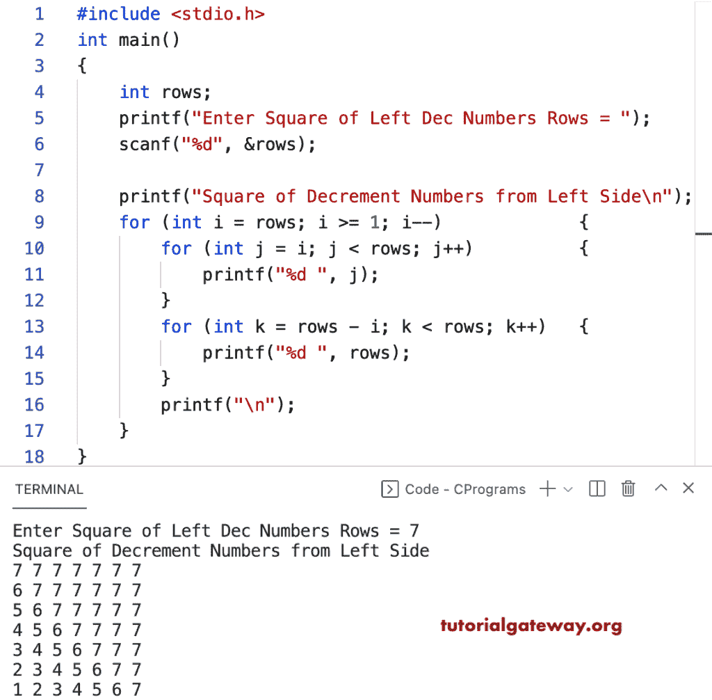

# C 程序：打印数字的左递减方形图案

> 原文：<https://www.tutorialgateway.org/c-program-to-print-square-of-left-decrement-numbers-pattern/>

写一个 C 程序来打印用于循环的左递减数字图案的平方。

```c
#include <stdio.h>

int main()
{
	int rows;

	printf("Enter Square of Left Dec Numbers Rows = ");
	scanf("%d", &rows);

	printf("Square of Decrement Numbers from Left Side\n");

	for (int i = rows; i >= 1; i--)
	{
		for (int j = i; j < rows; j++)
		{
			printf("%d ", j);
		}
		for (int k = rows - i; k < rows; k++)
		{
			printf("%d ", rows);
		}
		printf("\n");
	}
}
```



该 [C 程序](https://www.tutorialgateway.org/c-programming-examples/)使用 while 循环从左侧显示减量数字的方形图案。

```c
#include <stdio.h>

int main()
{
	int rows, i, j, k;

	printf("Enter Square of Left Dec Numbers Rows = ");
	scanf("%d", &rows);

	printf("Square of Decrement Numbers from Left Side\n");
	i = rows;

	while (i >= 1)
	{
		j = i;
		while (j < rows)
		{
			printf("%d ", j);
			j++;
		}

		k = rows - i;
		while (k < rows)
		{
			printf("%d ", rows);
			k++;
		}

		printf("\n");
		i--;
	}
}
```

```c
Enter Square of Left Dec Numbers Rows = 9
Square of Decrement Numbers from Left Side
9 9 9 9 9 9 9 9 9 
8 9 9 9 9 9 9 9 9 
7 8 9 9 9 9 9 9 9 
6 7 8 9 9 9 9 9 9 
5 6 7 8 9 9 9 9 9 
4 5 6 7 8 9 9 9 9 
3 4 5 6 7 8 9 9 9 
2 3 4 5 6 7 8 9 9 
1 2 3 4 5 6 7 8 9 
```