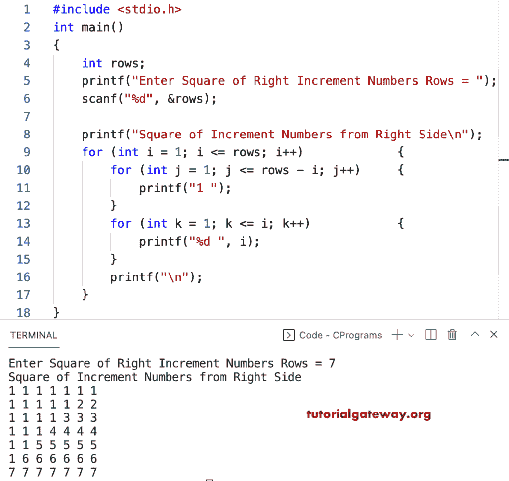

# C 程序：打印直角增量数字方格图案

> 原文：<https://www.tutorialgateway.org/c-program-to-print-square-of-right-increment-numbers-pattern/>

写一个 C 程序来打印用于循环的右增量数字图案的平方。

```c
#include <stdio.h>

int main()
{
	int rows;

	printf("Enter Square of Right Increment Numbers Rows = ");
	scanf("%d", &rows);

	printf("Square of Increment Numbers from Right Side\n");

	for (int i = 1; i <= rows; i++)
	{
		for (int j = 1; j <= rows - i; j++)
		{
			printf("1 ");
		}
		for (int k = 1; k <= i; k++)
		{
			printf("%d ", i);
		}
		printf("\n");
	}
}
```



这个 C 程序使用 while 循环从右侧打印增量数字的正方形模式。

```c
#include <stdio.h>

int main()
{
	int rows, i, j, k;

	printf("Enter Square of Right Increment Numbers Rows = ");
	scanf("%d", &rows);

	printf("Square of Increment Numbers from Right Side\n");
	i = 1;

	while (i <= rows)
	{
		j = 1;
		while (j <= rows - i)
		{
			printf("1 ");
			j++;
		}

		k = 1;
		while (k <= i)
		{
			printf("%d ", i);
			k++;
		}
		printf("\n");
		i++;
	}
}
```

这个 [C 例子](https://www.tutorialgateway.org/c-programming-examples/)使用 squareIncrementNum 函数打印正方形图案，其数字从右手边开始递增。

```c
#include <stdio.h>

void squareIncrementNum(int rows);

int main()
{
	int rows;

	printf("Enter Square of Right Increment Numbers Rows = ");
	scanf("%d", &rows);

	printf("Square of Increment Numbers from Right Side\n");
	squareIncrementNum(rows);
}

void squareIncrementNum(int rows)
{
	for (int i = 1; i <= rows; i++)
	{
		for (int j = 1; j <= rows - i; j++)
		{
			printf("1 ");
		}
		for (int k = 1; k <= i; k++)
		{
			printf("%d ", i);
		}
		printf("\n");
	}
}
```

```c
Enter Square of Right Increment Numbers Rows = 9
Square of Increment Numbers from Right Side
1 1 1 1 1 1 1 1 1 
1 1 1 1 1 1 1 2 2 
1 1 1 1 1 1 3 3 3 
1 1 1 1 1 4 4 4 4 
1 1 1 1 5 5 5 5 5 
1 1 1 6 6 6 6 6 6 
1 1 7 7 7 7 7 7 7 
1 8 8 8 8 8 8 8 8 
9 9 9 9 9 9 9 9 9
```