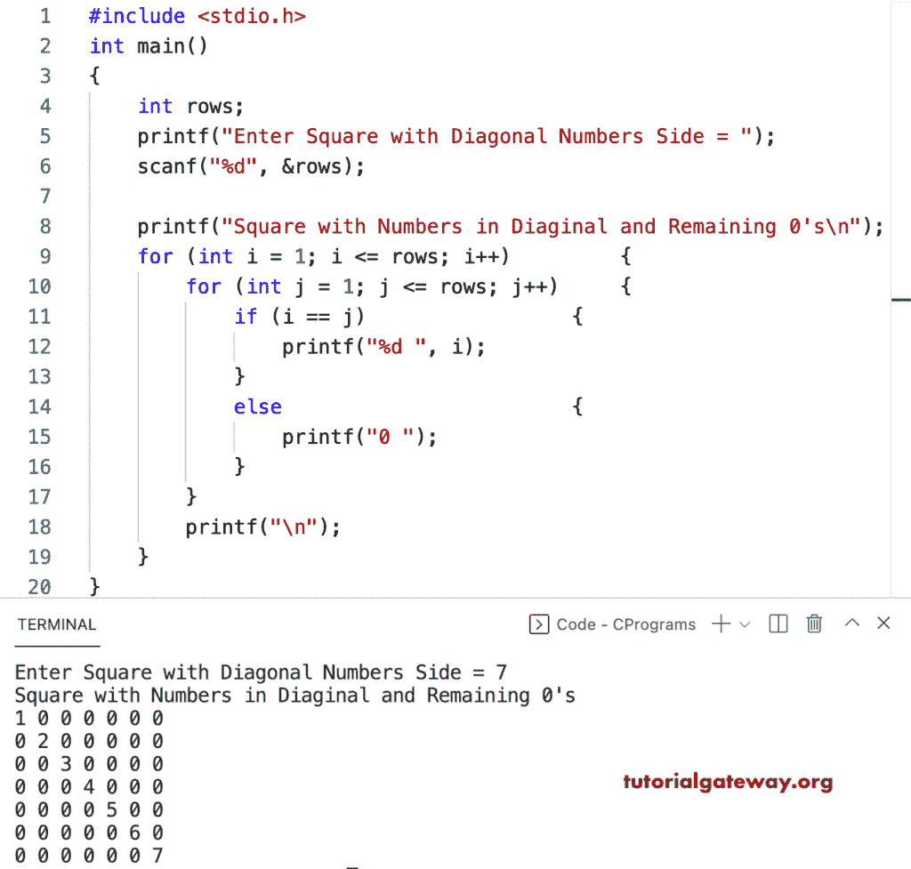

# C 程序：用对角线数字图案打印正方形

> 原文：<https://www.tutorialgateway.org/c-program-to-print-square-with-diagonal-numbers-pattern/>

写一个 C 程序来打印数字的带有对角线图案的正方形。或者用 C 程序打印除用于循环的对角线数字图案以外的全零正方形。

```c
#include <stdio.h>

int main()
{
	int rows;

	printf("Enter Square with Diagonal Numbers Side = ");
	scanf("%d", &rows);

	printf("Square with Numbers in Diaginal and Remaining 0's\n");

	for (int i = 1; i <= rows; i++)
	{
		for (int j = 1; j < i; j++)
		{
			printf("0 ");
		}
		printf("%d ", i);

		for (int k = i; k < rows; k++)
		{
			printf("0 ");
		}
		printf("\n");
	}
}
```



这是用对角线数字和 C. 中所有剩余的零打印正方形图案的另一种方式

```c
#include <stdio.h>

int main()
{
	int rows;

	printf("Enter Square with Diagonal Numbers Side = ");
	scanf("%d", &rows);

	printf("Square with Numbers in Diaginal and Remaining 0's\n");

	for (int i = 1; i <= rows; i++)
	{
		for (int j = 1; j <= rows; j++)
		{
			if (i == j)
			{
				printf("%d ", i);
			}
			else
			{
				printf("0 ");
			}
		}
		printf("\n");
	}
}
```

```c
Enter Square with Diagonal Numbers Side = 9
Square with Numbers in Diaginal and Remaining 0's
1 0 0 0 0 0 0 0 0 
0 2 0 0 0 0 0 0 0 
0 0 3 0 0 0 0 0 0 
0 0 0 4 0 0 0 0 0 
0 0 0 0 5 0 0 0 0 
0 0 0 0 0 6 0 0 0 
0 0 0 0 0 0 7 0 0 
0 0 0 0 0 0 0 8 0 
0 0 0 0 0 0 0 0 9 
```

这个 C 程序显示递增对角线数的正方形模式。使用 while 循环，所有剩余的 1 都是 0。

```c
#include <stdio.h>

int main()
{
	int i, j, rows;

	printf("Enter Square with Diagonal Numbers Side = ");
	scanf("%d", &rows);

	printf("Square with Numbers in Diaginal and Remaining 0's\n");
	i = 1;

	while (i <= rows)
	{
		j = 1;

		while (j <= rows)
		{
			if (i == j)
			{
				printf("%d ", i);
			}
			else
			{
				printf("0 ");
			}
			j++;
		}
		printf("\n");
		i++;
	}
}
```

```c
Enter Square with Diagonal Numbers Side = 15
Square with Numbers in Diaginal and Remaining 0's
1 0 0 0 0 0 0 0 0 0 0 0 0 0 0 
0 2 0 0 0 0 0 0 0 0 0 0 0 0 0 
0 0 3 0 0 0 0 0 0 0 0 0 0 0 0 
0 0 0 4 0 0 0 0 0 0 0 0 0 0 0 
0 0 0 0 5 0 0 0 0 0 0 0 0 0 0 
0 0 0 0 0 6 0 0 0 0 0 0 0 0 0 
0 0 0 0 0 0 7 0 0 0 0 0 0 0 0 
0 0 0 0 0 0 0 8 0 0 0 0 0 0 0 
0 0 0 0 0 0 0 0 9 0 0 0 0 0 0 
0 0 0 0 0 0 0 0 0 10 0 0 0 0 0 
0 0 0 0 0 0 0 0 0 0 11 0 0 0 0 
0 0 0 0 0 0 0 0 0 0 0 12 0 0 0 
0 0 0 0 0 0 0 0 0 0 0 0 13 0 0 
0 0 0 0 0 0 0 0 0 0 0 0 0 14 0 
0 0 0 0 0 0 0 0 0 0 0 0 0 0 15 
```

这个 [C 示例](https://www.tutorialgateway.org/c-programming-examples/)使用 do while 循环打印正方形数字图案，其中对角线是连续数字，其余都是零。

```c
#include <stdio.h>

int main()
{
	int i, j, rows;

	printf("Enter Square with Diagonal Numbers Side = ");
	scanf("%d", &rows);

	printf("Square with Numbers in Diaginal and Remaining 0's\n");
	i = 1;

	do
	{
		j = 1;

		do
		{
			if (i == j)
			{
				printf("%d ", i);
			}
			else
			{
				printf("0 ");
			}

		} while (++j <= rows);

		printf("\n");

	} while (++i <= rows);
}
```

```c
Enter Square with Diagonal Numbers Side = 12
Square with Numbers in Diaginal and Remaining 0's
1 0 0 0 0 0 0 0 0 0 0 0 
0 2 0 0 0 0 0 0 0 0 0 0 
0 0 3 0 0 0 0 0 0 0 0 0 
0 0 0 4 0 0 0 0 0 0 0 0 
0 0 0 0 5 0 0 0 0 0 0 0 
0 0 0 0 0 6 0 0 0 0 0 0 
0 0 0 0 0 0 7 0 0 0 0 0 
0 0 0 0 0 0 0 8 0 0 0 0 
0 0 0 0 0 0 0 0 9 0 0 0 
0 0 0 0 0 0 0 0 0 10 0 0 
0 0 0 0 0 0 0 0 0 0 11 0 
0 0 0 0 0 0 0 0 0 0 0 12 
```