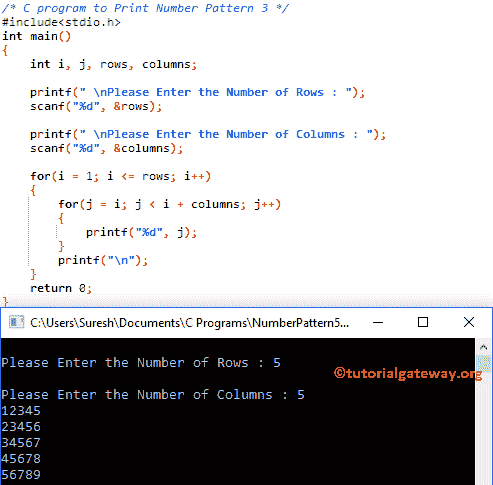

# C 程序：打印数字图案 3 

> 原文：<https://www.tutorialgateway.org/c-program-to-print-number-pattern-3/>

用例子写一个 C 程序打印数字图案 3。为此，我们将使用 For 循环和 While 循环。

## 使用 For 循环打印数字图案 3 的 c 程序

该程序允许用户输入他/她希望打印为矩形的最大行数和列数。接下来，编译器将打印数字图案。

```c
/* C program to Print Number Pattern 3 */

#include<stdio.h>

int main()
{
    int i, j, rows, columns;

    printf(" \nPlease Enter the Number of Rows : ");
    scanf("%d", &rows);

    printf(" \nPlease Enter the Number of Columns : ");
    scanf("%d", &columns);

    for(i = 1; i <= rows; i++)
    {
    	for(j = i; j < i + columns; j++)
		{
			printf("%d", j);     	
        }
        printf("\n");
    }
    return 0;
}
```



让我们看看[嵌套循环](https://www.tutorialgateway.org/for-loop-in-c-programming/)

```c
for(i = 1; i <= rows; i++)
{
   	for(j = i; j <= i + columns; j++)
	{
		printf("%d", j);     	
        }
        printf("\n");
}
```

外环–第一次迭代

从上面 [C 编程](https://www.tutorialgateway.org/c-programming/)截图可以观察到，I 的值为 5，条件(i < = 5)为真。因此，它将进入第二个 for 循环

内部循环–第一次迭代

j 值为 1，条件(1 <= 6)为真。因此，它将开始执行循环中的语句。

```c
printf("%d", j);
```

接下来，我们使用[增量运算符](https://www.tutorialgateway.org/increment-and-decrement-operators-in-c/) j++将 J 值增加 1。这种情况会一直发生，直到内部 for 循环中的条件失败。接下来，迭代将从头开始，直到内环和外环条件都失败。

## 使用 while 循环打印数字图案 3 的程序

在这个[程序](https://www.tutorialgateway.org/c-programming-examples/)中，我们刚刚用 While 循环替换了 For 循环。我建议你参考 [While Loop](https://www.tutorialgateway.org/while-loop-in-c/) 一文来了解逻辑。

```c
/* C program to Print Number Pattern 3 */

#include<stdio.h>

int main()
{
    int i, j, rows, columns;

    printf(" \nPlease Enter the Number of Rows : ");
    scanf("%d", &rows);

    printf(" \nPlease Enter the Number of Columns : ");
    scanf("%d", &columns);

	i = 1;

    while(i <= rows)
    {
    	j = i;

    	while(j < i + columns)
		{
			printf("%d", j);
			j++;     	
        }
        i++;
        printf("\n");
    }
    return 0;
}
```

```c
 Please Enter the Number of Rows : 5

Please Enter the Number of Columns : 6
123456
234567
345678
456789
5678910
```