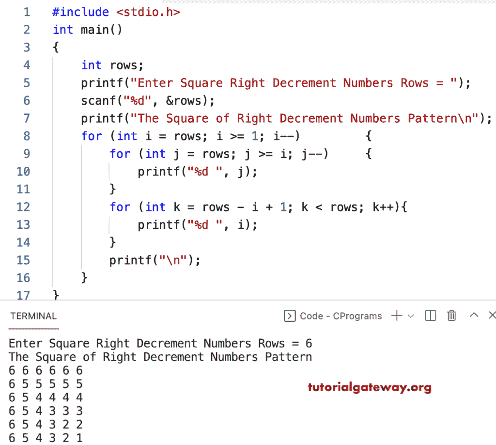

# C 程序：打印数字的右递减方形图案

> 原文：<https://www.tutorialgateway.org/c-program-to-print-square-of-right-decrement-numbers-pattern/>

写一个 C 程序来打印用于循环的右减数模式的平方。

```c
#include <stdio.h>

int main()
{
	int rows;

	printf("Enter Square Right Decrement Numbers Rows = ");
	scanf("%d", &rows);

	printf("The Square of Right Decrement Numbers Pattern\n");

	for (int i = rows; i >= 1; i--)
	{
		for (int j = rows; j >= i; j--)
		{
			printf("%d ", j);
		}
		for (int k = rows - i + 1; k < rows; k++)
		{
			printf("%d ", i);
		}
		printf("\n");
	}
}
```



该 [C 程序](https://www.tutorialgateway.org/c-programming-examples/)使用 while 循环打印右侧递减数字的方形模式。

```c
#include <stdio.h>

int main()
{
	int rows, i, j, k;

	printf("Enter Square Right Decrement Numbers Rows = ");
	scanf("%d", &rows);

	printf("The Square of Right Decrement Numbers Pattern\n");
	i = rows;

	while (i >= 1)
	{
		j = rows;
		while (j >= i)
		{
			printf("%d ", j);
			j--;
		}
		k = rows - i + 1;
		while (k < rows)
		{
			printf("%d ", i);
			k++;
		}
		printf("\n");
		i--;
	}
}
```

```c
Enter Square Right Decrement Numbers Rows = 9
The Square of Right Decrement Numbers Pattern
9 9 9 9 9 9 9 9 9 
9 8 8 8 8 8 8 8 8 
9 8 7 7 7 7 7 7 7 
9 8 7 6 6 6 6 6 6 
9 8 7 6 5 5 5 5 5 
9 8 7 6 5 4 4 4 4 
9 8 7 6 5 4 3 3 3 
9 8 7 6 5 4 3 2 2 
9 8 7 6 5 4 3 2 1 
```