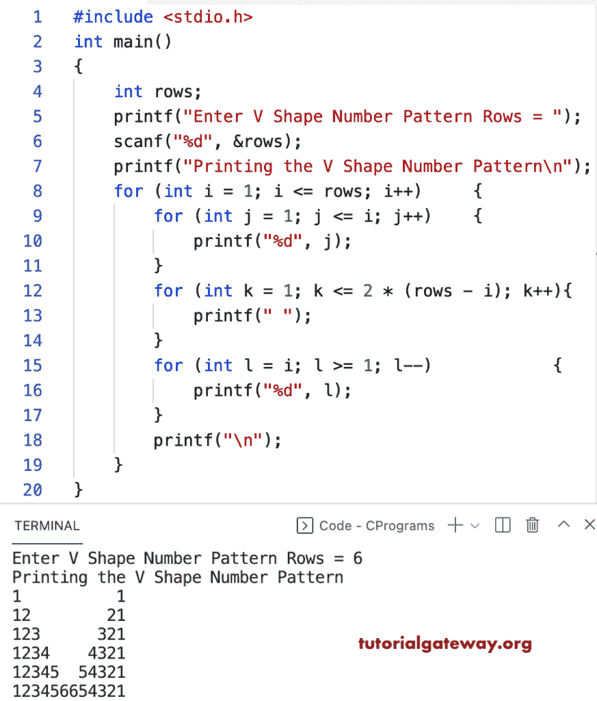

# C 程序：打印数字的`V`图案

> 原文：<https://www.tutorialgateway.org/c-program-to-print-v-numbers-pattern/>

写一个 C 程序打印 V 数字图案用于循环。

```c
#include <stdio.h>

int main()
{
	int rows;

	printf("Enter V Shape Number Pattern Rows = ");
	scanf("%d", &rows);

	printf("Printing the V Shape Number Pattern\n");

	for (int i = 1; i <= rows; i++)
	{
		for (int j = 1; j <= i; j++)
		{
			printf("%d", j);
		}
		for (int k = 1; k <= 2 * (rows - i); k++)
		{
			printf(" ");
		}
		for (int l = i; l >= 1; l--)
		{
			printf("%d", l);
		}
		printf("\n");
	}
}
```



这个 C 程序使用 while 循环打印数字的字母 V 模式。

```c
#include <stdio.h>

int main()
{
	int rows, i, j, k, l;

	printf("Enter V Shape Number Pattern Rows = ");
	scanf("%d", &rows);

	printf("Printing the V Shape Number Pattern\n");

	i = 1;

	while (i <= rows)
	{
		j = 1;
		while (j <= i)
		{
			printf("%d", j);
			j++;
		}
		k = 1;
		while (k <= 2 * (rows - i))
		{
			printf(" ");
			k++;
		}
		l = i;
		while (l >= 1)
		{
			printf("%d", l);
			l--;
		}
		printf("\n");
		i++;
	}
}
```

```c
Enter V Shape Number Pattern Rows = 8
Printing the V Shape Number Pattern
1              1
12            21
123          321
1234        4321
12345      54321
123456    654321
1234567  7654321
1234567887654321
```

这个 [C 例子](https://www.tutorialgateway.org/c-programming-examples/)使用 do while 循环来显示数字的大写 V 模式。

```c
#include <stdio.h>

int main()
{
	int rows, i, j, k, l;

	printf("Enter V Shape Number Pattern Rows = ");
	scanf("%d", &rows);

	printf("Printing the V Shape Number Pattern\n");

	i = 1;
	do
	{
		j = 1;
		do
		{
			printf("%d", j);

		} while (++j <= i);

		k = 1;
		while (k <= 2 * (rows - i))
		{
			printf(" ");
			k++;
		}

		l = i;
		do
		{
			printf("%d", l);

		} while (--l >= 1);

		printf("\n");

	} while (++i <= rows);
}
```

```c
Enter V Shape Number Pattern Rows = 9
Printing the V Shape Number Pattern
1                1
12              21
123            321
1234          4321
12345        54321
123456      654321
1234567    7654321
12345678  87654321
123456789987654321
```