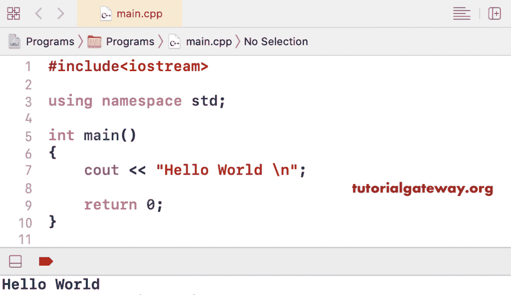

# C++ 程序：打印你好世界

> 原文：<https://www.tutorialgateway.org/cpp-program-to-print-hello-world/>

用一个例子写一个简单的 C++ 程序来打印 Hello World。每个 C++ 程序都以#include 语句开始，以包含预处理器指令。这里，#include <iostream>包含了帮助我们使用 cout 语句的 iostream 文件。这里，使用命名空间标准有助于导入标准命名空间。</iostream>

```cpp
#include<iostream>

using namespace std;

int main()
{
	cout << "Hello World";

	return 0;
}
```



如果不想导入命名空间标准(使用命名空间标准；)，然后取出来用 [C++](https://www.tutorialgateway.org/cpp-programs/) std::cout。

```cpp
#include<iostream>

int main()
{
	std::cout << "Hello World";

	return 0;
}
```

```cpp
Hello World
```

## 使用函数打印 Hello World 的简单 C++ 程序

```cpp
#include<iostream>

using namespace std;

void disply_helloworld() 
{
	cout << "Hello World";
}

int main()
{	
	disply_helloworld();

	return 0;
}
```

```cpp
Hello World!
```

在这个例子中，我们创建了一个单独的类(Message)，它包含一个打印消息的方法(disply_helloworld())。接下来，我们创建了该类的一个实例，并从主程序中调用了该方法。

```cpp
#include<iostream>

using namespace std;

class Message
{
	public: void disply_helloworld() {
		cout << "Hello World";
	}
};

int main()
{
	Message msg;

	msg.disply_helloworld();

	return 0;
}
```

```cpp
Hello World
```