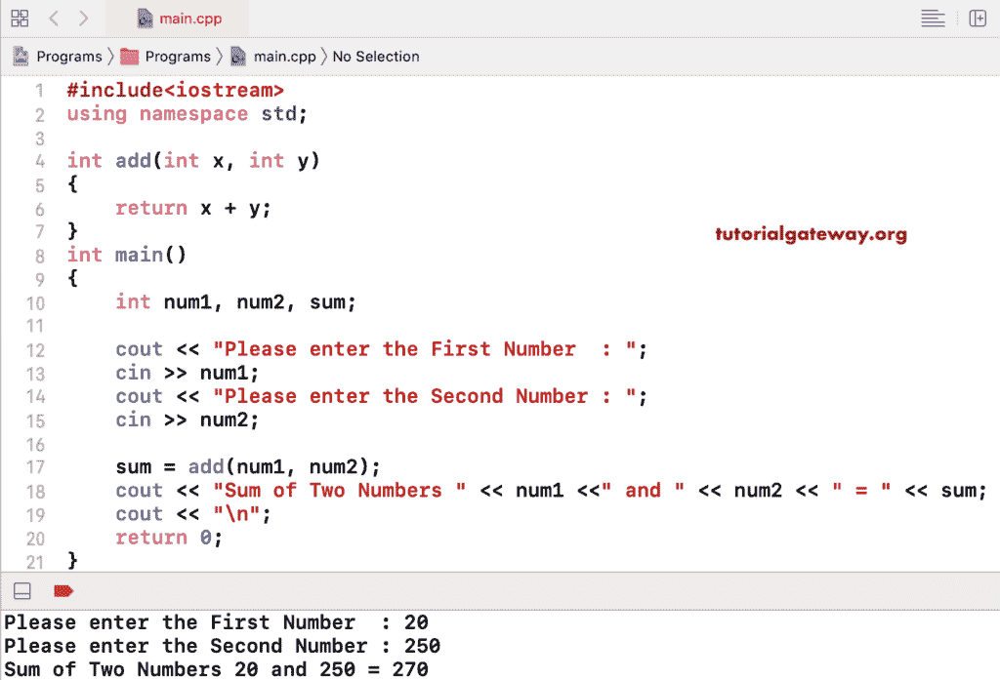

# C++ 程序：两个数相加

> 原文：<https://www.tutorialgateway.org/cpp-program-to-add-two-numbers/>

写一个 C++ 程序，用多个例子把两个数字相加。下面写的 C++ 代码使用算术加法运算符将 num1 和 num2 相加。

```cpp
#include<iostream>

using namespace std;

int main()
{
    int num1 = 10, num2 = 20, sum;

    sum = num1 + num2;
    cout << "Sum of Two Numbers " << num1 <<" and " << num2 << " = " << sum;

    return 0;
}
```

```cpp
Sum of Two Numbers 10 and 20 = 30
```

这个 [C++](https://www.tutorialgateway.org/cpp-programs/) 代码允许用户插入两个整数值，然后将这些数字相加。

```cpp
#include<iostream>

using namespace std;

int main()
{
	int num1, num2, sum;

	cout << "Please enter the First Number  : ";
	cin >> num1;

	cout << "Please enter the Second Number : ";
	cin >> num2;

	sum = num1 + num2;
	cout << "Sum of Two Numbers " << num1 <<" and " << num2 << " = " << sum;

	return 0;
}
```

```cpp
Please enter the First Number  : 5
Please enter the Second Number : 220
Sum of Two Numbers 5 and 220 = 225
```

## 用函数相加两个数的 C++ 程序

在这里，我们创建了一个接受两个参数并返回这两个参数之和的函数。接下来，我们在 main()程序中调用该函数。

```cpp
#include<iostream>

using namespace std;
int add(int x, int y)
{
	return x + y;
}

int main()
{
	int num1, num2, sum;

	cout << "Please enter the First Number  : ";
	cin >> num1;

	cout << "Please enter the Second Number : ";
	cin >> num2;

	sum = add(num1, num2);
	cout << "Sum of Two Numbers " << num1 <<" and " << num2 << " = " << sum;

	return 0;
}
```



在这个使用 OOPS 的 C++ 相加两个数的例子中，我们使用了一个单独的类和一个公共方法来执行相加。

```cpp
#include<iostream>

using namespace std;
class Addition {

	public: int add(int x, int y){
		return x + y;
	}
};
int main()
{
	int num1, num2, sum;

	cout << "Please enter the First Number  : ";
	cin >> num1;

	cout << "Please enter the Second Number : ";
	cin >> num2;

	Addition ad;

	sum = ad.add(num1, num2);
	cout << "Sum of Two Numbers " << num1 <<" and " << num2 << " = " << sum;

	return 0;
}
```

```cpp
Please enter the First Number  : 99
Please enter the Second Number : 145
Sum of Two Numbers 99 and 145 = 244
```