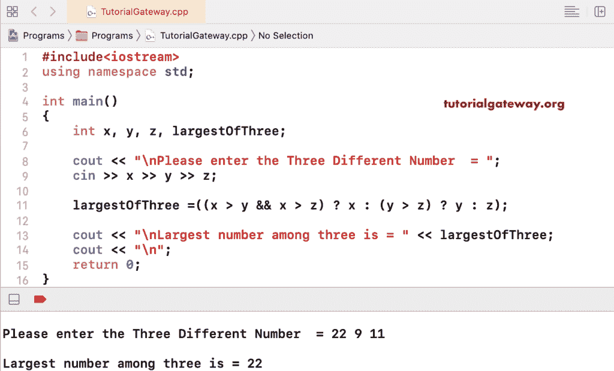

# C++ 程序：寻找三个数中的最大值

> 原文：<https://www.tutorialgateway.org/cpp-program-to-find-largest-of-three-numbers/>

写一个 C++ 程序，找出给定的三个数字中的最大值。在下面显示的 C++ 程序中，我们使用了嵌套 if 语句来查找三个中的最大值。第一个 if 条件 If(x–y > 0 & & x–z > 0)检查 x 是否大于 y 和 z，如果为真，则 x 大于 y。我们在 else 块中使用了嵌套的 If else 语句。如果(y–z > 0)结果为真，它将打印大于 x 和 z 的 y。如果上述条件失败，z 将同时大于 x 和 y

```cpp
#include<iostream>

using namespace std;

int main()
{
	int x, y, z;

	cout << "Please enter the Three Different Number  = ";
	cin >> x >> y >> z;

	if(x - y > 0 && x - z > 0)
	{
    	cout << x << " is Greater Than both " << y << " and " << z;  
	}         
	else
	{
		if(y - z > 0)
    	{
	  		cout << y << " is Greater Than both " << x << " and " << z;  
		}     
   		else
    	{
      		cout << z << " is Greater Than both " << x << " and " << y;  
		}
  	}
 	return 0;
}
```

```cpp
Please enter the Three Different Number  = 10 20 1
20 is Greater Than both 10 and 1
```

x= 44，y= 11，z= 9

```cpp
Please enter the Three Different Number  = 44 11 9
44 is Greater Than both 11 and 9
```

x= 88，y= 77，z= 122

```cpp
Please enter the Three Different Number  = 
88
77
122
122 is Greater Than both 88 and 77
```

## 用 Else If 语句求三个数中的最大值的 C++ 程序

```cpp
#include<iostream>

using namespace std;

int main()
{
    int x, y, z;

    cout << "Please enter the Three Different Number  = ";
    cin >> x >> y >> z;

    if (x > y && x > z)
    {
        cout << x << " is Greater Than both " << y << " and " << z;
    }
    else if (y > x && y > z)
    {
        cout << y << " is Greater Than both " << x << " and " << z;
    }
    else if (z > x && z > y)
    {
        cout << z << " is Greater Than both " << x << " and " << y;
    }
    else
    {
        cout << "Either any two variables are equal or all the three values are equal";
    }
    return 0;
}
```

```cpp
Please enter the Three Different Number  = 33 98 122
122 is Greater Than both 33 and 98
```

在这个 [C++](https://www.tutorialgateway.org/cpp-programs/) 三个数中最大的例子中，我们使用了一个嵌套的条件运算符(((x>y&T4】x>z)？x : (y > z)？y : z)。

```cpp
#include<iostream>

using namespace std;

int main()
{
	int x, y, z, largestOfThree;

	cout << "Please enter the Three Different Number  = ";
	cin >> x >> y >> z;

	largestOfThree =((x > y && x > z) ? x : (y > z) ? y : z);

	cout << "\nLargest number among three is = " << largestOfThree;

 	return 0;
}
```

