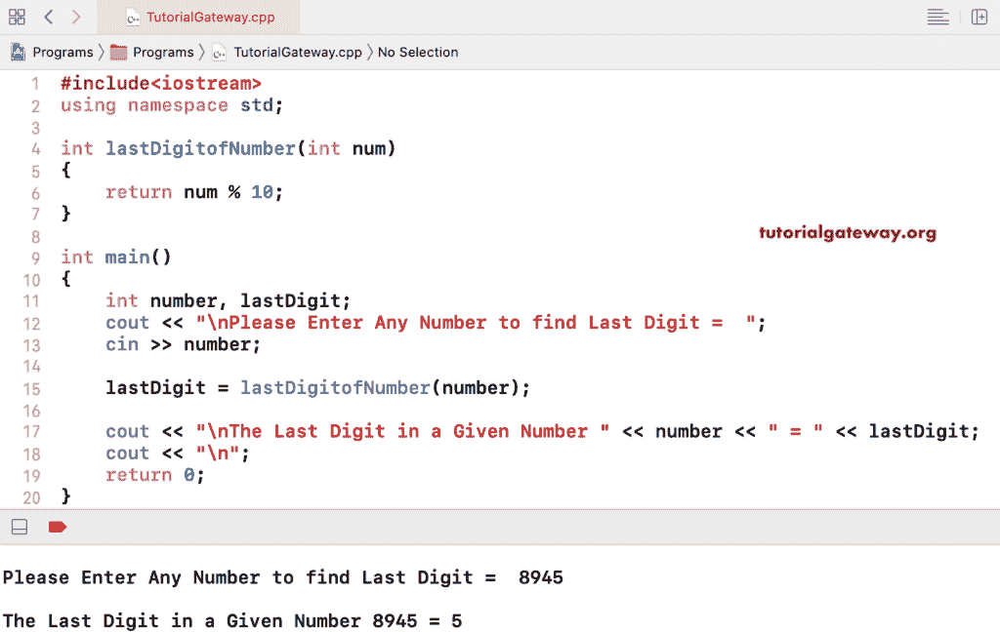

# C++ 程序：寻找数字最后一位

> 原文：<https://www.tutorialgateway.org/cpp-program-to-find-the-last-digit-of-a-number/>

用一个例子写一个 C++ 程序来找到一个数字的最后一位。任何数字百分比十都会给出那个数字的最后一位数字，而在这个 [C++ 程序](https://www.tutorialgateway.org/cpp-programs/)中，我们用的也是同样的。

```cpp
#include<iostream>

using namespace std;

int main()
{
	int number, lastDigit;

	cout << "\nPlease Enter Any Number to find Last Digit =  ";
	cin >> number;

  	lastDigit = number % 10;

	cout << "\nThe Last Digit in a Given Number " << number << " = " << lastDigit; 

 	return 0;
}
```

```cpp
Please Enter Any Number to find Last Digit =  5789

The Last Digit in a Given Number 5789 = 9
```

## 用函数寻找数字最后一位的 C++ 程序

```cpp
#include<iostream>

using namespace std;

int lastDigitofNumber(int num)
{
	return num % 10;
}

int main()
{
	int number, lastDigit;

	cout << "\nPlease Enter Any Number to find Last Digit =  ";
	cin >> number;

  	lastDigit = lastDigitofNumber(number);

	cout << "\nThe Last Digit in a Given Number " << number << " = " << lastDigit; 

 	return 0;
}
```

