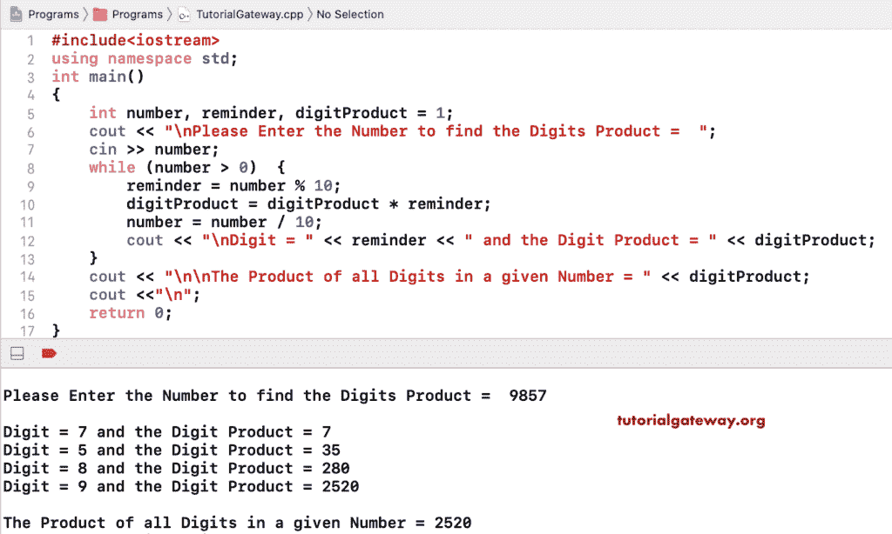

# C++ 程序：计算数字乘积

> 原文：<https://www.tutorialgateway.org/cpp-program-to-find-product-of-digits-in-a-number/>

用一个例子写一个 C++ 程序来寻找数字的乘积。在这个 C++ 数字乘积的数字例子中，while 循环检查数字是否大于 0。

*   提醒=数字% 10–它给出数字的最后一位。
*   数字产品=数字产品*提醒–它将最后一位乘以数字产品。
*   number = number/10–它删除数字的最后一位。

```cpp
#include<iostream>

using namespace std;

int main()
{
	int number, reminder, digitProduct = 1;

	cout << "\nPlease Enter the Number to find the Digits Product =  ";
	cin >> number;

	while (number > 0)
	{
    	reminder = number % 10;
    	digitProduct = digitProduct * reminder;
    	number = number / 10;

    	cout << "\nDigit = " << reminder << " and the Digit Product = " << digitProduct;
	}
	cout << "\n\nThe Product of all Digits in a given Number = " << digitProduct;

 	return 0;
}
```



## 使用 For 循环查找数字乘积的 C++ 程序

```cpp
#include<iostream>

using namespace std;

int main()
{
	int number, reminder, digitProduct;

	cout << "\nPlease Enter the Number to find the Digits Product =  ";
	cin >> number;

	for (digitProduct = 1; number > 0; number = number / 10)
	{
    	reminder = number % 10;
    	digitProduct = digitProduct * reminder;
	}
	cout << "\nThe Product of all Digits in a given Number = " << digitProduct;

 	return 0;
}
```

```cpp
Please Enter the Number to find the Digits Product =  47865

The Product of all Digits in a given Number = 6720
```

[C++ 程序](https://www.tutorialgateway.org/cpp-programs/)使用函数 计算数字的乘积

```cpp
#include<iostream>

using namespace std;

int productOfDigits(int number)
{
	int reminder, digitProduct;

	for (digitProduct = 1; number > 0; number = number / 10)
	{
    	reminder = number % 10;
    	digitProduct = digitProduct * reminder;
	cout << "\nDigit = " << reminder << " and the Digit Product = " << digitProduct;
	}
	return digitProduct;
}

int main()
{
	int number, digitProduct;

	cout << "\nPlease Enter the Number to find the Digits Product =  ";
	cin >> number;

	digitProduct = productOfDigits(number);

	cout << "\n\nThe Product of all Digits in a given Number = " << digitProduct;

 	return 0;
}
```

```cpp
Please Enter the Number to find the Digits Product =  789356

Digit = 6 and the Digit Product = 6
Digit = 5 and the Digit Product = 30
Digit = 3 and the Digit Product = 90
Digit = 9 and the Digit Product = 810
Digit = 8 and the Digit Product = 6480
Digit = 7 and the Digit Product = 45360

The Product of all Digits in a given Number = 45360
```

[C++ 程序](https://www.tutorialgateway.org/cpp-programs/)使用递归计算数字的乘积

```cpp
#include<iostream>

using namespace std;

int productOfDigits(int number)
{	
	static int reminder, digitProduct = 1;

  	if(number > 0)
  	{
    	reminder = number % 10;
    	digitProduct = digitProduct * reminder;
    	productOfDigits( number / 10);
    	return digitProduct;
 	}
 	else
   		return 0;
}

int main()
{
	int number, digitProduct;

	cout << "\nPlease Enter the Number to find the Digits Product =  ";
	cin >> number;

	digitProduct = productOfDigits(number);

	cout << "\nThe Product of all Digits in a given Number = " << digitProduct;

 	return 0;
}
```

```cpp
Please Enter the Number to find the Digits Product =  3456

The Product of all Digits in a given Number = 360
```