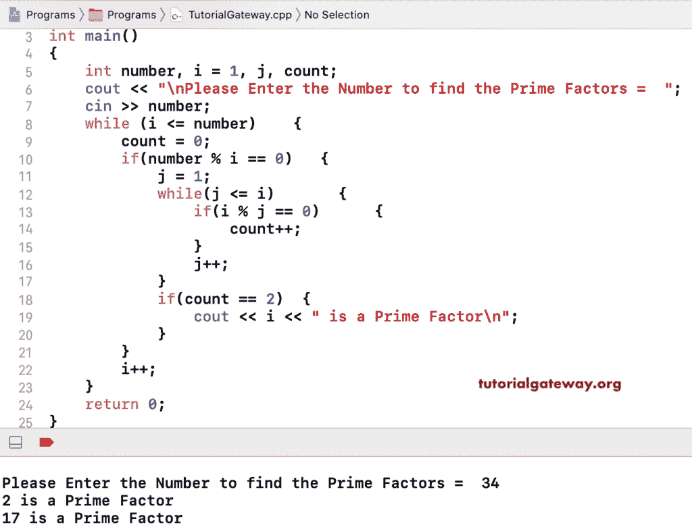

# C++ 程序：寻找一个数的质因数

> 原文：<https://www.tutorialgateway.org/cpp-program-to-find-prime-factors-of-a-number/>

用一个例子写一个 C++ 程序来求一个数的质因数。在这个 C++ 质因数的例子中，我们使用了嵌套 while 循环。

```cpp
#include<iostream>

using namespace std;

int main()
{
	int number, i = 1, j, count;

	cout << "\nPlease Enter the Number to find the Prime Factors =  ";
	cin >> number;

	while (i <= number)
   	{
   		count = 0;
    	if(number % i == 0)
      	{
      		j = 1;
      		while(j <= i)
      		{
      			if(i % j == 0)
      			{
      				count++;
				}
				j++;
			}
			if(count == 2)
			{
				cout << i << " is a Prime Factor\n";
			} 
      	}
    	i++;
   	}

 	return 0;
}
```



## 用 For 循环求一个数的质因数的 C++ 程序

```cpp
#include<iostream>

using namespace std;

int main()
{
	int number, i, j, count;

	cout << "\nPlease Enter the Number to find the Prime Factors =  ";
	cin >> number;

	for(i = 1; i <= number; i++)
   	{
   		count = 0;
    	if(number % i == 0)
      	{    		
      		for(j = 1; j <= i; j++)
      		{
      			if(i % j == 0)
      			{
      				count++;
				}				
			}
			if(count == 2)
			{
				cout << i << " is a Prime Factor\n";
			} 
      	}
   	}

 	return 0;
}
```

```cpp
Please Enter the Number to find the Prime Factors =  72
2 is a Prime Factor
3 is a Prime Factor
```

另一个 [C++ 例子](https://www.tutorialgateway.org/cpp-programs/)求给定数的素因子。

```cpp
#include<iostream>

using namespace std;

int main()
{
	int number, i, j, isPrime, x; 

	cout << "\nPlease Enter the Number to find the Prime Factors =  ";
	cin >> number;

   	for (i = 2; i <= number; i++)
   	{
     	if(number % i == 0)
        {
   			isPrime = 1;
			for (j = 2; j <= i/2; j++)
			{
				x =  i % j;
				if(i % j == 0)
				{
					isPrime = 0;
					break;
				}
			} 
			if(isPrime == 1)
			{
				cout << i << " is a Prime Factor\n";
			}	          	
		}
   }

 	return 0;
}
```

```cpp
Please Enter the Number to find the Prime Factors =  120
2 is a Prime Factor
3 is a Prime Factor
5 is a Prime Factor
```

## 用递归求一个数的质因数的 C++ 程序

在这个 C++ 示例中，void findFactors(int number)方法查找给定数字的因子。并且，void findPrime(int number)方法可以找到素数。

```cpp
#include<iostream>

using namespace std;

void findPrime(int number)
{ 
  	int i, count = 0; 
  	for (i = 2; i <= number/2; i++)   	
	{
    	if(number % i == 0)
		{
       		count++;
     	} 
   	}
   	if(count == 0 && number != 1 )
	{
   		cout << number << " is a Prime Factor\n";
   	}
}
void findFactors(int number)
{ 
  	for (int i = 1; i <= number; i++)
   	{
    	if(number % i == 0)
     	{
       		findPrime(i);
     	} 
   	}
}

int main()
{
	int number; 

	cout << "\nPlease Enter the Number to find the Prime Factors =  ";
	cin >> number;

   	cout << "\nThe Prime Factors of a Given Number " << number << " are\n";
   	findFactors(number);

 	return 0;
}
```

```cpp
Please Enter the Number to find the Prime Factors =  266

The Prime Factors of a Given Number 266 are
2 is a Prime Factor
7 is a Prime Factor
19 is a Prime Factor
```