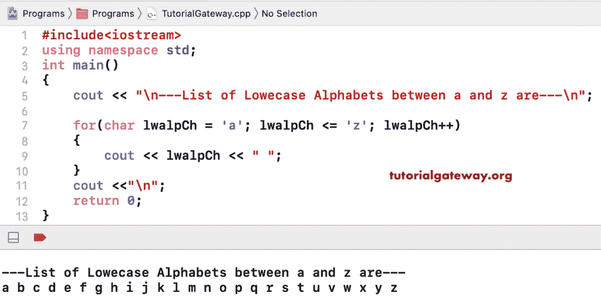

# C++ 程序：打印`a`和`z`之间的字母

> 原文：<https://www.tutorialgateway.org/cpp-program-to-print-alphabets-from-a-to-z/>

写一个 C++ 程序打印字母从 a 到 z 用一个例子。这里，for 循环(for(char lwalpCh = ' a '；lwalpCh < = ' zlwalpCh++))从 a 到 z 迭代字符。在循环内，cout < < lwalpCh 语句打印从 a 到 z 的字符。

```cpp
#include<iostream>
using namespace std;

int main()
{
	cout << "\n---List of Lowercase Alphabets between a and z are---\n";

	for(char lwalpCh = 'a'; lwalpCh <= 'z'; lwalpCh++)
	{
		cout << lwalpCh << " ";
	}

	return 0;
}
```



在这个 C++ 代码中，这个 for 循环(for(lwalpCh = 97；<= 122; lwalpCh++)) iterates between ASCII Values of a and z.

```cpp
#include<iostream>
using namespace std;

int main()
{
	char lwalpCh;

	cout << "\n---List of Lowercase Alphabets between a and z are---\n";

	for(lwalpCh = 97; lwalpCh <= 122; lwalpCh++)
	{
		cout << lwalpCh << " ";
	}

	return 0;
}
```

```cpp
---List of Lowercase Alphabets between a and z are---
a b c d e f g h i j k l m n o p q r s t u v w x y z 
```

## 使用 While 循环打印字母的 C++ 程序

```cpp
#include<iostream>
using namespace std;

int main()
{
	char lwalpCh = 'a'; 

	cout << "\n---List of Lowercase Alphabets between a and z are---\n";

	while(lwalpCh <= 'z')
	{
		cout << lwalpCh << " ";
		lwalpCh++;
	}

	return 0;
}
```

```cpp
---List of Lowercase Alphabets between a and z are---
a b c d e f g h i j k l m n o p q r s t u v w x y z 
```

这个 [C++ 程序](https://www.tutorialgateway.org/cpp-programs/)返回字母从 a 到 z 的代码允许用户输入起始小写字母。接下来，它打印从 startLwAlp 到 z 的小写字母。

```cpp
#include<iostream>
using namespace std;

int main()
{
	char startLwAlp;

	cout << "\nPlease Enter the Starting Lowercase Alphabet = ";
	cin >> startLwAlp;

	cout << "\n---List of Lowercase between " << startLwAlp << " and z are---\n";

	for(char lwalpCh = startLwAlp; lwalpCh <= 'z'; lwalpCh++)
	{
		cout << lwalpCh << " ";
	}

	return 0;
}
```

```cpp
Please Enter the Starting Lowercase Alphabet = j

---List of Lowercase between j and z are---
j k l m n o p q r s t u v w x y z 
```

这个从 a 到 z 返回字母的 C++ 代码允许用户输入小写字母的开始和结束。接下来，它打印从 startLwAlp 到 endLwAlp 的小写字母。

```cpp
#include<iostream>
using namespace std;

int main()
{
	char startLwAlp, endLwAlp;

	cout << "\nPlease Enter the Starting Lowercase Alphabet = ";
	cin >> startLwAlp;

	cout << "\nPlease Enter the Starting Lowercase Alphabet = ";
	cin >> endLwAlp;

	cout << "\n---List of Lowercase between " << startLwAlp << " and " << endLwAlp << " are---\n";	
	for(char lwalpCh = startLwAlp; lwalpCh <= endLwAlp; lwalpCh++)
	{
		cout << lwalpCh << " ";
	}

	return 0;
}
```

```cpp
Please Enter the Starting Lowercase Alphabet = f

Please Enter the Starting Lowercase Alphabet = v

---List of Lowercase between f and v are---
f g h i j k l m n o p q r s t u v 
```