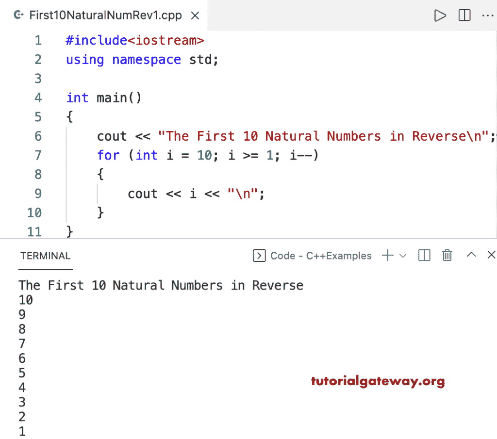

# C++ 程序：反向打印前 10 个自然数

> 原文：<https://www.tutorialgateway.org/cpp-program-to-print-first-10-natural-numbers-in-reverse/>

编写一个 C++ 程序，使用 for 循环以相反的顺序打印前 10 个自然数。

```cpp
#include<iostream>
using namespace std;

int main()
{
	cout << "The First 10 Natural Numbers in Reverse\n";

	for (int i = 10; i >= 1; i--)
	{
		cout << i << "\n";
	}
}
```



## 使用 while 循环反向打印前 10 个自然数的 C++ 程序

```cpp
#include<iostream>
using namespace std;

int main()
{
	int i = 10;

	cout << "The First 10 Natural Numbers in Reverse\n";
	while (i >= 1)
	{
		cout << i << "\n";
		i--;
	}
}
```

```cpp
The First 10 Natural Numbers in Reverse
10
9
8
7
6
5
4
3
2
1
```

这个 C++ 程序使用 do while 循环，以逆序或降序显示前 10 个自然数。

```cpp
#include<iostream>
using namespace std;

int main()
{
	int i = 10;

	cout << "The First 10 Natural Numbers in Reverse\n";

	do
	{
		cout << i << "\n";

	} while (--i >= 1);
}
```

```cpp
The First 10 Natural Numbers in Reverse
10
9
8
7
6
5
4
3
2
1
```