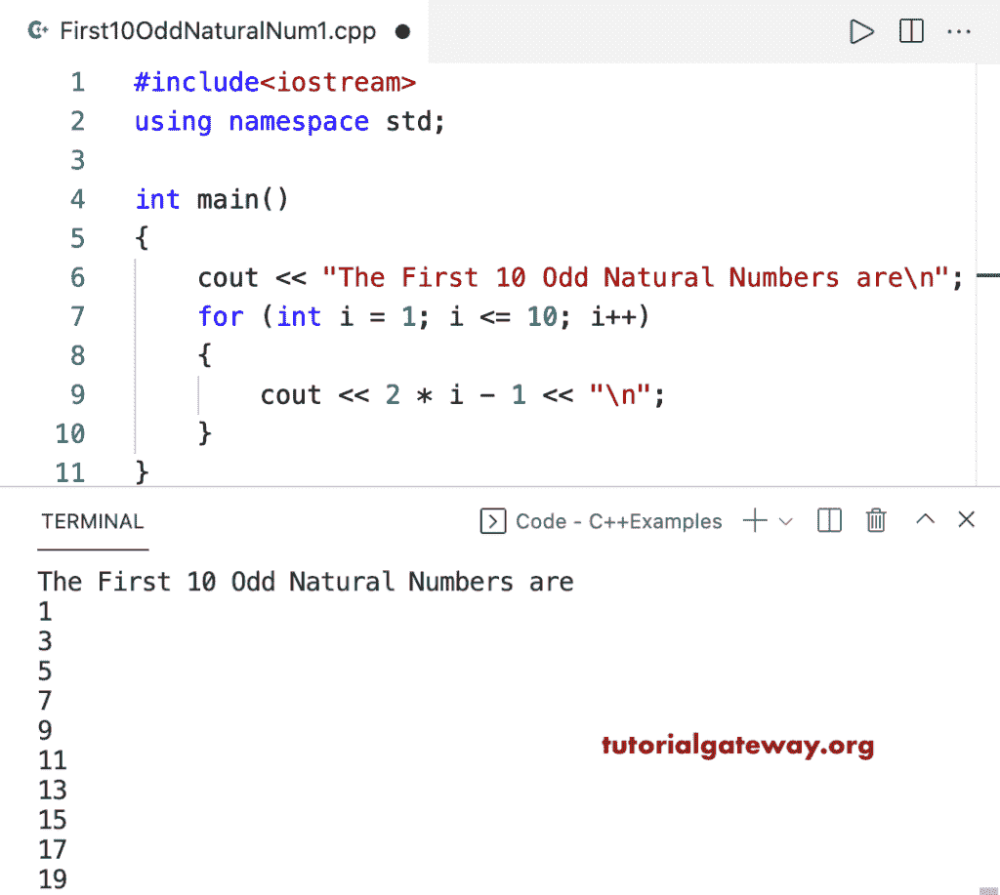

# C++ 程序：打印前 10 个奇数自然数

> 原文：<https://www.tutorialgateway.org/cpp-program-to-print-first-10-odd-natural-numbers/>

编写一个 C++ 程序，使用 for 循环打印前 10 个奇数自然数。

```cpp
#include<iostream>
using namespace std;

int main()
{
	cout << "The First 10 Odd Natural Numbers are\n";

	for (int i = 1; i <= 10; i++)
	{
		cout << 2 * i - 1 << "\n";
	}
}
```



## 使用 while 循环打印前 10 个奇数自然数的 C++ 程序

```cpp
#include<iostream>
using namespace std;

int main()
{
	int i = 1;

	cout << "The First 10 Odd Natural Numbers are\n";

	while (i <= 10)
	{
		cout << 2 * i - 1 << "\n";
		i++;
	}
}
```

```cpp
The First 10 Odd Natural Numbers are
1
3
5
7
9
11
13
15
17
19
```

这个 [C++ 程序](https://www.tutorialgateway.org/cpp-programs/)使用 do while 循环，显示前 10 个奇数自然数。

```cpp
#include<iostream>
using namespace std;

int main()
{
	int i = 1;

	cout << "The First 10 Odd Natural Numbers are\n";

	do
	{
		cout << 2 * i - 1 << "\n";

	} while (++i <= 10);
}
```

```cpp
The First 10 Odd Natural Numbers are
1
3
5
7
9
11
13
15
17
19
```