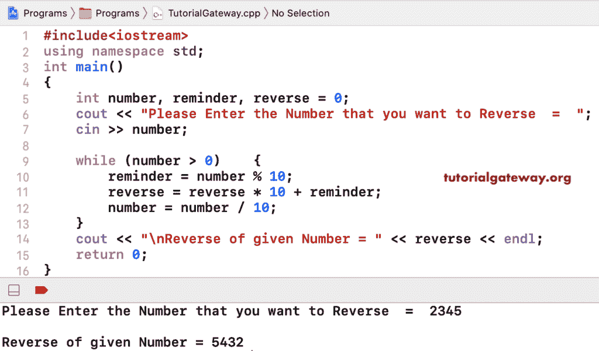

# C++ 程序：反转数字

> 原文：<https://www.tutorialgateway.org/cpp-program-to-reverse-a-number/>

用一个例子写一个 C++ 程序来反转一个数字。在这个 C++ 逆向数示例中，while 循环检查给定值是否大于 0。

*   提醒=数字% 10–给出最后一位
*   reverse = reverse * 10 +提醒–它在第一个位置添加最后一位。因为反向* 10，该值将在第 2、3、…`N`个位置相加。否则，它将替换现有的。
*   number = number/10–它会删除最后一位。

```cpp
#include<iostream>

using namespace std;

int main()
{
	int number, reminder, reverse = 0;

	cout << "Please Enter the Number that you want to Reverse  =  ";
	cin >> number;

	while (number > 0)
	{
    	reminder = number % 10;
    	reverse = reverse * 10 + reminder;
    	number = number / 10;
	}
	cout << "\nReverse of given Number = " << reverse;

 	return 0;
}
```



## 使用 For 循环反转数字的 C++ 程序

```cpp
#include<iostream>

using namespace std;

int main()
{
	int number, reminder, reverse = 0;

	cout << "Please Enter the Num  =  ";
	cin >> number;

	for (;number > 0; number = number / 10)
	{
    	reminder = number % 10;
    	reverse = reverse * 10 + reminder;
	}
	cout << "\nReverse of given Num = " << reverse;

 	return 0;
}
```

```cpp
Please Enter the Num  =  67859

Reverse of given Num = 95876
```

[C++ 代码](https://www.tutorialgateway.org/cpp-programs/)使用递归函数反转一个数字。

```cpp
#include<iostream>
using namespace std;

int reverseNumber(int number)
{
	static int reminder, reverse = 0;

	if (number > 0)
	{
    	reminder = number % 10;
    	reverse = reverse * 10 + reminder;
    	reverseNumber(number / 10);
	}

	return reverse;

}
int main()
{
	int num, rev = 0;

	cout << "Please Enter the Num  =  ";
	cin >> num;

	rev = reverseNumber(num);
	cout << "\nReverse of given = " << rev;

 	return 0;
}
```

```cpp
Please Enter the Num  =  478956

Reverse of given = 659874
```