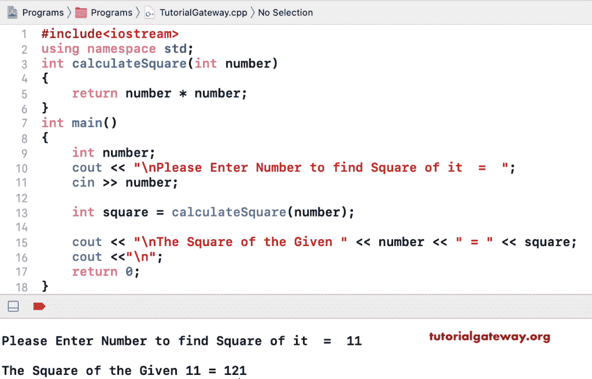

# C++ 程序：计算数字平方

> 原文：<https://www.tutorialgateway.org/cpp-program-to-calculate-square-of-a-number/>

用一个例子写一个 C++ 程序来求一个数的平方。这个 [C++ 代码](https://www.tutorialgateway.org/cpp-programs/)可以让你输入任意一个数字，找到它的平方。

```cpp
#include<iostream>
using namespace std;

int main()
{
	int number, square;

	cout << "\nPlease Enter Number to find Square of it  =  ";
	cin >> number;	

	square = number * number;

	cout << "\nThe Square of the Given " << number << " = " << square;

 	return 0;
}
```

```cpp
Please Enter Number to find Square of it  =  5

The Square of the Given 5 = 25
```

## 用函数计算数字平方的 C++ 程序

```cpp
#include<iostream>
using namespace std;

int calculateSquare(int number)
{
	return number * number;
}

int main()
{
	int number;

	cout << "\nPlease Enter Number to find Square of it  =  ";
	cin >> number;	

	int square = calculateSquare(number);

	cout << "\nThe Square of the Given " << number << " = " << square;

 	return 0;
}
```

