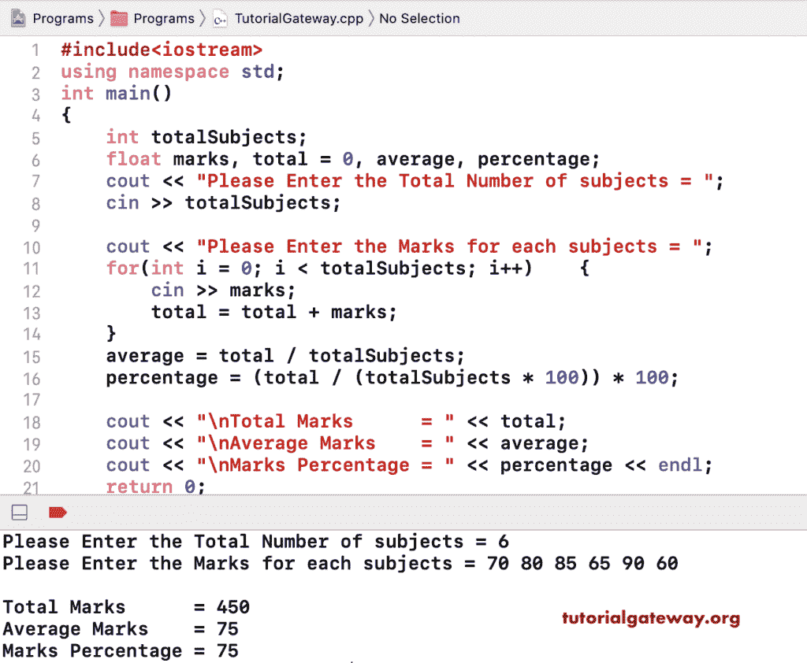

# C++ 程序：计算学生成绩

> 原文：<https://www.tutorialgateway.org/cpp-program-to-calculate-student-marks/>

用例子写一个计算学生成绩的 C++ 程序。下面显示的 C++ 程序允许输入五个不同的科目标记。接下来，它计算这五个科目的总数、平均值和百分比，并打印结果。

```cpp
#include<iostream>

using namespace std;

int main()
{
	int english, chemistry, computers, physics, maths; 
    float total, average, percentage;

    cout << "Please Enter the marks of five subjects: \n";
    cin >> english >> chemistry >> computers >> physics >> maths;

    total = english + chemistry + computers + physics + maths;
    average = total / 5;
    percentage = (total / (500)) * 100;

    cout << "\nTotal Marks      = " << total;
    cout << "\nAverage Marks    = " << average;
    cout << "\nMarks Percentage = " << percentage;
 	return 0;
}
```

```cpp
Please Enter the marks of five subjects: 
50 60 45 70 85

Total Marks      = 310
Average Marks    = 62
Marks Percentage = 62
```

## 计算学生成绩的 C++ 程序示例 2

这个 [C++ 程序](https://www.tutorialgateway.org/cpp-programs/)允许用户选择学生科目的总数。接下来，它计算学生分数。

```cpp
#include<iostream>

using namespace std;

int main()
{
	int totalSubjects; 
    float marks, total = 0, average, percentage;

    cout << "Please Enter the Total Number of subjects = ";
    cin >> totalSubjects;

	cout << "Please Enter the Marks for each subjects = ";
	for(int i = 0; i < totalSubjects; i++)
	{
		cin >> marks;
		total = total + marks;
	}
    average = total / totalSubjects;
    percentage = (total / (totalSubjects * 100)) * 100;

    cout << "\nTotal Marks      = " << total;
    cout << "\nAverage Marks    = " << average;
    cout << "\nMarks Percentage = " << percentage;
 	return 0;
}
```

