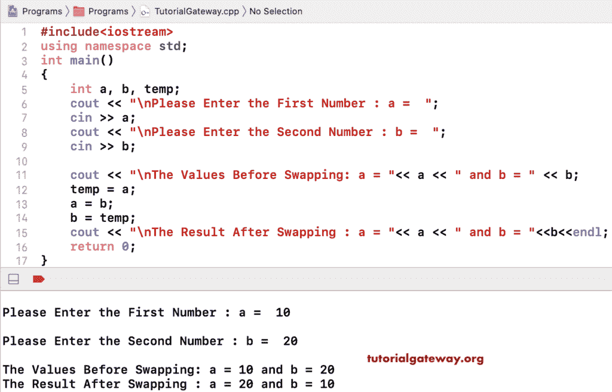

# C++ 程序：交换两个数字

> 原文：<https://www.tutorialgateway.org/cpp-program-to-swap-two-numbers/>

用一个例子写一个 C++ 程序来交换两个数字。我们可以通过多种方式做到这一点:

*   使用临时变量。
*   使用按位运算符
*   算术运算符
*   通过创建函数
*   使用指针
*   使用引用调用

在这个例子中，我们使用了一个临时变量。它允许我们输入 a 和 b 值。然后，它使用 temp 变量来交换这两个值。

```cpp
#include<iostream>
using namespace std;

int main()
{
	int a, b, temp;

	cout << "\nPlease Enter the First Number : a =  ";
	cin >> a;

	cout << "\nPlease Enter the Second Number : b =  ";
	cin >> b;

	cout << "\nThe Values Before Swapping: a = "<< a << " and b = " << b;

	temp = a;
	a = b;
	b = temp;

	cout << "\nThe Result After Swapping : a = "<< a << " and b = " << b;

 	return 0;
}
```



## 使用按位运算符交换两个数字的 C++ 程序

```cpp
#include<iostream>
using namespace std;

int main()
{
	int a, b;

	cout << "\nPlease Enter the First Value : a =  ";
	cin >> a;

	cout << "\nPlease Enter the Second Value : b =  ";
	cin >> b;

	cout << "\nThe Values Before : a = "<< a << " and b = " << b;

	a = a ^ b;
	b = a ^ b; 
	a = a ^ b;

	cout << "\nThe Result After : a = "<< a << " and b = " << b;

 	return 0;
}
```

```cpp
Please Enter the First Value : a =  30

Please Enter the Second Value : b =  40

The Values Before : a = 30 and b = 40
The Result After : a = 40 and b = 30
```

用算术运算符交换两个数字的 C++ 程序

```cpp
#include<iostream>
using namespace std;

int main()
{
	int a, b;

	cout << "\nPlease Enter the First : a =  ";
	cin >> a;

	cout << "\nPlease Enter the Second : b =  ";
	cin >> b;

	cout << "\nThe Values Before : a = "<< a << " and b = " << b;

	a = a + b;
	b = a - b; 
	a = a - b;

	cout << "\nThe Result After : a = "<< a << " and b = " << b;

 	return 0;
}
```

```cpp
Please Enter the First : a =  9

Please Enter the Second : b =  17

The Values Before : a = 9 and b = 17
The Result After : a = 17 and b = 9
```

## 用函数交换两个数字的 C++ 程序

```cpp
#include<iostream>
using namespace std;

void swapTwoNumbers(int a, int b)
{
	int temp;

	temp = a;
	a = b;
	b = temp;

	cout << "\nThe Result After : a = "<< a << " and b = " << b;
}
int main()
{
	int a, b;

	cout << "\nPlease Enter the First Num : a =  ";
	cin >> a;

	cout << "\nPlease Enter the Second Num : b =  ";
	cin >> b;

	cout << "\nThe Values Before : a = "<< a << " and b = " << b;

	swapTwoNumbers(a, b);

 	return 0;
}
```

```cpp
Please Enter the First Num : a =  222

Please Enter the Second Num : b =  999

The Values Before : a = 222 and b = 999
The Result After : a = 999 and b = 222
```

[C++ 程序](https://www.tutorialgateway.org/cpp-programs/)使用指针交换两个数字

```cpp
#include<iostream>
using namespace std;

int main()
{
	int a, b, *i, *j, temp;

	cout << "\nPlease Enter the First Num : a =  ";
	cin >> a;

	cout << "\nPlease Enter the Second Num : b =  ";
	cin >> b;

	cout << "\nThe Values Before : a = "<< a << " and b = " << b;
	i = &a;
	j = &b;

	temp = *i;
	*i = *j;
	*j = temp;

	cout << "\n\nThe Result After : a = "<< a << " and b = " << b;
	cout << "\nThe Result After : *i = "<< *i << " and *j = " << *j;
	cout << "\nThe Result After : i = "<< i << " and j = " << j;

 	return 0;
}
```

```cpp
Please Enter the First Num : a =  1212

Please Enter the Second Num : b =  8796

The Values Before : a = 1212 and b = 8796

The Result After : a = 8796 and b = 1212
The Result After : *i = 8796 and *j = 1212
The Result After : i = 0x7ffeefbff458 and j = 0x7ffeefbff454
```

C++ 程序通过引用调用 来交换两个号码

```cpp
#include<iostream>
using namespace std;

void swapTwoNumbers(int *i, int *j)
{
	int temp;

	temp = *i;
	*i = *j;
	*j = temp;

	cout << "\n\nThe Result After : i = "<< i << " and j = " << j;
	cout << "\nThe Result After  : *i = "<< *i << " and *j = " << *j;
}

int main()
{
	int a, b, *i, *j, temp;

	cout << "\nPlease Enter the First : a =  ";
	cin >> a;

	cout << "\nPlease Enter the Second : b =  ";
	cin >> b;

	cout << "\nThe Values Before : a = "<< a << " and b = " << b;
	i = &a;
	j = &b;

	swapTwoNumbers(i, j);	
	cout << "\nThe Result After  : a = "<< a << " and b = " << b;

 	return 0;
}
```

```cpp
Please Enter the First : a =  1500

Please Enter the Second : b =  9877

The Values Before : a = 1500 and b = 9877

The Result After : i = 0x7ffeefbff458 and j = 0x7ffeefbff454
The Result After : *i = 9877 and *j = 1500
The Result After : a = 9877 and b = 1500
```