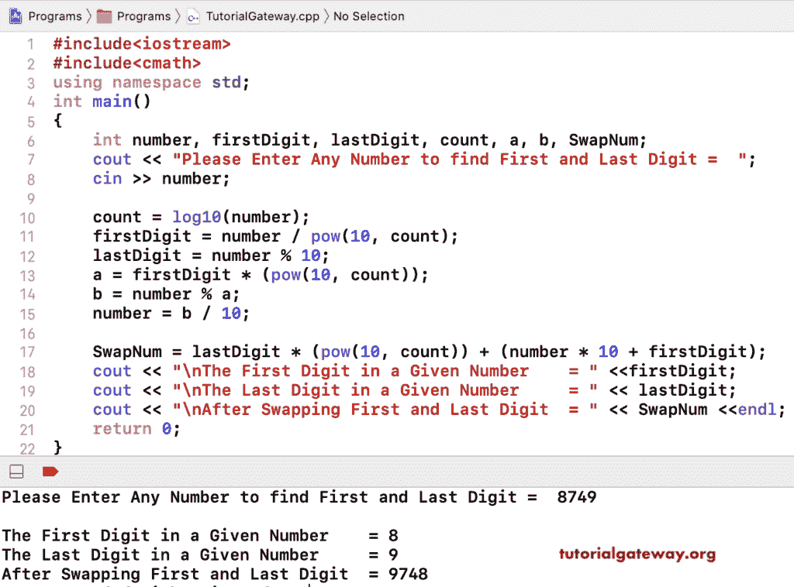

# C++ 程序：交换数字的第一个和最后一个数字

> 原文：<https://www.tutorialgateway.org/cpp-program-to-swap-first-and-last-digit-in-a-number/>

用一个例子写一个 C++ 程序来交换数字的第一个和最后一个数字。这个 [C++ 程序](https://www.tutorialgateway.org/cpp-programs/)允许用户输入任意数值，它找到第一个和最后一个数字，并交换它们。

```cpp
#include<iostream>
#include<cmath>
using namespace std;

int main()
{
	int number, firstDigit, lastDigit, count, a, b, SwapNum;

	cout << "\nPlease Enter Any Number to find First and Last Digit =  ";
	cin >> number;

	count = log10(number);  	
  	firstDigit = number / pow(10, count);

  	lastDigit = number % 10;

  	a = firstDigit * (pow(10, count));
  	b = number % a;
  	number = b / 10;

  	SwapNum = lastDigit * (pow(10, count)) + (number * 10 + firstDigit);

	cout << "\nThe First Digit in a Given Number    = " <<firstDigit; 
	cout << "\nThe Last Digit in a Given Number     = " << lastDigit; 
	cout << "\nAfter Swapping First and Last Digit  = " << SwapNum; 	
 	return 0;
}
```



## 交换数字的第一个和最后一个数字的 C++ 程序示例 2

```cpp
#include<iostream>
#include<cmath>
using namespace std;

int main()
{
	int number, firstDigit, lastDigit, count, SwapNum;

	cout << "\nPlease Enter Any Number to find First and Last Digit =  ";
	cin >> number;

	count = log10(number);  	
  	firstDigit = number / pow(10, count);

  	lastDigit = number % 10;

  	SwapNum = lastDigit;
  	SwapNum = SwapNum  * (round(pow(10, count)));
  	SwapNum = SwapNum + number % (int)(round(pow(10, count)));
  	SwapNum = SwapNum - lastDigit;
  	SwapNum = SwapNum + firstDigit;

	cout << "\nThe First Digit in a Given Number    = " <<firstDigit; 
	cout << "\nThe Last Digit in a Given Number     = " << lastDigit; 
	cout << "\nAfter Swapping First and Last Digit  = " << SwapNum; 	
 	return 0;
}
```

```cpp
Please Enter Any Number to find First and Last Digit =  69732

The First Digit in a Given Number    = 6
The Last Digit in a Given Number     = 2
After Swapping First and Last Digit  = 29736
```