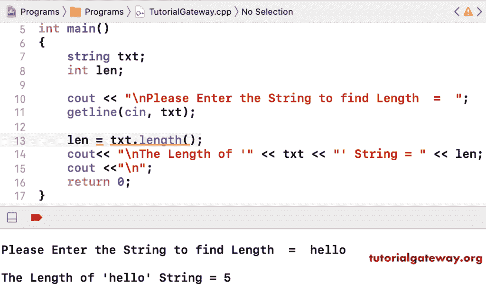

# C++ 程序：计算字符串长度

> 原文：<https://www.tutorialgateway.org/cpp-program-to-find-string-length/>

用一个例子写一个 C++ 程序来查找字符串长度。在 C++ 中，有一个长度函数来查找字符串。

```cpp
#include<iostream>
#include<string>
using namespace std;

int main()
{
	string txt;

	cout << "\nPlease Enter the String to find Length  =  ";
	getline(cin, txt);

	int len = txt.length();
	cout<< "\nThe Length of '" << txt << "' String = " << len;

 	return 0;
}
```



在 [C++](https://www.tutorialgateway.org/cpp-programs/) 中，有一个返回字符串长度的大小函数。

```cpp
#include<iostream>
#include<string>
using namespace std;

int main()
{
	string txt;

	cout << "\nPlease Enter the Text  =  ";
	getline(cin, txt);

	int len = txt.size();
	cout<< "\nThe Length of '" << txt << "' = " << len;

 	return 0;
}
```

```cpp
Please Enter the Text  =  hello world

The Length of 'hello world' = 11
```

## 使用 While 循环查找字符串长度的 C++ 程序

```cpp
#include<iostream>
#include<string>
using namespace std;

int main()
{
	string txt;

	cout << "\nPlease Enter the Text  =  ";
	getline(cin, txt);

	int i = 0;
	while(txt[i])
	{
		i++;
	}
	cout<< "\nThe Length of '" << txt << "' = " << i;

 	return 0;
}
```

```cpp
Please Enter the Text  =  c++ programming

The Length of 'c++ programming' = 15
```

使用 For 循环查找字符串字符总数的 C++ 程序

```cpp
#include<iostream>
#include<string>
using namespace std;

int main()
{
	string txt;
	int i;

	cout << "\nPlease Enter the text  =  ";
	getline(cin, txt);

	for (i = 0; txt[i]; i++);

	cout<< "\nThe Length of " << txt << " = " << i;

 	return 0;
}
```

```cpp
Please Enter the Text  =  hello world!

The Length of 'hello world!' = 12
```