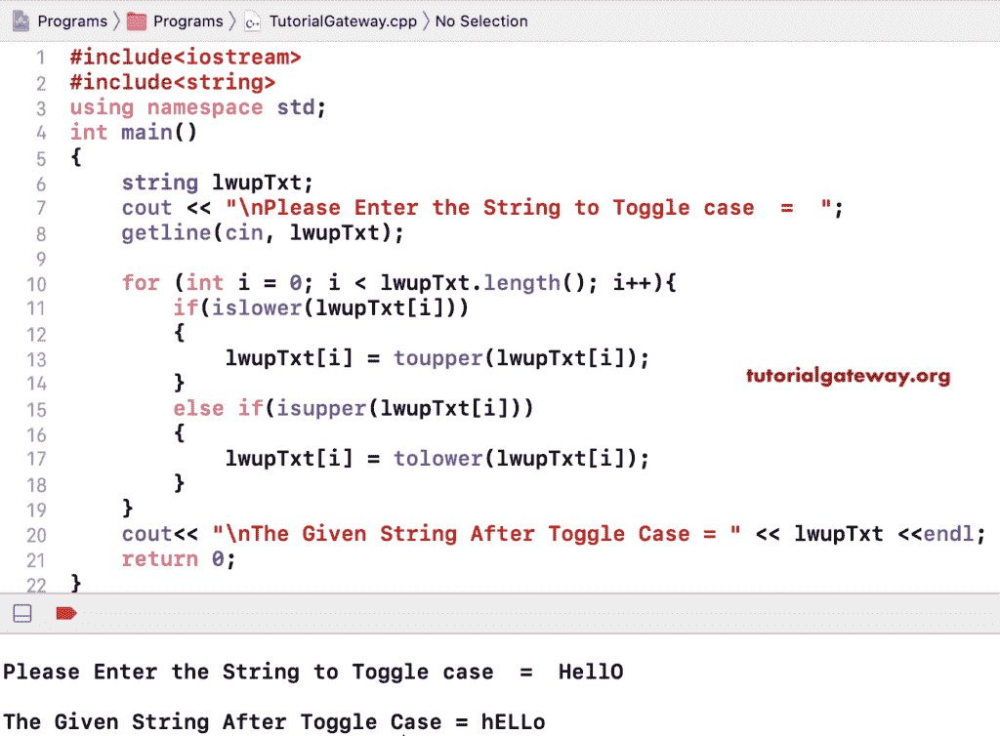

# C++ 程序：切换字符串中字符大小写

> 原文：<https://www.tutorialgateway.org/cpp-program-to-toggle-character-cases-in-a-string/>

用一个例子写一个 C++ 程序来切换字符串中的字符大小写。在这个 C++ 切换字符串的例子中，我们在 for 循环中使用了 Else If 语句(for(int I = 0；I < lwupxt . length()；i++)。第一个 if 语句使用 islower 函数(if(is lower(lWupxt[I]))来查找小写字符。然后，它使用 toupper 将它们转换成大写。else if 语句使用 is upper(else if(is upper(LwUPxt[I]))来检查大写字符。然后，它使用 tolower 函数将它们转换为小写。

```cpp
#include<iostream>
#include<string>
using namespace std;

int main()
{
	string lwupTxt;

	cout << "\nPlease Enter the String to Toggle Case  =  ";
	getline(cin, lwupTxt);

	for (int i = 0; i < lwupTxt.length(); i++)
  	{
  		if(islower(lwupTxt[i]))
  		{
  			lwupTxt[i] = toupper(lwupTxt[i]);
  		}
  		else if(isupper(lwupTxt[i]))
  		{
  			lwupTxt[i] = tolower(lwupTxt[i]);
		}
  	}

	cout<< "\nThe Given String After Toggle Case = " << lwupTxt;

 	return 0;
}
```



在这个 [C++ 代码](https://www.tutorialgateway.org/cpp-programs/)中切换字符串，不是使用内置的 islower 和 isupper 函数，而是使用 A、Z、A、Z 来检查字符是小写还是大写。如果它是小写的，我们将 ASCII 值加 32，如果它是大写的，我们将从中减去 32。

```cpp
#include<iostream>
#include<string>
using namespace std;

int main()
{
	string lwupTxt;

	cout << "\nPlease Enter the String to Toggle Case  =  ";
	getline(cin, lwupTxt);

	for (int i = 0; i < lwupTxt.length(); i++)
  	{
  		if(lwupTxt[i] >= 'a' && lwupTxt[i] <= 'z')
  		{
  			lwupTxt[i] = lwupTxt[i] - 32;
  		}
  		else if(lwupTxt[i] >= 'A' && lwupTxt[i] <= 'Z')
  		{
  			lwupTxt[i] = lwupTxt[i] + 32;
		}
  	}

	cout<< "\nThe Given String After Toggle Case = " << lwupTxt;

 	return 0;
}
```

```cpp
Please Enter the String to Toggle Case  =  Tutorial GATEwaY

The Given String After Toggle Case = tUTORIAL gateWAy
```

## 使用 ASCII 值切换字符串中字符大小写的 C++ 程序

```cpp
#include<iostream>
#include<string>
using namespace std;

int main()
{
	string lwupTxt;

	cout << "\nPlease Enter the String to Toggle Case  =  ";
	getline(cin, lwupTxt);

	for (int i = 0; i < lwupTxt.length(); i++)
  	{
  		if(lwupTxt[i] >= 65 && lwupTxt[i] <= 90)
  		{
  			lwupTxt[i] = lwupTxt[i] + 32;
  		}
  		else if(lwupTxt[i] >= 97 && lwupTxt[i] <= 122)
  		{
  			lwupTxt[i] = lwupTxt[i] - 32;
		}
  	}

	cout<< "\nThe Given String After Toggle Case = " << lwupTxt;

 	return 0;
}
```

```cpp
Please Enter the String to Toggle Case  =  HellO WoRLd!

The Given String After Toggle Case = hELLo wOrlD!
```

使用 while 循环切换字符串中字符大小写的 C++ 示例

```cpp
#include<iostream>
#include<string>
using namespace std;

int main()
{
	string lwupTxt;
	int i = 0; 

	cout << "\nPlease Enter the String to Toggle Case  =  ";
	getline(cin, lwupTxt);

	while(i < lwupTxt.length())
  	{
  		if(lwupTxt[i] >= 'a' && lwupTxt[i] <= 'z')
  		{
  			lwupTxt[i] = lwupTxt[i] - 32;
  		}
  		else if(lwupTxt[i] >= 'A' && lwupTxt[i] <= 'Z')
  		{
  			lwupTxt[i] = lwupTxt[i] + 32;
		}
		i++;
  	}

	cout<< "\nThe Given String After Toggle Case = " << lwupTxt;

 	return 0;
}
```

```cpp
Please Enter the String to Toggle Case  =  C++ ProGRAMMinG

The Given String After Toggle Case = c++ pROgrammINg
```

## C++ 使用函数切换字符串大小写

```cpp
#include<iostream>
#include<string>
using namespace std;

string stringLower(string lwupTxt)
{
	for (int i = 0; i < lwupTxt.length(); i++)
  	{
  		if(lwupTxt[i] >= 'a' && lwupTxt[i] <= 'z')
  		{
  			lwupTxt[i] = lwupTxt[i] - 32;
  		}
  		else if(lwupTxt[i] >= 'A' && lwupTxt[i] <= 'Z')
  		{
  			lwupTxt[i] = lwupTxt[i] + 32;
		}
  	}
  	return lwupTxt;
}

int main()
{
	string lwupTxt;

	cout << "\nPlease Enter the String to Toggle Case  =  ";
	getline(cin, lwupTxt);

	string lwup = stringLower(lwupTxt);

	cout<< "\nThe Given String After Toggle Case = " << lwup;

 	return 0;
}
```

```cpp
Please Enter the String to Toggle Case  =  LearN C++ ProGRaMS

The Given String After Toggle Case = lEARn c++ pROgrAms
```