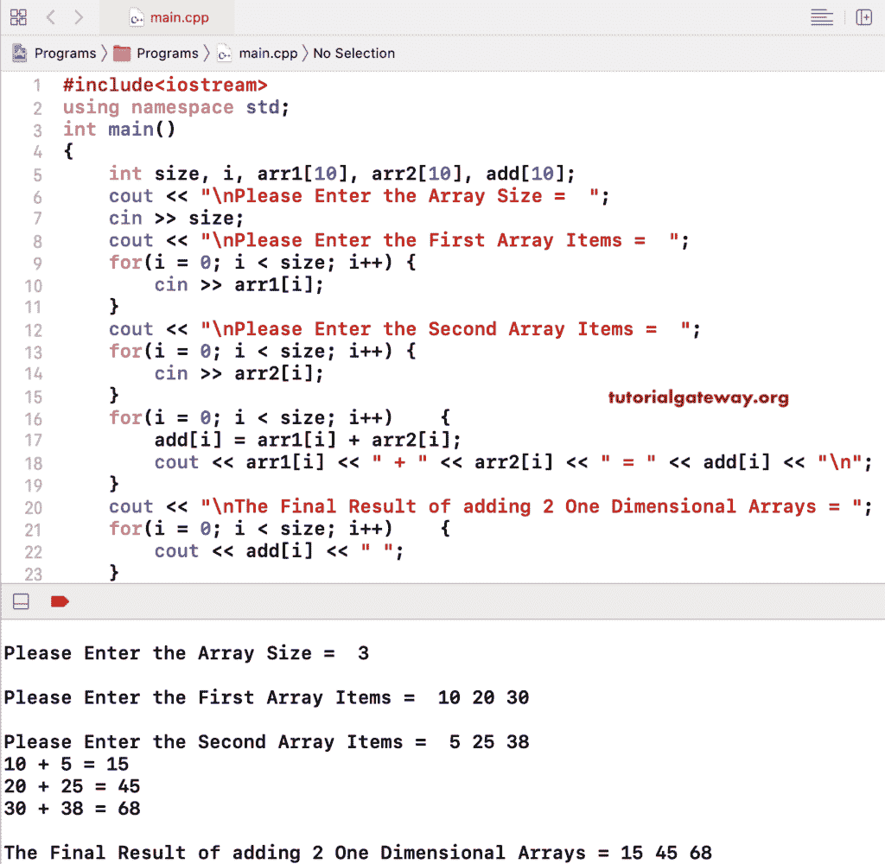

# C++ 程序：相加两个数组

> 原文：<https://www.tutorialgateway.org/cpp-program-to-add-two-arrays/>

用一个例子写一个 C++ 程序来相加两个数组。在这个 C++ 相加两个数组的例子中，我们允许用户输入数组大小和数组项。接下来，我们使用 C++ for 循环将数组从 0 迭代到大小。

在 for 循环中，我们相加了两个数组项，并将它们分配给一个名为 add 的新数组。这里，我们还使用 cout 语句向您展示了每次 for 循环迭代的结果。最后，我们使用了一个 for 循环来打印 add 数组项。

```cpp
#include<iostream>
using namespace std;

int main()
{
	int size, i, arr1[10], arr2[10], add[10];

	cout << "\nPlease Enter the Array Size =  ";
	cin >> size;

	cout << "\nPlease Enter the First Array Items =  ";
	for(i = 0; i < size; i++)
	{
		cin >> arr1[i];
	}	
	cout << "\nPlease Enter the Second Array Items =  ";
	for(i = 0; i < size; i++)
	{
		cin >> arr2[i];
	}
	for(i = 0; i < size; i++)
	{
		add[i] = arr1[i] + arr2[i];
		cout << arr1[i] << " + " << arr2[i] << " = " << add[i] << "\n";
	}
	cout << "\nThe Final Result of adding 2 One Dimensional Arrays = ";
	for(i = 0; i < size; i++)
	{
		cout << add[i] << " ";
	}

 	return 0;
}
```



在这个 [C++](https://www.tutorialgateway.org/cpp-programs/) 相加数组的例子中，我们移除了额外的 for 循环来显示项目，并在执行相加后放置了一个 cout 语句。

```cpp
#include<iostream>
using namespace std;

int main()
{
	int size, i, arr1[10], arr2[10], add[10];

	cout << "\nPlease Enter the Array Size =  ";
	cin >> size;

	cout << "\nPlease Enter the First Array Items =  ";
	for(i = 0; i < size; i++)
	{
		cin >> arr1[i];
	}	
	cout << "\nPlease Enter the Second Array Items =  ";
	for(i = 0; i < size; i++)
	{
		cin >> arr2[i];
	}
	cout << "\nThe Final Result of adding 2 One Dimensional Arrays = ";
	for(i = 0; i < size; i++)
	{
		add[i] = arr1[i] + arr2[i];
		cout << add[i] << " ";
	}

 	return 0;
}
```

```cpp
Please Enter the Array Size =  5

Please Enter the First Array Items =  10 20 30 40 50

Please Enter the Second Array Items =  9 29 35 55 77

The Final Result of adding 2 One Dimensional Arrays = 19 49 65 95 127 
```

## 使用 While 循环相加两个数组的 C++ 程序

```cpp
#include<iostream>
using namespace std;

int main()
{
	int size, i, arr1[10], arr2[10], add[10];

	cout << "\nPlease Enter the Array Size =  ";
	cin >> size;

	cout << "\nPlease Enter the First Array Items =  ";
	i = 0; 
	while(i < size)
	{
		cin >> arr1[i];
		i++;
	}	
	cout << "\nPlease Enter the Second Array Items =  ";
	i = 0; 
	while(i < size)
	{
		cin >> arr2[i];
		i++;
	}
	cout << "\nThe Final Result of adding 2 One Dimensional Arrays = ";
	i = 0; 
	while(i < size)
	{
		add[i] = arr1[i] + arr2[i];
		cout << add[i] << " ";
		i++;
	}

 	return 0;
}
```

```cpp
Please Enter the Array Size =  7

Please Enter the First Array Items =  1 2 3 4 5 6 7

Please Enter the Second Array Items =  10 11 12 13 14 15 16

The Final Result of adding 2 One Dimensional Arrays = 11 13 15 17 19 21 23
```