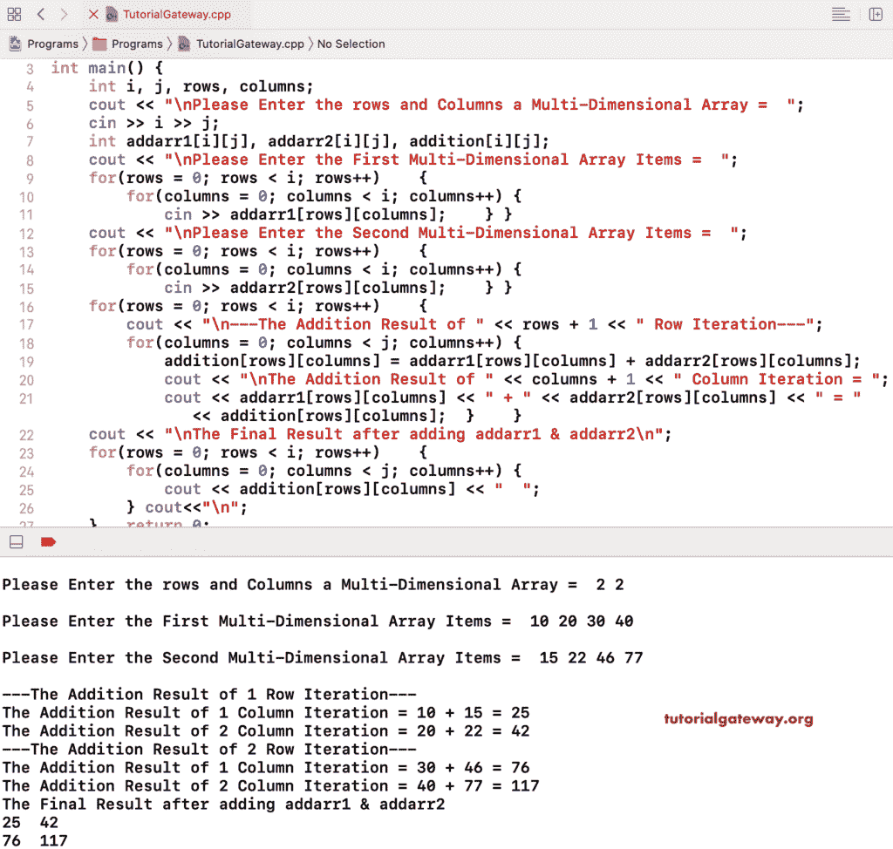

# C++ 程序：添加两个矩阵

> 原文：<https://www.tutorialgateway.org/cpp-program-to-add-two-matrixes/>

用一个例子写一个 C++ 程序来增加两个矩阵。在这个 C++ 矩阵加法示例中，我们使用 C++ 嵌套 for 循环从 0 到行和列迭代 addarr1 和 addarr2 矩阵。在嵌套 for 循环中，我们对两个矩阵执行加法运算，并将它们赋给矩阵。

(加法[行][列]= add arr 1[行][列]+add arr 2[行][列]；)

最后，我们使用了一个嵌套的 for 循环来打印矩阵项。

```cpp
#include<iostream>
using namespace std;

int main()
{
	int i, j, rows, columns;

	cout << "\nPlease Enter the rows and Columns a Multi-Dimensional Array =  ";
	cin >> i >> j;

	int addarr1[i][j], addarr2[i][j], addition[i][j];

	cout << "\nPlease Enter the First Multi-Dimensional Array Items =  ";
	for(rows = 0; rows < i; rows++)	{
		for(columns = 0; columns < i; columns++) {
			cin >> addarr1[rows][columns];
		}		
	}	
	cout << "\nPlease Enter the Second Multi-Dimensional Array Items =  ";
	for(rows = 0; rows < i; rows++)	{
		for(columns = 0; columns < i; columns++) {
			cin >> addarr2[rows][columns];
		}		
	}
	for(rows = 0; rows < i; rows++)	{
		cout << "\n---The Addition Result of " << rows + 1 << " Row Iteration---\n";
		for(columns = 0; columns < j; columns++) {
			addition[rows][columns] = addarr1[rows][columns] + addarr2[rows][columns];

			cout << "\nThe Addition Result of " << columns + 1 << " Column Iteration = ";
			cout << addarr1[rows][columns] << " + " << addarr2[rows][columns] << " = " << addition[rows][columns] << "\n";
		}
	}
	cout << "\nThe Final Result after adding addarr1 & addarr2 \n ";
	for(rows = 0; rows < i; rows++)	{
		for(columns = 0; columns < j; columns++) {
			cout << addition[rows][columns] << "  ";
		}
		cout<<"\n";
	}

 	return 0;
}
```



## C++ 程序添加两个矩阵示例 2

在这个 [C++](https://www.tutorialgateway.org/cpp-programs/) 矩阵加法示例中，我们移除了额外的 for 循环来显示项目，并放置了一个 cout 语句(cout < <加法【行】【列】< <】;)在执行加法之后。

```cpp
#include<iostream>
using namespace std;

int main()
{
	int i, j, rows, columns;

	cout << "\nPlease Enter the rows and Columns a Multi-Dimensional Array =  ";
	cin >> i >> j;

	int addarr1[i][j], addarr2[i][j], addition[i][j];

	cout << "\nPlease Enter the First Multi-Dimensional Array Items =  ";
	for(rows = 0; rows < i; rows++)	{
		for(columns = 0; columns < i; columns++) {
			cin >> addarr1[rows][columns];
		}		
	}	
	cout << "\nPlease Enter the Second Multi-Dimensional Array Items =  ";
	for(rows = 0; rows < i; rows++)	{
		for(columns = 0; columns < i; columns++) {
			cin >> addarr2[rows][columns];
		}		
	}
	cout << "\nThe Final Result after adding addarr1 & addarr2\n";
	for(rows = 0; rows < i; rows++)	{
		for(columns = 0; columns < j; columns++) {
			addition[rows][columns] = addarr1[rows][columns] + addarr2[rows][columns];
			cout << addition[rows][columns] << " ";
		}
	}
 	return 0;
}
```

```cpp
Please Enter the rows and Columns a Multi-Dimensional Array =  3 3

Please Enter the First Multi-Dimensional Array Items =  
1 2 3
4 5 6
7 8 9

Please Enter the Second Multi-Dimensional Array Items =  
11 22 33
44 55 66
77 88 99

The Final Result after adding addarr1 & addarr2
12 24 36 48 60 72 84 96 108 
```